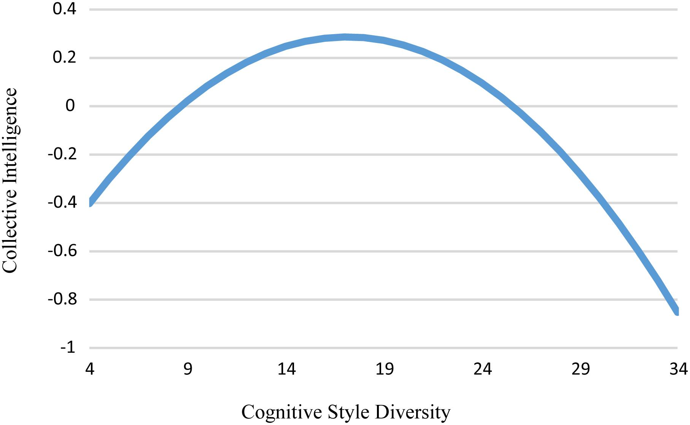

In a very interesting study, [Aggarwal et al. (2019)](https://www.frontiersin.org/journals/psychology/articles/10.3389/fpsyg.2019.00112/full){target="_blank"} investigated how the diversity of cognitive styles in teams (as measured by object-spatial imagery and OSIVQ verbal questionnaire) indirectly affects team learning through collective intelligence (as measured by a battery of various tasks, including the minimum-effort tacit coordination game to estimate team learning). 

They found that cognitive style diversity has a curvilinear, inverted U-shaped relationship with collective intelligence, which is further positively related to the rate at which teams learn and is a mechanism guiding the indirect relationship between cognitive style diversity and team learning.

{width=100%}

*The relationship between cognitive style diversity and collective intelligence controlling for team size and cognitive style level.*

The authors did not directly study the causes of this type of relationship, but the hypothesis they tested was based on an existing theorizing that contrasts cognitive diversity, which, on the one hand, brings a wealth of cognitive resources (knowledge, skills, etc.) useful for tackling the range of tasks the team faces, but on the other hand, also causes higher coordination costs due to different perspectives of team members.       

These results thus suggest that good old "moderation" might be a sound guiding principle in this area, as in many others. 

