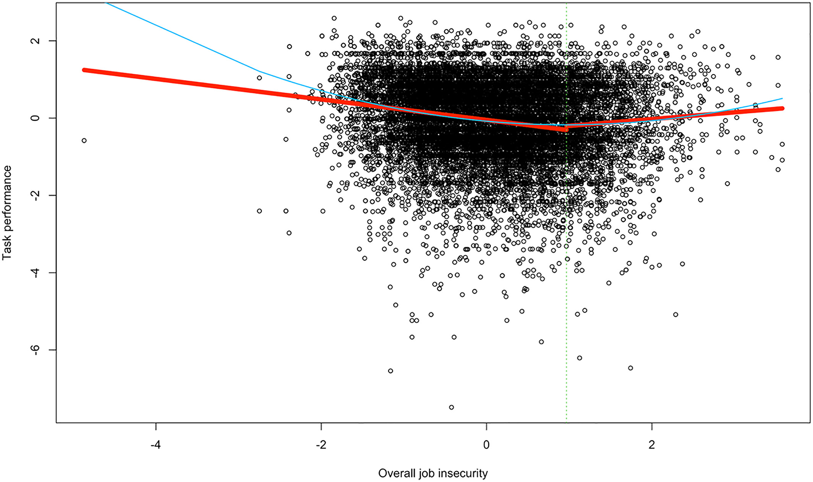

Such data seems to be provided by an interesting meta-analysis conducted by [Jiang, Lawrence, and Xu (2022)](https://onlinelibrary.wiley.com/doi/full/10.1002/job.2652){target="_blank"}. The authors conclude that although job insecurity has curvilinear relationships with some employee workplace behaviors, such as task performance and organizational citizenship behavior (OCB-organization) (i.e., they first decrease and then increase with increasing job insecurity after reaching a certain inflection point), it is not a good motivational strategy for several reasons:

1. The positive relationships after the inflection points are relatively weak.
2. There is a linear, negative relationship of job insecurity with safety behavior, and a linear, positive relationship with counterproductive work behavior (CWB-organization).
3. The (negative) relationship of job insecurity with OCB-individual and creative performance becomes nonsignificant as job insecurity further increases, so if the goal is to increase these two specific behavioral outcomes, increasing employee job insecurity is not a way to achieve that.
4. As other studies have shown, such as meta-analysis by [Jiang & Lavaysse (2018)](https://www.researchgate.net/publication/325022952_Cognitive_and_Affective_Job_Insecurity_A_Meta-Analysis_and_a_Primary_Study){target="_blank"}, increased job insecurity has unwanted negative impacts on employee well-being and job attitudes.

{width=100%}

*A plot of the curvilinear relationship between (overall) job insecurity and task performance where the blue line is the fitted curve, whereas the red, straight lines are based on the interrupted regression results from the two-lines test.*

All in all, low levels of job insecurity seem to be more beneficial as they are related to higher levels of task performance, OCB-I, OCB-O, creative performance, and safety behavior, as well as lower levels of CWB-O, without unwanted negative impacts on employee attitudes and well-being.

For more interesting details of the study, check the original paper [here](https://onlinelibrary.wiley.com/doi/full/10.1002/job.2652){target="_blank"}. 
