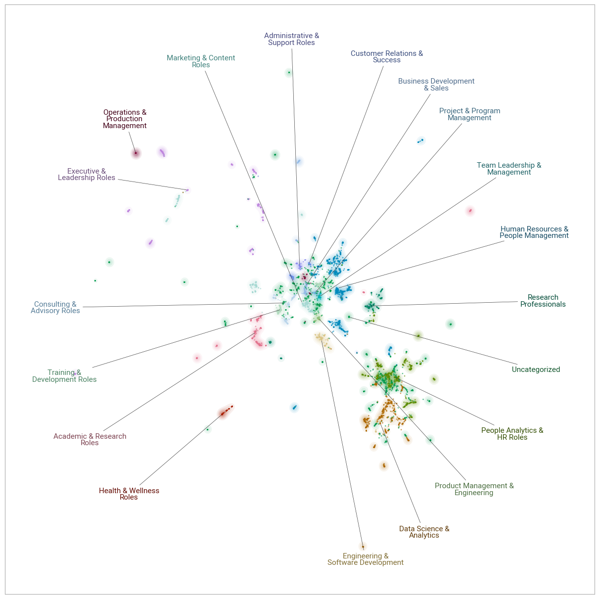

I took advantage of one rainy day during my vacation to dive into some LI data and explore what my nearly 7K contacts are doing professionally.

The challenge was that the available LI data about my contacts' jobs was pretty limited - just their job titles. So, my first step was to enrich this information using a LLM to generate brief descriptions of their positions based on those titles. It's not perfect and it's a bit error-prone, but in a low-stakes situation like this, fortunately we can accept a bit of imperfection and some minor “hallucinations” 🧙

Next, I fed these descriptions into a [BERTopic](https://maartengr.github.io/BERTopic/index.html){target="_blank"} workflow, which applies several NLP techniques to identify clusters of similar documents:

1. Generating sentence embeddings.
2. Reducing the dimensionality of those embeddings.
3. Clustering the reduced embeddings.
4. Vectorizing texts at the cluster level.
5. Extracting key terms per cluster using class-based TF-IDF.
6. Fine-tuning the cluster representations with the help of an LLMs.

As you can see in the chart below, the range of roles is quite broad, but it seems that most of my contacts work in people analytics, data science, HR & people management, as executives, and as researchers in academia or in enterprises.

<div style="text-align:center">
{width=100%}
</div>

Below is an interactive version of the chart, where you can check the individual job titles behind the job categories.

```{r, echo=FALSE, include=FALSE}
library(reticulate)
```

```{python}
# packages used
import numpy as np
import pickle
import pandas as pd
import plotly.graph_objects as go
import plotly.offline as py
import matplotlib.pyplot as plt
import matplotlib.colors as mcolors


# data used
with open('all_labels_remapped.pkl', 'rb') as f:
    all_labels_remapped = pickle.load(f)
reduced_embeddings = np.load('reduced_embeddings.npy')
data = pd.read_csv('data.csv')

# extracting job titles
titles = data['position']

# defining the 'Uncategorized' label
uncategorized_label = 'Uncategorized'

# generating 20 distinct colors
cmap = plt.get_cmap('tab20')
colors = [cmap(i) for i in range(20)]

# convert matplotlib colors to hex format
colors_hex = [mcolors.to_hex(c) for c in colors]

# defining color for 'Uncategorized'
uncategorized_color = '#D3D3D3'  # Light gray

# creating an empty figure
fig = go.Figure()

# plotting 'Uncategorized' points first
uncategorized_indices = pd.Series(all_labels_remapped) == uncategorized_label
fig.add_trace(go.Scatter(
    x=reduced_embeddings[uncategorized_indices, 0],
    y=reduced_embeddings[uncategorized_indices, 1],
    mode='markers',
    marker=dict(
        size=5,
        color=uncategorized_color,
        opacity=0.5
    ),
    name=uncategorized_label,
    text=[f'Title: {titles[j]}<br>Category: {all_labels_remapped[j]}' for j in range(len(uncategorized_indices)) if uncategorized_indices[j]],
    hoverinfo='text',
    showlegend=True
));

# plotting the rest of the groups on top
unique_labels = pd.Series(all_labels_remapped).unique()

for i, label in enumerate(unique_labels):
    if label == uncategorized_label:
        continue  # skipping 'Uncategorized' since it was already plotted

    indices = pd.Series(all_labels_remapped) == label
    color = colors_hex[i % len(colors_hex)]
    
    fig.add_trace(go.Scatter(
        x=reduced_embeddings[indices, 0],
        y=reduced_embeddings[indices, 1],
        mode='markers',
        marker=dict(
            size=5,
            color=color,
            opacity=0.5
        ),
        name=f'{label}',
        text=[f'Title: {titles[j]}<br>Category: {all_labels_remapped[j]}' for j in range(len(indices)) if indices[j]],
        hoverinfo='text',
        showlegend=True
    ));

# updating layout
fig.update_layout(
    title='',
    xaxis=dict(
        showgrid=False, 
        zeroline=False,  
        showline=False,  
        showticklabels=False,  
        title='',  
    ),
    yaxis=dict(
        showgrid=False, 
        zeroline=False,  
        showline=False,  
        showticklabels=False, 
        title='',  
    ),
    plot_bgcolor='rgba(0,0,0,0)',
    height=600,
    width=850,
    template='plotly_white'
)

```

No big surprises here, considering my career path and control over who I connect with. However, it can be more useful to view it from the perspective of who is missing and use it as a tool for intentional LI network building. After all, as some wise people say, we are the average of the people we spend the most time with. For example, I would appreciate having more artists among my contacts, but it’s a question of whether LI is the right network for finding such connections 😉  

P.S. If interested, feel free to check out [one of my earlier apps](https://blog-about-people-analytics.netlify.app/posts/2021-12-16-linkedin-connections-analysis/){target="_blank"} that automatically generates basic descriptive statistics about your LI connections.