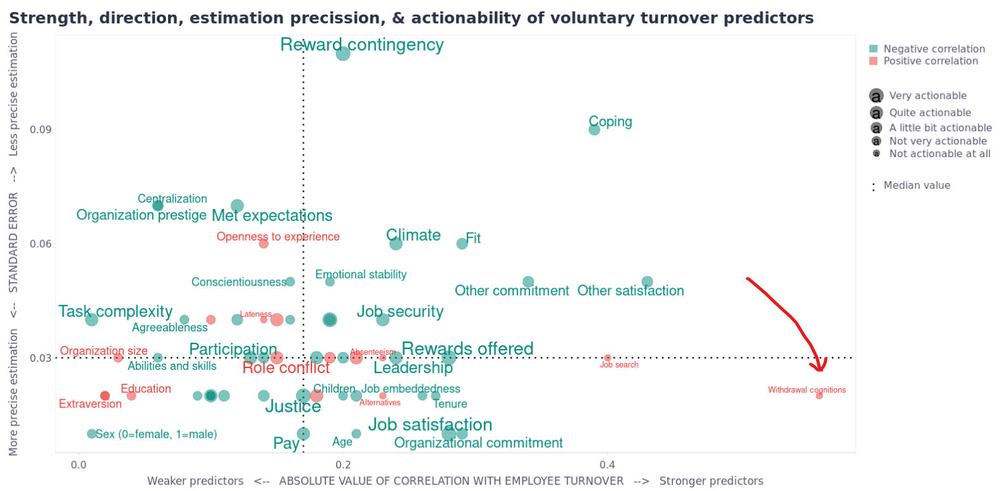

I recently came across a LI post discussing a more or less surprising fact about the relatively high predictive power of a single item from employee surveys in relation to employee turnover. The item in question was a simple question about the employee's intention to stay with the company if they were offered the same job at another organization. An insight corresponding to my mom’s wise advice she gave me when I was a small child: If you don’t know, just ask, most people will be happy to answer 🙂 

To expand on this post, I'd like to add another related fact that I've encountered in several real-world datasets. There is another aspect of employee surveys that is quite highly predictive of people’s intention to leave the company. However, this time, it’s not a specific survey item, but the team (or individual) survey participation rate. The lower the participation rate, the higher the probability of leaving, all other things being equal.

We can view it as one specific manifestation of employees’ withdrawal that is highly predictive of the intention to leave, as illustrated in the attached chart showing the strength, direction, and estimation precision of voluntary turnover predictors, as assessed in [Rubenstein et al. (2017) meta-analysis](https://onlinelibrary.wiley.com/doi/10.1111/peps.12226?msockid=2f13ca573eec66351787ded23f9b6733){target="_blank"}.

{width=100%}

[Link to the app with the interactive plot](https://peopleanalyticsblog.shinyapps.io/voluntary_turnover_predictors/){target="_blank"}

Apparently, people may signal their exit intentions not only by their actions but also by their inactions. As Sherlock Holmes famously observed in one of his cases, what’s suspicious is not only the barking of the dog but also its silence.

Have you noticed any other forms of inaction that might predict an intention to leave? For example, one might consider lateness and absenteeism as types of inaction as well (they are, btw, also included among the predictors in the chart and are performing pretty well).

