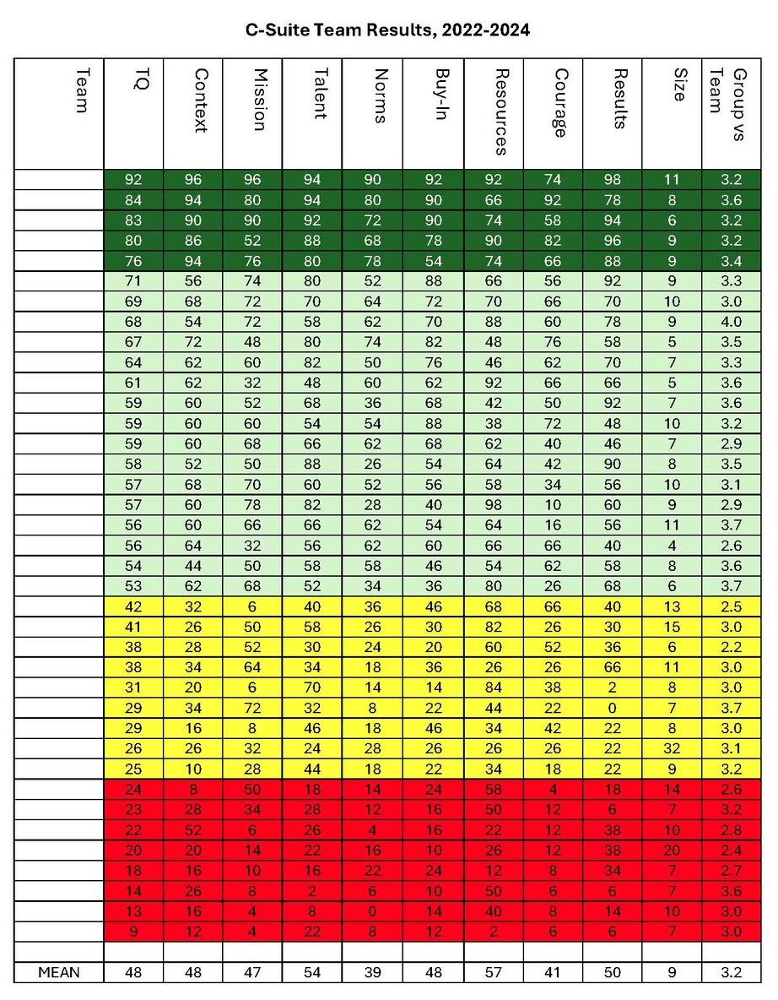

Recently, [Dr. Gordon (Gordy) Curphy](https://www.linkedin.com/in/gordoncurphy/){target="_blank"} posted an insightful [article discussing lessons learned from working with nearly 40 C-suite teams](https://www.linkedin.com/pulse/lessons-learned-working-c-suite-teams-gordon-gordy-curphy-phd-yezgc/?trackingId=jSnNpf%2B89EccpKTSog38IA%3D%3D){target="_blank"}, based on their results in the [Team Assessment Survey (TAS)](https://rocketmodelforteams.com/what-is-rocket-model/){target="_blank"}, a tool designed to evaluate the efficiency and effectiveness of teams by assessing various factors that contribute to team performance.

The lessons could be briefly summarized as follows:

* **Need for Improvement:** Many C-suite teams overestimate their performance and lack "how" feedback on team dynamics, revealing a need for benchmarking to improve efficiency and effectiveness.
* **Optimal Team Size:** Teams often struggle with inclusivity issues, becoming too large to be effective. Smaller, focused "tiger teams" are recommended for strategic decision-making, while larger groups can handle execution.
* **Group vs. Team Dynamics:** Most C-suite teams operate as hybrids, balancing individual and collective goals. Clarifying when to function as a group versus a team can enhance performance and reduce inefficiencies.
* **Alpha Paralysis:** Dominance by assertive members and avoidance of difficult topics often lead to ineffective meetings. Facilitators should help teams prioritize strategic discussions and decide on group or team approaches to minimize this issue.
* **Adaptability Challenges:** C-suite teams may need restructuring or personnel changes when performance lags, especially if team members’ skills or attitudes are mismatched with evolving organizational needs.
* **Continuous Improvement:** Benchmarking feedback is essential but insufficient; ongoing efforts and accountability are crucial for sustained improvement in team dynamics and performance.

The article also included a screenshot of a data table with the C-suite teams’ TAS results, along with information about their respective team size and the extent to which they operate as a team versus as a group.

<div style="text-align:center">
{width=70%}
</div>

It sparked my curiosity about whether further insights could be gleaned from this data using an analytical technique known as a [regularized partial correlation network](https://eiko-fried.com/wp-content/uploads/Epskamp-Fried-2018-Tutorial-partial-corr.pdf){target="_blank"}, a method that identifies direct relationships between variables by controlling for others while using regularization to enforce sparsity, ensuring clarity and reducing overfitting.  

```{r fig.width=11, fig.height=9, warning=FALSE}

# libraries
library(tidyverse)
library(bootnet)

# data extracted from the table
data <- readxl::read_xlsx('table_extracted.xlsx')

# preparing data
mydata <- data %>% 
  dplyr::select(-Team, -TQ) %>% 
  dplyr::rename(`Team x Group`=`Group vs Team`)


# estimating a regularized partial correlation network
network <- bootnet::estimateNetwork(
  mydata,
  default = "EBICglasso",
  corMethod = "spearman",
  threshold = FALSE # when TRUE, enforces higher specificity, at the cost of sensitivity
)

# plotting the estimated network 
plot(
  network, 
  layout = "spring",
  groups = NaN,
  nodeNames = names(mydata),
  weighted = TRUE,
  directed = FALSE,
  label.cex = 0.7, 
  label.color = 'black', 
  label.prop = 0.9, 
  negDashed = TRUE, 
  legend = FALSE,
  font = 2,
  theme = "classic"
)

```

```{r}

# computing centrality measures for individual variables
qgraph::centralityPlot(network, include = "all", orderBy = "ExpectedInfluence")

```

The resulting network, IMHO,  revealed two or three extra insights that are at least interesting, if not useful:

* **The Central Role of Norms and Buy-In:** These factors emerged as central in the network, a conclusion supported not only by a visual inspection of the network but also by the expected influence centrality measure. This finding may suggest that interventions targeting these areas could have the greatest leverage when trying to improve team efficiency and effectiveness.
* **Team Dynamics and Courage:** Operating more as a team than as a group appears to predict lower levels of Courage - a factor related to team trust and psychological safety. A plausible explanation for this surprising finding could be that teams, as opposed to groups, place a stronger emphasis on cohesion, interdependence, and collective identity, which may create pressures that suppress perceived psychological safety. If this is true, it underscores the need to strike a delicate balance between fostering team cohesion and encouraging individual courage, ensuring that members feel safe to speak up without fear of disrupting team harmony.
* **The Trade-offs of Team Size:** While having more members can be detrimental to a team’s efficiency and effectiveness - particularly regarding Buy-In (motivation to achieve team goals) and Talent (right size, skills, roles, rewards, and followership) - larger teams may benefit from better access to resources such as budget, equipment, data, and the authority or autonomy needed to accomplish goals. As is often the case in real life, things are not black and white and one must navigate various trade-offs and tailor their approach to specific circumstances.   

⚠️ A small caveat: These findings are based on a very small sample of highly specific teams, which limits their reliability and validity. They should therefore be treated as such and used only as an inspiration for further reflection on team performance and potential improvement strategies.

P.S. Kudos to ChatGPT for extracting the data from the screenshot of the data table - it made the analysis much easier. Thanks! 🤖😀 
