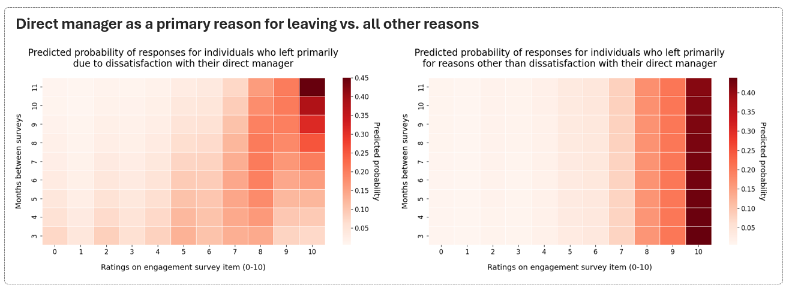
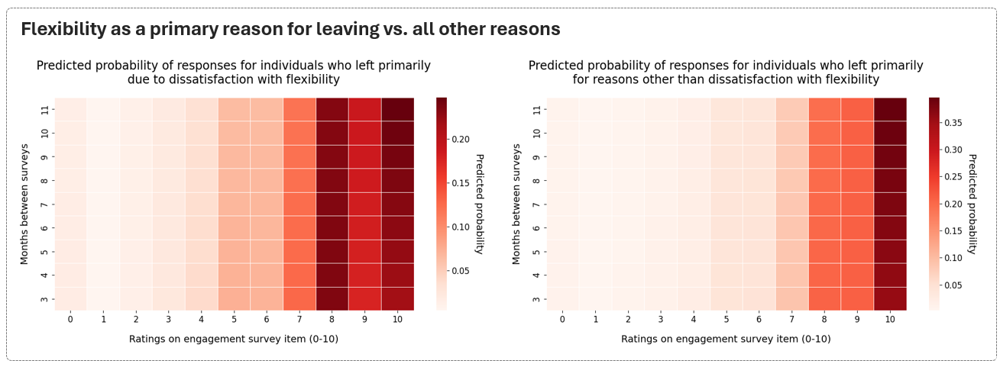
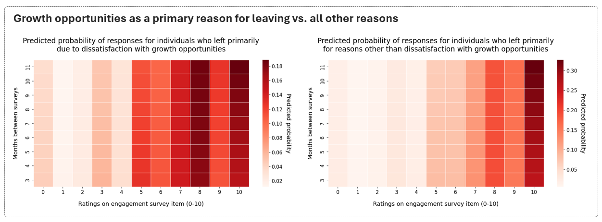

One way to test whether this ‘political distortion’ exists, or to what extent, is to examine how consistent the responses of voluntarily departing employees are across the exit and engagement surveys. If such a distortion exists, one would expect to see in the data that the primary reason people gave for leaving is NOT reflected in lower scores on the corresponding items in the most recent engagement survey they completed before leaving the company, compared to leavers who gave a different primary reason. Another compatible observation would be that the primary reason for leaving DOES translate into lower scores, but this effect diminishes with the longer lag between the administration of the two surveys, because people further away from the actual date of departure may not have decided whether to leave and may therefore feel less free to express their true positions on politically sensitive topics.

In analyzing a sample dataset and focusing on 'direct manager' as a primary reason for leaving, the results from an ordinal regression analysis appear to support the second scenario described above. The results are illustrated by the pair of heatmaps below, which show the negative effect of that primary reason (i.e., direct manager vs. all other reasons) on ratings on the engagement survey, and the interaction between that primary reason and the distance between the two surveys in their effect on ratings of one particular engagement survey item related to the quality of the direct manager.

{width=100%}

However, this pattern could also be alternatively explained by the simple, non-problematic fact that people's opinions change over time. The closer the exit survey is to the last engagement survey, the more it reflects what people answered in the last engagement survey. This suggests that the observed interaction/ "diminishing" effect may be actually common across all stated reasons and engagement survey items. 

To differentiate between these two explanations, one could examine another primary reason for leaving that is assumed to be less politically sensitive, where employees may feel more comfortable expressing their true opinions before deciding to leave. An example of such a reason might be dissatisfaction with flexibility in work location and/or schedule. In this case, the data shows a negative (though statistically non-significant) effect of the stated primary reason (i.e., flexibility vs. all other reasons) on engagement survey ratings, and almost zero interaction between the stated primary reason and the time between the two surveys. This finding seems to align more closely with the expectation of how honest responses should be reflected in the data. 

{width=100%}

However, we can still speculate about alternative explanations. It could be that the dynamics of different reasons for leaving evolve differently over time. For example, dissatisfaction with flexibility might stay similarly high over the long term without any employee’s action till the moment when better opportunity occurs and they leave. In contrast, dissatisfaction with a direct manager may have a tendency to show a more sudden, abrupt increase before an employee makes a final decision to depart. To further investigate this, we can examine a reason for leaving that is less politically sensitive than dissatisfaction with a direct manager but has similar dynamics over time. One such reason could be dissatisfaction with career growth opportunities. The data for this specific reason shows a pattern very similar to what we observed already for the 'flexibility' reason. 

{width=100%}

This similarity, therefore, supports the conclusion that, in cases of dissatisfaction with a direct manager, there is some evidence in the data of a "political distortion" in people's responses to the engagement survey on this topic. However, this conclusion should be taken with a big grain of salt, as it relies on several significant, and perhaps overly speculative, assumptions made throughout the analysis; and it is also crucial to consider the limitations of the data used, such as the shorter time span of the data and the self-selected nature of the group of people motivated enough to complete both the engagement and exit surveys. All this weakens the validity of the conclusion made above.

Despite all the uncertainty, it was a very useful exercise to confront my thoughts and ideas with some evidence and refine them a bit. To build on this work and move closer to answering the question in the title of this post, I would welcome any suggestions for next steps, detours or completely alternative approaches that you think might help.

