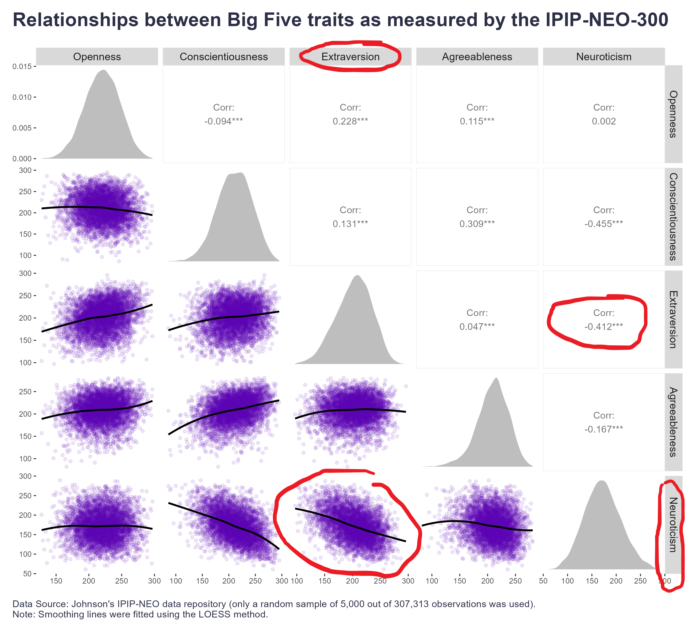
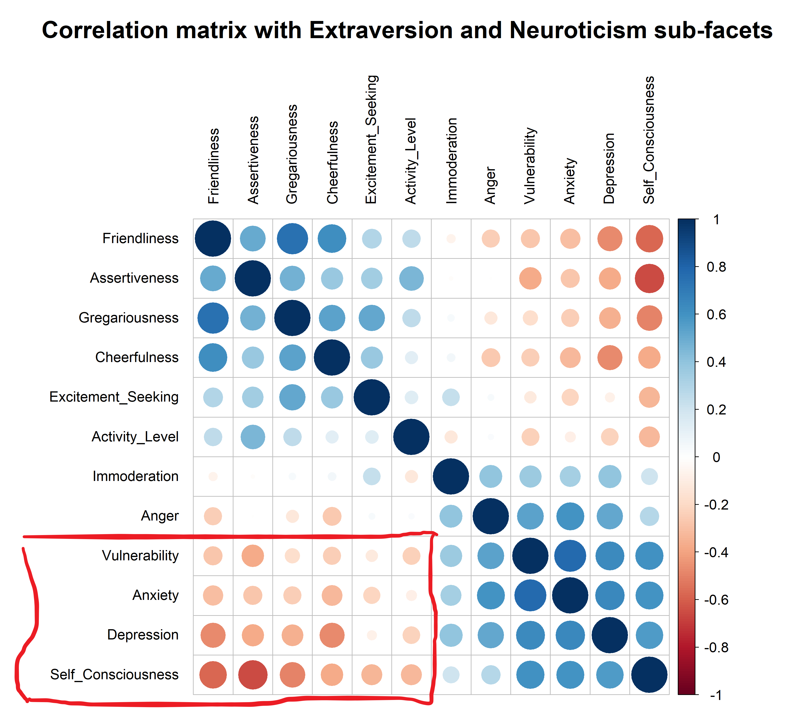

In public discourse, one often encounters defenses of the strengths and advantages of introverts in a world that generally prefers and celebrates more extroverted behaviors. While this advocacy can have many positive effects, it seems to me that those defending introverts often (mistakenly?) describe them in terms of negative emotionality, such as shyness, anxiety, fear, insecurity, etc., i.e. in terms of qualities that fall under the umbrella of the trait of Neuroticism rather than Extraversion. 

I was curious about why this is the case. One obvious explanation is the strong correlation between these two traits. When examining data from [Johnson's IPIP-NEO data repository](https://osf.io/tbmh5/){target="_blank"}, the data indeed appear to support this hypothesis. Compared to all other traits, Neuroticism much more strongly (negatively) correlates with Extraversion (see the pairplot below). 

```{r eval=FALSE}

# libraries for data manipulation and dataviz
library(foreign)
library(tidyverse)
library(GGally)

# uplaoding .por file 
# data from Johnson, J. A. (2014). Measuring thirty facets of the five factor model with a 120-item public domain inventory: Development of the IPIP-NEO-120. J. of Research in Personality, 51, 78-89.
# source: https://osf.io/tbmh5/ 
data <- read.spss("IPIP300.por", to.data.frame = TRUE)

# assigning items to individual traits
o_items <- c(3, 8, 13, 18, 53, 28, 33, 68, 43, 138, 203, 58, 63, 188, 223, 168, 233, 148, 93, 218, 283, 288, 263, 268, 23, 38, 48, 73, 78, 83, 88, 98, 103, 108, 113, 118, 123, 128, 133, 143, 153, 158, 163, 173, 178, 183, 193, 198, 208, 213, 228, 238, 243, 248, 253, 258, 273, 278, 293, 298)
c_items <- c(5, 40, 45, 50, 55, 120, 35, 160, 105, 140, 145, 150, 65, 190, 165, 260, 205, 210, 155, 220, 195, 290, 265, 270, 10, 15, 20, 25, 30, 60, 70, 75, 80, 85, 90, 95, 100, 110, 115, 125, 130, 135, 170, 175, 180, 185, 200, 215, 225, 230, 235, 240, 245, 250, 255, 275, 280, 285, 295, 300)
e_items <- c(2, 7, 12, 17, 22, 27, 62, 37, 42, 47, 52, 57, 212, 157, 132, 77, 142, 147, 272, 247, 162, 167, 172, 177, 32, 67, 72, 82, 87, 92, 97, 102, 107, 112, 117, 122, 127, 137, 152, 182, 187, 192, 197, 202, 207, 217, 222, 227, 232, 237, 242, 252, 257, 262, 267, 277, 282, 287, 292, 297)
a_items <- c(4, 99, 74, 169, 144, 29, 34, 159, 104, 199, 174, 59, 64, 249, 194, 229, 204, 149, 184, 279, 284, 259, 264, 239, 9, 14, 19, 24, 39, 44, 49, 54, 69, 79, 84, 89, 94, 109, 114, 119, 124, 129, 134, 139, 154, 164, 179, 189, 209, 214, 219, 224, 234, 244, 254, 269, 274, 289, 294, 299)
n_items <- c(1, 6, 11, 76, 111, 26, 31, 36, 41, 106, 171, 56, 61, 126, 71, 136, 201, 86, 91, 216, 251, 256, 231, 176, 16, 21, 46, 51, 66, 81, 96, 101, 116, 121, 131, 141, 146, 151, 156, 161, 166, 181, 186, 191, 196, 206, 211, 221, 226, 236, 241, 246, 261, 266, 271, 276, 281, 286, 291, 296)

# adding 'I' prefix
o_items <- paste0("I", o_items)
c_items <- paste0("I", c_items)
e_items <- paste0("I", e_items)
a_items <- paste0("I", a_items)
n_items <- paste0("I", n_items)

# selecting a random sample of 5000 respondents and computing scores for all five major scales  
set.seed(2024)
mydata_sample <- data %>% 
  dplyr::select(all_of(c(o_items, c_items, e_items , a_items, n_items))) %>% 
  dplyr::rename_with(~ str_replace_all(., "I", "O"), .cols = all_of(o_items)) %>% 
  dplyr::rename_with(~ str_replace_all(., "I", "C"), .cols = all_of(c_items)) %>% 
  dplyr::rename_with(~ str_replace_all(., "I", "E"), .cols = all_of(e_items)) %>% 
  dplyr::rename_with(~ str_replace_all(., "I", "A"), .cols = all_of(a_items)) %>% 
  dplyr::rename_with(~ str_replace_all(., "I", "N"), .cols = all_of(n_items)) %>% 
  dplyr::sample_n(5000,replace = FALSE) %>% 
  dplyr::mutate(
    Openness = rowSums(select(., starts_with("O"))),
    Conscientiousness = rowSums(select(., starts_with("C"))),
    Extraversion = rowSums(select(., starts_with("E"))),
    Agreeableness = rowSums(select(., starts_with("A"))),
    Neuroticism = rowSums(select(., starts_with("N")))
  ) %>% 
  dplyr::select(Openness:Neuroticism)


# pairplot
GGally::ggpairs(
  mydata_sample,
    lower = list(
      continuous = wrap("smooth", method = "loess", se = FALSE, alpha = 0.1, color='#5c00ae')
    ),
    diag = list(
      continuous = wrap("densityDiag", fill = "grey", color=NA)
    )
  ) +
  ggplot2::labs(
    title = 'Relationships between Big Five traits as measured by the IPIP-NEO-300',
    caption = "\nData Source: Johnson's IPIP-NEO data repository (only a random sample of 5,000 out of 307,313 observations was used).\nNote: Smoothing lines were fitted using the LOESS method."
  ) +
  ggplot2::theme(
    plot.title = element_text(color = '#2C2F46', face = "bold", size = 22, margin=margin(0,0,20,0)),
    plot.subtitle = element_text(color = '#2C2F46', face = "plain", size = 15, margin=margin(0,0,20,0)),
    plot.caption = element_text(color = '#2C2F46', face = "plain", size = 11, hjust = 0),
    panel.background = element_rect(fill = "white", color = NA), 
    panel.grid.major =  element_blank(),          
    panel.grid.minor = element_blank(),                          
    plot.background = element_rect(fill = "white", color = NA), 
    strip.text = element_text(size = 12, face = "plain"),
    plot.margin=unit(c(5,5,5,5),"mm"), 
    plot.title.position = "plot",
    plot.caption.position =  "plot"
  )

```

<div style="text-align:center">
{width=100%}
</div>

At the level of sub-facets of these two traits, we can observe in the correlation plot below - where individual items are ordered based on the first principal component, which groups together highly correlated variables - that the sub-facets of Extraversion are most strongly predicted by scores on the Neuroticism sub-facets of *Self-Consciousness* (sensitivity to others' judgments and fear of embarrassment) and *Depression* (inclination toward feelings of sadness, hopelessness, and low self-esteem). To some extent, *Anxiety* (tendency to worry, feel nervous, or experience fear) and *Vulnerability* (susceptibility to stress and inability to cope under pressure) also contribute.

```{r eval=FALSE}

# library for correlation plot
library(corrplot)

# assigning items to individual sub-facets of Extraversion and Neuroticism
E_Friendliness_items <- c(2, 62, 212, 272, 32, 92, 122, 152, 182, 242)
E_Gregariousness_items <- c(7, 37, 157, 247, 67, 97, 127, 187, 217, 277)
E_Assertiveness_items <- c(12, 42, 132, 162, 72, 102, 192, 222, 252, 282)
E_Activity_Level_items <- c(17, 47, 77, 167, 107, 137, 197, 227, 257, 287)
E_Excitement_Seeking_items <- c(22, 52, 142, 172, 82, 112, 202, 232, 262, 292)
E_Cheerfulness_items <- c(27, 57, 147, 177, 87, 117, 207, 237, 267, 297)

N_Anxiety_items <- c(1, 31, 61, 91, 121, 151, 181, 211, 241, 271)
N_Anger_items <- c(6, 36, 126, 216, 66, 96, 156, 186, 246, 276)
N_Depreesion_items <- c(11, 41, 71, 251, 101, 131, 161, 191, 221, 281)
N_Self_Consciousness_items <- c(76, 106, 136, 256, 16, 46, 166, 196, 226, 286)
N_Immoderation_items <- c(111, 171, 201, 231, 21, 51, 81, 141, 261, 291)
N_Vulnerability_items <- c(26, 56, 86, 176, 116, 146, 206, 236, 266, 296)

# adding 'I' prefix
E_Friendliness_items <- paste0("I", E_Friendliness_items)
E_Gregariousness_items <- paste0("I", E_Gregariousness_items)
E_Assertiveness_items <- paste0("I", E_Assertiveness_items)
E_Activity_Level_items <- paste0("I", E_Activity_Level_items)
E_Excitement_Seeking_items <- paste0("I", E_Excitement_Seeking_items)
E_Cheerfulness_items <- paste0("I", E_Cheerfulness_items)

N_Anxiety_items <- paste0("I", N_Anxiety_items)
N_Anger_items <- paste0("I", N_Anger_items)
N_Depreesion_items <- paste0("I", N_Depreesion_items)
N_Self_Consciousness_items <- paste0("I", N_Self_Consciousness_items)
N_Immoderation_items <- paste0("I", N_Immoderation_items)
N_Vulnerability_items <- paste0("I", N_Vulnerability_items)

# selecting a random sample of 5000 respondents and computing scores for all sub-facets considered  
set.seed(2024)
mydata_sample <- data %>%
  dplyr::select(all_of(c(
    E_Friendliness_items, E_Gregariousness_items, E_Assertiveness_items, 
    E_Activity_Level_items, E_Excitement_Seeking_items, E_Cheerfulness_items, 
    N_Anxiety_items, N_Anger_items, N_Depreesion_items, 
    N_Self_Consciousness_items, N_Immoderation_items, N_Vulnerability_items
  ))) %>% 
  dplyr::sample_n(5000,replace = FALSE) %>% 
  dplyr::mutate(
    Friendliness = rowSums(select(., all_of(E_Friendliness_items))),
    Gregariousness = rowSums(select(., all_of(E_Gregariousness_items))),
    Assertiveness = rowSums(select(., all_of(E_Assertiveness_items))),
    Activity_Level = rowSums(select(., all_of(E_Activity_Level_items))),
    Excitement_Seeking = rowSums(select(., all_of(E_Excitement_Seeking_items))),
    Cheerfulness = rowSums(select(., all_of(E_Cheerfulness_items))),
    
    Anxiety = rowSums(select(., all_of(N_Anxiety_items))),
    Anger = rowSums(select(., all_of(N_Anger_items))),
    Depression = rowSums(select(., all_of(N_Depreesion_items))),
    Self_Consciousness = rowSums(select(., all_of(N_Self_Consciousness_items))),
    Immoderation = rowSums(select(., all_of(N_Immoderation_items))),
    Vulnerability = rowSums(select(., all_of(N_Vulnerability_items)))
  ) %>% 
  dplyr::select(
    Friendliness, Gregariousness, Assertiveness, Activity_Level, 
    Excitement_Seeking, Cheerfulness, Anxiety, Anger, Depression, 
    Self_Consciousness, Immoderation, Vulnerability
  )
  
# correlation matrix
cor_matrix <- cor(mydata_sample, use = "complete.obs")

# correlation plot
corrplot::corrplot(
  cor_matrix, 
  method = "circle", 
  type = "full", 
  order = "FPC", # ordering vars based on the first principal component which groups together highly correlated vars
  tl.col = "black", tl.cex = 1.2, cl.cex=1.2,
  mar=c(0,0,5,0), tl.offset = 1
)
title(
  main = "Correlation matrix with Extraversion and Neuroticism sub-facets",
  cex.main = 2, font.main = 2
)


```

<div style="text-align:center">
{width=100%}
</div>

These patterns could indeed provide an answer to the question posed in the title of my post. However, the question now is whether, when discussing introverts, we should limit ourselves to behaviors that fall exclusively under the umbrella of Extraversion, as described in modern personality psychology, or whether we should also include other closely related behaviors. My personal stance is that we should include them, while explicitly noting that the picture we are describing is not a monolith but rather a blend of multiple traits. This approach helps prevent oversimplification, avoid stereotypes, and appreciate the complexity of introverts' strengths and challenges, ultimately leading to greater self-awareness and more tailored strategies in personal and professional contexts. What’s your take on this? 🤔
