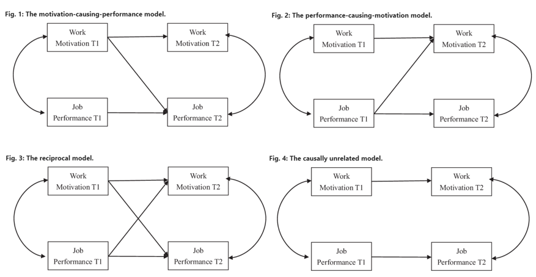
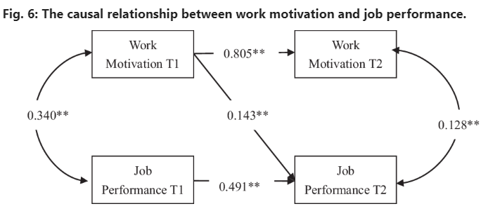

The authors of the examined four competing hypotheses:

1. Motivation causes performance.
2. Performance causes motivation.
3. A reciprocal relationship exists.
4. They are causally unrelated.

Below are visual illustrations of arguments for these four hypotheses.

{width=100%}

Their findings suggest that **work motivation is more likely to cause job performance than vice versa**. The results appear reasonably robust, as the finding that work motivation predicts job performance was consistent across various moderators, including the type of job performance measure, the type of motivation measure, and the length of the time lag.

{width=100%}

The practical implications for people management are straightforward according to the authors: leveraging human performance practices (e.g., compensation management and performance management) and motivation-based leadership (e.g., empowering leadership) can positively influence employee motivation, which in turn enhances employee performance over the long term.

Additionally, there was one surprising finding: job performance does not predict work motivation. According to the authors, this suggests that HR practitioners should identify effective practices to strengthen feedback mechanisms between them, helping employees to continuously improve their performance.

For a deeper dive into this research, check out the full article [here](https://www.nature.com/articles/s41599-024-03038-w){target="_blank"}.

