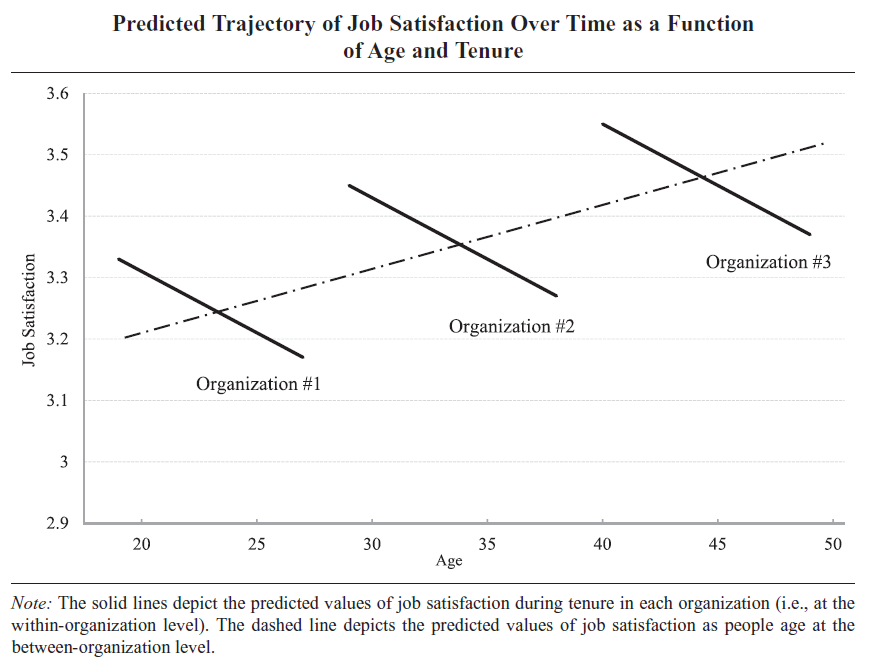
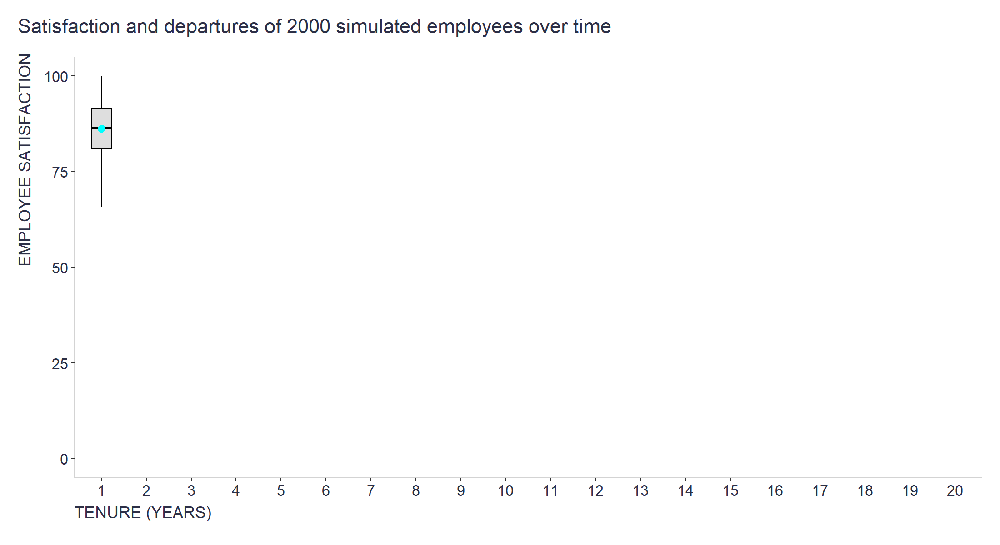

In a [recent post on LinkedIn](https://www.linkedin.com/posts/ludekstehlik_employeesatisfaction-tenure-age-activity-7237423725715820545-Gr7x?utm_source=share&utm_medium=member_desktop){target="_blank"}, I shared a research paper by [Dobrow & Ganzach (2014)](https://www.researchgate.net/publication/276893636_Job_Satisfaction_over_Time_A_Longitudinal_Study_of_the_Differential_Roles_of_Age_and_Tenure){target="_blank"} that used longitudinal data to disentangle the effects of age and job tenure on employee satisfaction and concluded that people are on average more satisfied with their jobs over their lifetimes, but their satisfaction declines over time within a given company (see the illustrative chart below).

<div style="text-align:center">
{width=100%}
</div>

A reader of this post reached out to me and asked how this might relate to the U-shaped pattern they observe in their data: new hires tend to be the most satisfied, then there is a slight decline at "mid-company" age, and then satisfaction rises again.

My general reply was that this pattern might be a kind of illusion caused by the fact that the more satisfied employees "survive" and are more likely to stay longer, and the more dissatisfied ones leave after a few years, so they couldn't lower the average satisfaction level of those who stayed longer and are, by definition, more satisfied. 

In support of my point, I also created a simple simulation in R that takes a cohort of 2000 employees who joined the company at the same point in time, each of whom exhibits a more or less steep and noisy downward (or flat) slope of declining satisfaction levels over their years at the company, and a probability of leaving that is non-linearly (sigmoidally) related to their respective satisfaction levels. As can be seen in the attached chart, the resulting pattern closely resembles what might be observed in real data. 

```{r eval=FALSE}

# loading necessary libraries
library(gganimate)
library(tidyverse)

# setting basic params of the simulation
set.seed(2024)
n_employees <- 2000
years <- 20
desired_sd <- 5 

# creating basic df
employee_data <- data.frame(
  employee_id = 1:n_employees,
  tenure = 0,
  satisfaction = runif(n_employees, min = 80, max = 100),
  status = "Active",
  degree = abs(rnorm(n_employees, mean = 0, sd = desired_sd))
)

# function to compute leaving probability
compute_prob_leave <- function(satisfaction, k, midpoint) {
  # lower satisfaction should correspond to higher probability of being cut
  # non-linear/logistic probability
  p_leave <- 1 / (1 + exp(-k * (satisfaction - midpoint)))
  return(p_leave)
}

midpoint <- 60  # satisfaction level where probability of cut is 50%
k <- -0.15      # controlling the steepness of the logistic curve

# just checking the shape of the function determining probability of leaving depending on satisfaction level
visualize_prob_leave <- function(k, midpoint, satisfaction_range = c(0, 100)) {
  # generating a sequence of satisfaction values
  satisfaction <- seq(from = satisfaction_range[1], to = satisfaction_range[2], length.out = 1000)
  
  # compute probabilities
  prob_leave <- compute_prob_leave(satisfaction, k, midpoint)
  
  # creating a data frame for plotting
  df <- data.frame(satisfaction = satisfaction, probability = prob_leave)
  
  # creating the plot
  p <- ggplot(df, aes(x = satisfaction, y = probability)) +
    geom_line(color = "blue", size = 1) +
    geom_vline(xintercept = midpoint, linetype = "dashed", color = "red") +
    geom_hline(yintercept = 0.5, linetype = "dashed", color = "red") +
    labs(title = "Probability of Leaving vs. Satisfaction",
         x = "Satisfaction",
         y = "Probability of Leaving") +
    theme_minimal() +
    coord_cartesian(ylim = c(0, 1))
  
  # displaying the plot
  print(p)
}

visualize_prob_leave(k, midpoint)


# function to update satisfaction level of employees over time
update_satisfaction <- function(data, year) {
  data <- data %>%
    mutate(
      # increasing tenure
      tenure = tenure + 1,
      # decreasing satisfaction according to degree parameter and add some noise
      satisfaction = satisfaction - degree + rnorm(n(), mean = 0, sd = 5),
      # ensuring satisfaction is between 0 and 100
      satisfaction = pmin(pmax(satisfaction, 0), 100),
      # computing probability to leave
      prob_leave = compute_prob_leave(satisfaction, k, midpoint),
      # determining employee status
      status = ifelse(runif(n()) <= prob_leave, "Leave", "Active")
    ) %>%
    # keeping only active employees
    filter(status == "Active")
  
  if (nrow(data) > 0) {
    data$year <- year  # assigning the year if there are remaining employees
  } else {
    # if there are no employees left after filtering, creating an empty data frame for consistency
    data <- data.frame(employee_id = integer(0), tenure = integer(0), satisfaction = numeric(0), 
                       status = character(0), year = integer(0), degree = numeric(0))
  }
  
  return(data)
}

# running simulation over 20 years 
set.seed(2023)
all_years_data <- list()
all_years_data[[1]] <- employee_data
for (i in 2:(years + 1)) {
  all_years_data[[i]] <- update_satisfaction(all_years_data[[i - 1]], i - 1)
}

# combine all data
simulated_data <- bind_rows(all_years_data) %>% 
  drop_na()


# plotting with gganimate
plot <- ggplot(simulated_data, aes(x = as.factor(tenure), y = satisfaction)) +
  geom_line(aes(group = employee_id), alpha = 0.25) +
  geom_boxplot(alpha = 0.5, fill = "grey", color = "black", width = 0.45, outlier.shape = NA) +
  stat_summary(
    fun = mean, geom = "point", color = "#00FFFF", size = 2.5, shape = 21, fill = "#00FFFF"
  ) +
  labs(
    title = 'Satisfaction and departures of 2000 simulated employees over time', 
    x = 'TENURE (YEARS)', 
    y = 'EMPLOYEE SATISFACTION'
  ) +
  scale_x_discrete() +
  scale_y_continuous(limits = c(0, 100)) +
  theme(
    plot.title = element_text(color = '#2C2F46', face = "bold", size = 16, margin = margin(0, 0, 12, 0)),
    plot.subtitle = element_text(color = '#2C2F46', face = "plain", size = 13, margin = margin(0, 0, 0, 0)),
    plot.caption = element_text(color = '#2C2F46', face = "plain", size = 11, hjust = 0),
    axis.line.x = element_line(color = "lightgrey"),
    axis.line.y = element_line(color = "lightgrey"),
    axis.title.x = element_text(size = 13, color = '#2C2F46', hjust = 0, margin = margin(5, 0, 0, 0)),  
    axis.title.y = element_text(size = 13, color = '#2C2F46', margin = margin(0, 5, 0, 0), hjust = 1),
    axis.text.x = element_text(size = 12, color = '#2C2F46'),
    axis.text.y = element_text(size = 12, color = '#2C2F46'),
    plot.margin=unit(c(5,5,5,5),"mm"), 
    plot.title.position = "plot",
    plot.caption.position = "plot",
    legend.position = "",
    plot.background = element_rect(fill = "white", color = NA),
    panel.background = element_rect(fill = "white", color = NA)
  ) +
  transition_reveal(year)

# animating the plot and saving it
anim <- animate(plot, nframes = 125, fps = 10, height = 6, width = 11, units = "in", res = 200)
gganimate::anim_save(filename = "employee_tenure_satisfaction.gif", animation = anim)

```

<div style="text-align:center">
{width=100%}
</div>

Although this mechanism seems to provide a plausible answer to the reader's question, perhaps I have missed something important or there are alternative or complementary explanations. Feel free to share your ideas and suggestions.