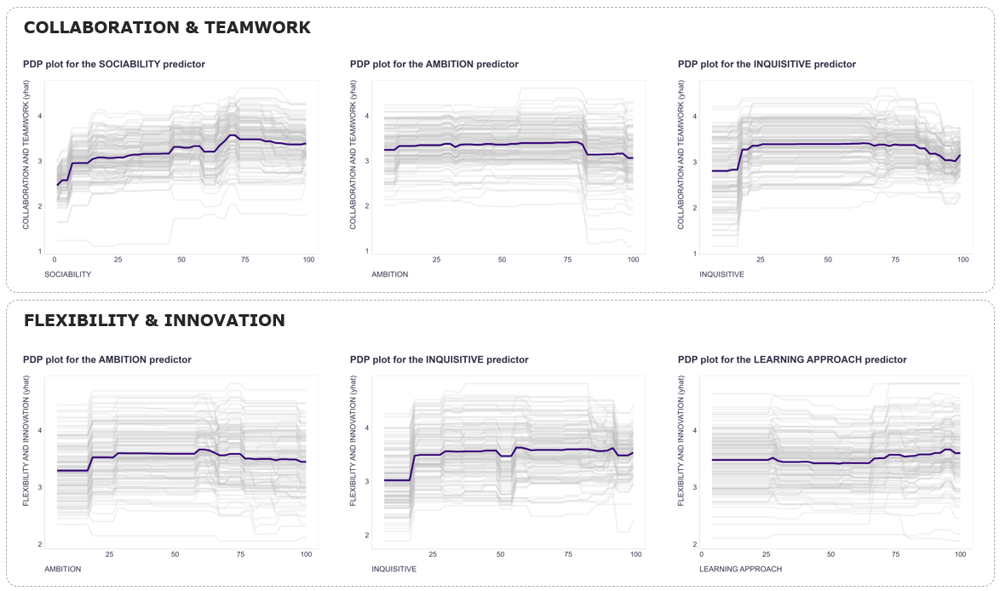

I recently came across a post discussing research that highlights how the prediction power of personality traits in relation to business outcomes may be underestimated because most studies rely on linear analytical methods, which, unlike many ML algorithms like Random Forest or XGBoost, fail to capture and utilize nonlinear signals in the data.

This led me to reflect that maybe it’s not just the prediction power that suffers from this limitation. The true nature and shape of these relationships are likely misunderstood as well as a result of relying on linear methods. We’re used to reading about positive or negative correlations between personality traits and various outcomes, but the reality is probably more complex and nuanced.

For a quick visual, I’ve attached charts from one of my recent projects, illustrating how the top three personality trait predictors, as measured by the HPI, relate to employee performance across two competencies, as modeled by XGBoost and visualized using Partial Dependence Plots - a global ML interpretation tool. Notice how these relationships aren’t simply positive or negative but show clear non-linearities.

<div style="text-align:center">
{width=100%}
</div>

With interpretable ML, exploring these nuances becomes pretty straightforward. If you haven’t dived into these waters yet, give it a try - you might be surprised (or not) by what you find 😉

P.S. Below is a snippet of R code if you'd like to start experimenting with your own data. 


```{r eval=FALSE}

# libraries
library(tidyverse)
library(readxl)
library(recipes)
library(tidymodels)
library(xgboost)
library(vip)
library(pdp)

# uploading data
data <- read_xlsx("your_data.xlsx")

# setting the target and predictors
target <- "Agility_and_Initiative"
predictors <- c("Adjustment", "Ambition", "Sociability", "Interpersonal_Sensitivity", "Prudence", "Inquisitive", "Learning_Approach")

# specifying the formula
fmla <- as.formula(paste(target, " ~ ."))

# dropping rows without the target
predDf <- mydata %>%
  drop_na(target) %>%
  select(all_of(c(target, predictors)))

# defining recipe for data preparation
recipe_spec <- recipe(fmla, data = predDf) %>%
  step_impute_knn(all_predictors(), neighbors = 3) %>%
  step_dummy(all_nominal_predictors())

# specifying the model and running the whole pipeline
set.seed(1234)
workflow_fit_xgb <- workflow() %>%
  add_model(boost_tree(mode = "regression") %>% set_engine("xgboost")) %>%
  add_recipe(recipe_spec) %>%
  fit(predDf)

# identifying and visualizing the most important predictors
workflow_fit_xgb$fit$fit$fit %>% 
  vi() %>%
  ggplot(aes(x =  fct_reorder(Variable, Importance), y = Importance)) +
  geom_bar(stat = "identity", fill = "#003d73", color = "#003d73") +
  coord_flip() +
  labs(
    y = "IMPORTANCE",
    x = "PREDICTORS",
    title = str_glue("Strength of predictors of {target}"),
    caption = "\nXGBoost algorithm is used for identification of the most important predictors."
  ) +
  theme(plot.title = element_text(color = '#2C2F46', face = "bold", family = "URW Geometric", size = 18, margin=margin(0,0,20,0)),
        plot.subtitle = element_text(color = '#2C2F46', face = "plain", family = "URW Geometric", size = 16, margin=margin(0,0,20,0)),
        plot.caption = element_text(color = '#2C2F46', face = "plain", family = "Nunito Sans", size = 11, hjust = 0),
        axis.title.x.bottom = element_text(margin = margin(t = 15, r = 0, b = 0, l = 0), color = '#2C2F46', face = "plain", family = "Nunito Sans", size = 14, lineheight = 16, hjust = 0),
        axis.title.y.left = element_text(margin = margin(t = 0, r = 15, b = 0, l = 0), color = '#2C2F46', face = "plain", family = "Nunito Sans", size = 14, lineheight = 16, hjust = 1),
        axis.text = element_text(color = '#2C2F46', face = "plain", family = "Nunito Sans", size = 13, lineheight = 16),
        panel.border = element_rect(color = "#E0E1E6", fill = NA),
        axis.line.x = element_line(colour = "#E0E1E6"),
        axis.line.y = element_line(colour = "#E0E1E6"),
        legend.position = "top",
        legend.direction = "horizontal",
        legend.justification = c(0, 1),
        legend.key = element_rect(fill = "white"),
        legend.key.width = unit(1.6, "line"),
        legend.margin = margin(0,0,0,0, unit="cm"),
        legend.text = element_text(color = '#2C2F46', face = "plain", family = "Nunito Sans", size = 10, lineheight = 16),
        panel.background = element_blank(),
        panel.grid.major.y = element_blank(),
        panel.grid.major.x = element_blank(),
        panel.grid.minor = element_blank(),
        axis.ticks.x = element_line(color = "#E0E1E6"),
        axis.ticks.y = element_line(color = "#E0E1E6"),
        plot.margin=unit(c(5,5,5,5),"mm"), 
        plot.title.position = "plot",
        plot.caption.position =  "plot"
  )

# exploring the shape of relationship between the target and its predictors using ICE & PDP

# preparing pre-processed data for partial function 
preprocessedData <- recipe_spec %>%
  prep() %>%
  bake(new_data = predDf)

# function for computation of ICE and PDP
pred <- function(object, newdata){
  # Predict and return the vector of predictions, not the mean
  results <- as.numeric(as.data.frame(predict(object, newdata))[[1]])
  return(results)  # Return a vector, not a single number
}

# function for computation of PDP only
# pred <- function(object, newdata){
#   results <- mean(as.numeric(as.data.frame(predict(object, newdata))[[1]]))
#   return(results)
# }
  
# predictor of interest
predictor <- "Prudence"

# computing ICE
g <- partial(
  object = workflow_fit_xgb,
  pred.var = predictor,
  pred.fun = pred,
  grid.resolution = 50,
  ice=TRUE,
  type = "regression",
  train = preprocessedData %>% select(-target),
  plot = FALSE
)

# computing PDP part (average yhat for individual predictor values)
g2 <- g %>% 
  group_by(!!sym(predictor)) %>% 
  summarise(avg_yhat = mean(yhat)) %>% 
  ungroup()

# ICE & PDP dataviz
ggplot()+
  geom_line(mapping=aes_string(x = predictor, y = "yhat", group="yhat.id"), data=g, size = 1.35, color = "grey", alpha=0.2) + 
  geom_line(mapping=aes_string(x = predictor, y = "avg_yhat", group=1), data=g2, size = 1.5, color = "#340078", alpha=1) +
  labs(
    x = str_to_upper(str_replace_all(predictor, '_', ' ')),
    y = str_glue("{str_to_upper(str_replace_all(target, '_', ' '))} (yhat)"),
    title = str_glue("PDP plot for the {str_to_upper(str_replace_all(predictor, '_', ' '))} predictor")
  ) +
  theme(plot.title = element_text(color = '#2C2F46', face = "bold", family = "URW Geometric", size = 18, margin=margin(0,0,20,0)),
        plot.subtitle = element_text(color = '#2C2F46', face = "plain", family = "URW Geometric", size = 16, margin=margin(0,0,20,0)),
        plot.caption = element_text(color = '#2C2F46', face = "plain", family = "Nunito Sans", size = 11, hjust = 0),
        axis.title.x.bottom = element_text(margin = margin(t = 15, r = 0, b = 0, l = 0), color = '#2C2F46', face = "plain", family = "Nunito Sans", size = 14, lineheight = 16, hjust = 0),
        axis.title.y.left = element_text(margin = margin(t = 0, r = 15, b = 0, l = 0), color = '#2C2F46', face = "plain", family = "Nunito Sans", size = 14, lineheight = 16, hjust = 1),
        axis.text = element_text(color = '#2C2F46', face = "plain", family = "Nunito Sans", size = 13, lineheight = 16),
        panel.border = element_rect(color = "#E0E1E6", fill = NA),
        axis.line.x = element_line(colour = "#E0E1E6"),
        axis.line.y = element_line(colour = "#E0E1E6"),
        legend.position = "top",
        legend.direction = "horizontal",
        legend.justification = c(0, 1),
        legend.key = element_rect(fill = "white"),
        legend.key.width = unit(1.6, "line"),
        legend.margin = margin(0,0,0,0, unit="cm"),
        legend.text = element_text(color = '#2C2F46', face = "plain", family = "Nunito Sans", size = 10, lineheight = 16),
        panel.background = element_blank(),
        panel.grid.major.y = element_blank(),
        panel.grid.major.x = element_blank(),
        panel.grid.minor = element_blank(),
        axis.ticks.x = element_line(color = "#E0E1E6"),
        axis.ticks.y = element_line(color = "#E0E1E6"),
        plot.margin=unit(c(5,5,5,5),"mm"), 
        plot.title.position = "plot",
        plot.caption.position =  "plot"
  )


```
