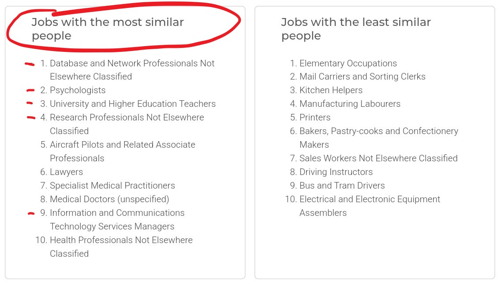

Over the years, it seems I’ve gravitated toward a job family that aligns well with my personality - or at least, that’s how it appears when you find job choices of other similarly-minded people as a validation of your own choices 😉

Attached, you can see one of my results from an online tool that measures the Big Five personality traits and compares them with the personality profiles of individuals across various occupations.

{width=100%}

It’s based on research by [Anni, Vainik, & Mõttus (2024)](https://psycnet.apa.org/fulltext/2025-38154-001.html){target="_blank"}, which examined personality trait patterns across 263 occupations and yielded following key insights:

* Certain personality traits align predictably with specific jobs, supporting the person–job fit model. For instance, openness is more common in creative fields, while conscientiousness tends to be higher in managerial roles.
* Occupations account for 2%–7% of the variance in Big Five personality traits, suggesting modest but meaningful differences across roles.
* Occupations with high average levels of traits linked to job performance (e.g., conscientiousness) show greater homogeneity in these traits, indicating selective environments.
* The results align with previous studies across different regions, suggesting that these occupational-personality trends are broadly applicable across cultures.
* Detailed personality traits beyond the Big Five (e.g., specific aspects of extraversion or conscientiousness) explain even more variance, illustrating nuanced differences among job incumbents.

These findings suggest that while personality explains only part of the variation among occupations, it may still offer valuable insights for career counseling and personal development.

If you’d like to try the tool yourself, here’s the [link](https://apps.psych.ut.ee/JobProfiler/){target="_blank"}.