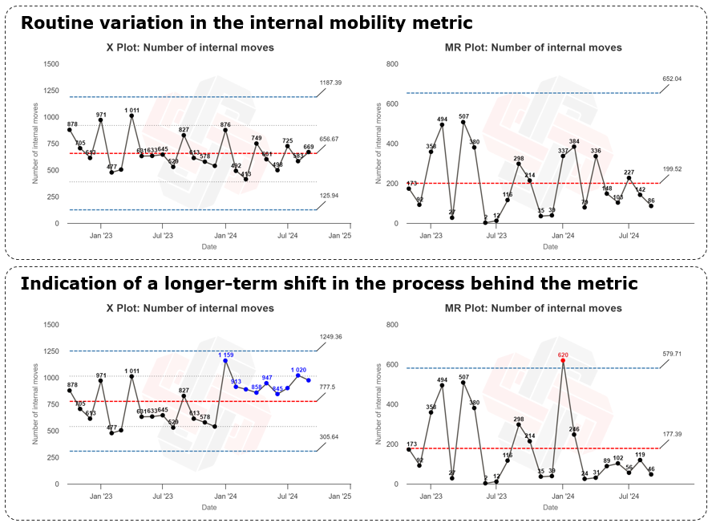

I'm curious if anyone in People Analytics space has experience - good, bad, or a bit of both - using XmR charts for tracking and interpreting HR-related metrics and guiding follow-up process improvements, especially among non-technical end users.

I stumbled upon this interesting tool, originally rooted in statistical process control in industrial engineering and manufacturing, through posts by [Frank Corrigan](https://www.linkedin.com/in/frankxc/){target="_blank"}, and recently dug a bit deeper into it through a series of email lectures from [Commoncog](https://commoncog.com/){target="_blank"}.

From the get-go, it struck me as a potentially effective way for HR or business people - who may not have deep data expertise - to become more data-driven, as it simplifies the task of separating signal from noise and makes it straightforward for even laypeople to determine whether changes in metrics are due to real shifts or just random fluctuations. In effect, it helps users address the "So what?" question by validating when data points signify something meaningful, like a trend, shift, or outlier that warrants further action or adjustment.

As the attached charts illustrate (based on a sample of dummy data tracking internal mobility), it is pretty intuitive to spot if a metric should (or should not) require further investigation into the process behind it, or whether a change introduced at the start of 2024 is actually impacting the numbers. All you really need to do is keep an eye on the limit lines and follow some basic rules, such as:

1. Investigate when a point is outside the limit lines.
2. Take a closer look if three out of four successive points are near the limits rather than the center.
3. If eight consecutive points appear on one side of the average, that may signal a meaningful shift.

{width=100%}

Would love to hear any experiences you might’ve had with XmR charts in the PA space! 🙏

P.S. The attached charts were created with [Xmrit, a free online tool](https://click.convertkit-mail2.com/zlup0g28rga7ulmg9quphw09qg00c6/owhkhqhr55le7eaq/aHR0cHM6Ly94bXJpdC5jb20vdC8=){target="_blank"} from Commoncog, whose website also has more useful information about this analytical tool.