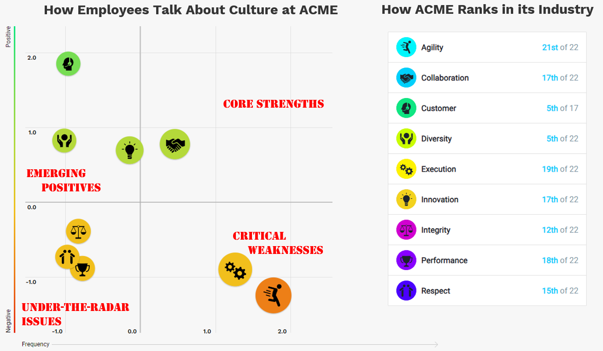
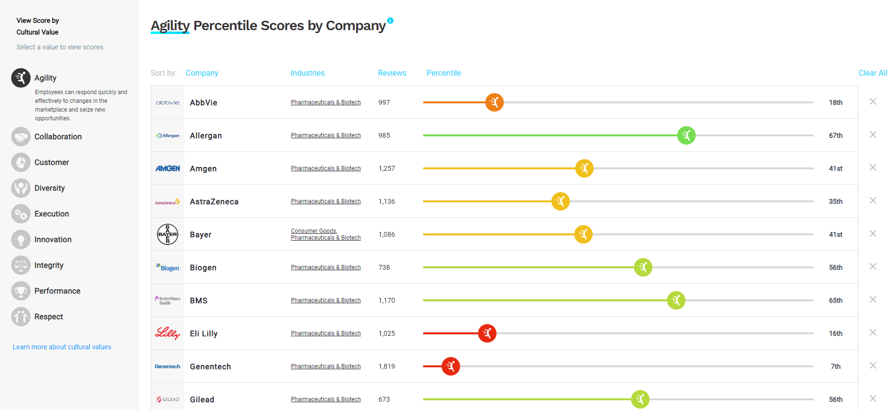

I recently came across the [Culture 500](https://sloanreview.mit.edu/culture500){target="_blank"} - an interesting tool created by MIT Sloan Management Review and CultureX, which offers a data-driven evaluation of corporate culture across the Big Nine Cultural Values as assessed through analysis of over 1 million employee reviews on Glassdoor. The model used includes the following nine culture values:

* **Agility:** *Employees can respond quickly and effectively to changes in the marketplace and seize new opportunities.*
* **Collaboration:** *Employees work well together within their team and across different parts of the organization.*
* **Customer:** *Employees put customers at the center of everything they do, listening to them and prioritizing their needs.*
* **Diversity:** *The company promotes a diverse and inclusive workplace where no one is disadvantaged because of their gender, race, ethnicity, sexual orientation, religion, or nationality.*
* **Execution:** *Employees are empowered to act, have the resources they need, adhere to process discipline, and are held accountable for results.*
* **Innovation:** *The company pioneers novel products, services, technologies, or ways of working.*
* **Integrity:** *Employees consistently act in an honest and ethical manner.*
* **Performance:** *The company rewards results through compensation, informal recognition, and promotions, and deals effectively with underperforming employees.*
* **Respect:** *Employees demonstrate consideration and courtesy for others, and treat each other with dignity.*

The tool’s primary chart visualizes each company's results by showing, in standard deviations, the frequency of mentions and the sentiment toward each cultural value discussed in employee reviews. The resulting 2x2 matrix provides a clear dataviz that aids in identifying a company's core strengths, critical weaknesses, emerging positives, and under-the-radar issues (see the example below).

With a standardized scale, one can quickly see how their company’s culture compares to that of other companies across individual values. The tool also allows side-by-side comparisons, helping leaders benchmark against both industry standards and standout peers (see the example below).

{width=100%}

{width=100%}

This tool can be a nice complement to an internal employee listening program, giving an outside perspective. That said, if your listening program is on point, the results shouldn’t come as a big surprise 😉 Also could be a helpful resource for anyone weighing job offers and looking to understand a company’s culture before joining.

⚠️ When using the tool, one should keep in mind its limits, like potential review bias, limited cross-industry comparability, constraints in capturing nuanced sentiments and emerging cultural dimensions, the freshness of data reflecting real-time changes, dependency on Glassdoor’s review policies, focus restricted to nine core values, and exclusion of global employee perspectives. And as its name suggests, it includes results for only around 500 leading companies.

To learn more about the methodology behind the tool, check out [this site](https://sloanreview.mit.edu/projects/measuring-culture-in-leading-companies/){target="_blank"}.
