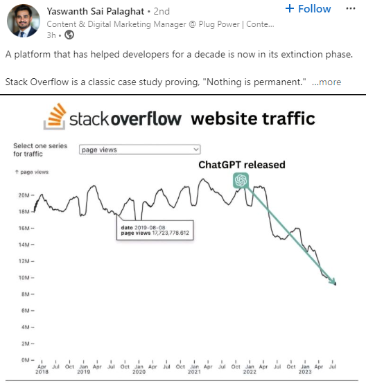
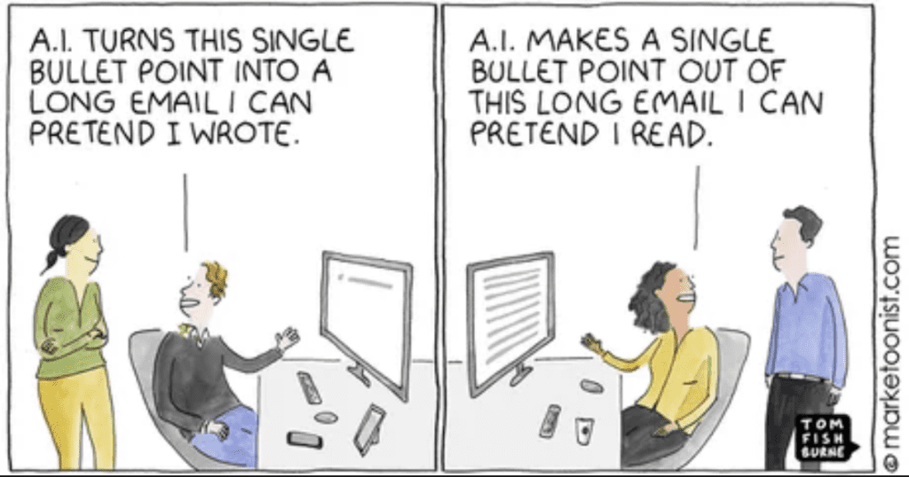
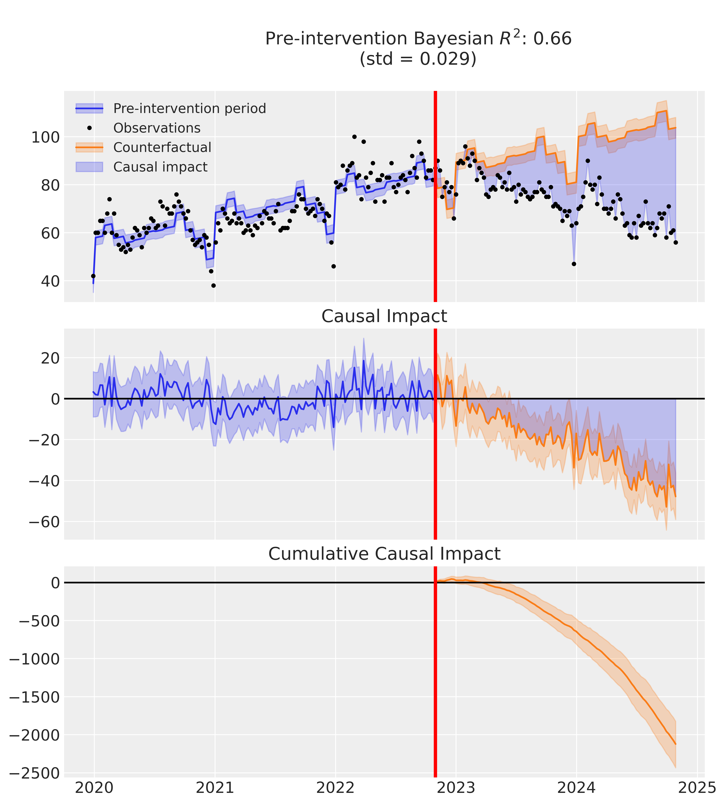

I wanted to try out the new [CausalPy](https://causalpy.readthedocs.io/en/latest/?s=09){target="_blank"} package for causal inference and was brainstorming interesting research questions to apply it to. My inspiration came from a recent wave of LI posts in my feed, all sharing a chart showing a drop in Stack Overflow traffic after ChatGPT’s release in November 2022.

<div style="text-align:center">
{width=75%}
</div>

Given that many studies - including one we conducted internally at Sanofi - show that one of the most frequent use cases for GenAI in the business world is helping with email writing (we've probably all seen the hilarious meme on this topic shown below 😁), I got curious about whether a similar pattern might show up in Google Trends for searches like “*How to write an email.*”

<div style="text-align:center">
{width=75%}
</div>

For the analysis, I used an [interrupted time series method](https://academic.oup.com/ije/article/46/1/348/2622842){target="_blank"}, which examines the effect of an intervention by comparing time series data before and after the intervention that happened at a known point in time, allowing us to assess any shifts in level or trend.

As the resulting charts below show, there does seem to be a noticeable drop in searches on how to write emails following ChatGPT’s official release. In fact, the shift is so pronounced that it’s clear even with a quick eyeballing analysis. Sure, we can speculate about other factors to be involved - maybe we're sending fewer emails because we’re relying more on platforms like Slack or Teams - but as other available stats suggest (see, for example, [this one](https://financesonline.com/email-statistics/){target="_blank"}), we can only wish that were the case 😉

<div style="text-align:center">
{width=100%}
</div>

Either way, CausalPy turned out to be a super easy-to-use and user-friendly tool. I'm looking forward to using it in my future projects. Kudos to the entire CausalPy team! 👏

P.S. To replicate the analysis, you can use the Python code below.

```{r}
# uploading the reticulate package for running Python in .Rmd file
library(reticulate)
```

```{python eval=FALSE}

# uploading libraries
import pandas as pd
import numpy as np
from pytrends.request import TrendReq
import matplotlib.pyplot as plt
import arviz as az
import causalpy as cp

# getting global Google Trends data for a key phrase of interest
# initializing the TrendReq object
pytrends = TrendReq(hl='en-US', tz=360, requests_args={'verify': False})

# specifying keyword and time range
keywords = ['How to write email']
timeframe = '2020-01-01 2024-10-31'

# creating payload and fetching data
pytrends.build_payload(keywords, cat=0, timeframe=timeframe, geo='', gprop='')
data = pytrends.interest_over_time()

# data overview
# data.head()
# data.info()

# creating month variable for capturing seasonality in the data
data['month'] = data.index.month

# creating time variable
data['t'] = np.arange(len(data))

# renaming target variable
data.rename(columns={'How to write email': 'y'}, inplace=True)

# saving the data for later usage
# data.to_csv('google_trends_data.csv', index=True)

# specifying the date of intervention
treatment_time = pd.to_datetime("2022-10-30")

# specifying and fitting the model
seed = 2024
result = cp.InterruptedTimeSeries(
    data,
    treatment_time,
    formula="y ~ 1 + t + C(month)",
    model=cp.pymc_models.LinearRegression(
      sample_kwargs={
        "random_seed": seed, 
        "draws": 5000,
        "tune": 1000, 
        "chains": 4 
      }
    ),
)

# summary of the fitted model
result.summary()

# plotting the results
fig, ax = result.plot()
plt.show()

# summary statistics of the causal impact over the entire post-intervention period
az.summary(result.post_impact.mean("obs_ind"))

# summary statistics of the cumulative causal impact
# getting index of the final time point
index = result.post_impact_cumulative.obs_ind.max()
# grabbing the posterior distribution of the cumulative impact at this final time point
last_cumulative_estimate = result.post_impact_cumulative.sel({"obs_ind": index})
# getting summary stats
az.summary(last_cumulative_estimate)

```
