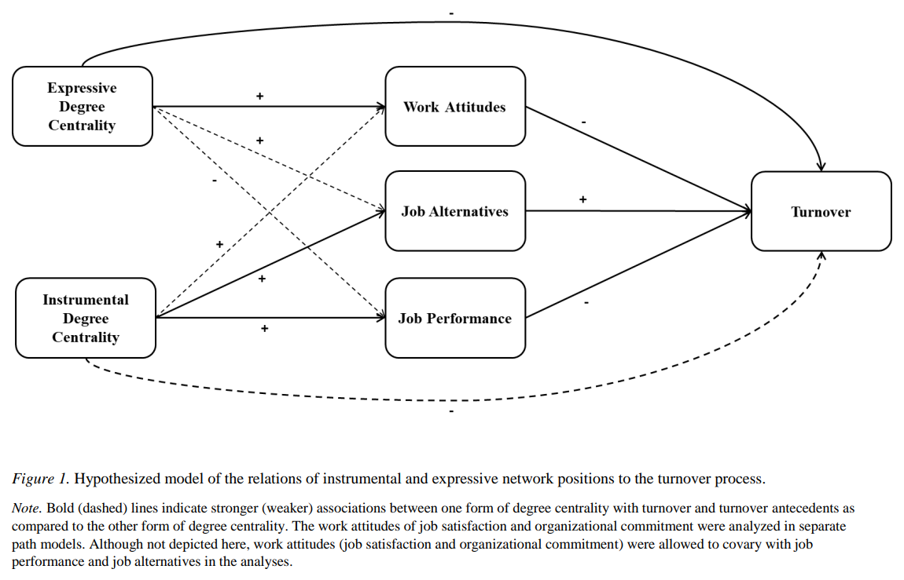

I recently came across an interesting and potentially useful meta-analysis by [Porter et al. (2018)](https://www.researchgate.net/publication/328379014_How_Do_Instrumental_and_Expressive_Network_Positions_Relate_to_Turnover_A_Meta-Analytic_Investigation/link/5bd1ee3fa6fdcc3a8da63aee/download?_tp=eyJjb250ZXh0Ijp7ImZpcnN0UGFnZSI6InB1YmxpY2F0aW9uIiwicGFnZSI6InB1YmxpY2F0aW9uIn19){target="_blank"} that used meta-analytic path analysis to explore specific mechanisms through which two types of workplace networks are related to employee turnover:

1. **Instrumental networks:** These are job-related connections that provide resources like advice, expertise, or work-related information, built through initiatives like knowledge-sharing programs, access to key stakeholders, and attending external conferences.
2. **Expressive networks:** These are connections with focus on emotional support, friendships, and social bonding, developed through activities like company social events, cross-team job rotations, and peer mentorship programs.

{width=100%}

The study found that both network types are connected with turnover but through different mechanisms. Instrumental ties reduce turnover by improving job performance (thanks to access to work-related resources) and strengthening organizational commitment. Meanwhile, expressive ties lower turnover by increasing job satisfaction (through emotional support and social bonds) and boosting organizational commitment.

What also stood out: Expressive network ties appear to be nearly three times as "sticky" (95% CI: [-0.60, -0.37]) as instrumental ties (95% CI: [-0.23, -0.07]) based on simple bivariate correlations. Moreover, after accounting for turnover antecedents such as job performance and satisfaction, only expressive ties maintained a negative association with turnover (*b* = -0.47, *SE* = 0.02).

While there are some limitations to consider - such as the relatively small number of studies, variability in how networks were measured, sampling bias, or missing contextual moderators - these estimates may still be useful for setting priors when considering the shape of retention strategies before conducting a similar analysis on your own data. Meanwhile, with only these results in hand, we might assume that, while instrumental ties help employees succeed in their jobs, they don’t generate the same level of 'stickiness' as expressive ties.