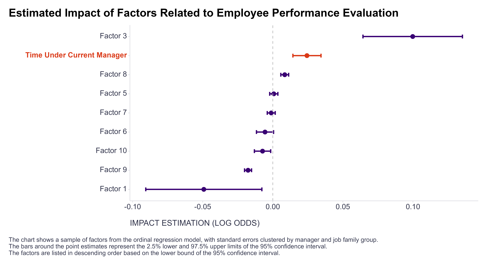

As the year comes to a close, my LinkedIn feed is buzzing with posts about performance evaluations - some positive, but mostly calling out the negatives. This, combined with reflecting on one of my own past experiences as a people manager, got me wondering: do managers who are relatively new to their direct reports tend to be stricter (or perhaps more objective?) in their evaluations, on average?

My hypothesis is based on the assumption that a shorter history with their direct reports allows managers to focus more purely on performance, without the influence of relationship-building efforts, potentially leading to more objective assessments.

One straightforward way to explore this question is to analyze how employee evaluations vary based on the length of time they’ve worked under their current manager - while controlling for other relevant factors like employees’ and managers’ age, company and position tenure, gender, etc.  

Looking at the available data, it seems to support my initial “suspicion.” The effect is there but quite small - specifically, there’s only a 2.5% increase in the odds of being in a higher performance category for each additional year spent working under the same manager (95% CI [1.4%, 3.5%]). However, when compounded over four years - a realistic scenario for the average employee - this results in a more noticeable 10.3% increase.

{width=100%}

While this sheds some light on my original question, it’s worth noting that this pattern could still be explained by alternative mechanisms. For instance, over time, direct reports’ performance might better align with their manager’s expectations as they incorporate their feedback. Another possible explanation is a selection effect, where managers are more likely to retain those they consider to be high performers in their teams over time. So, the quest can happily continue 😉

Curious if anyone has practical experiences with systematically studying the mechanisms behind managers’ evaluations of their direct reports’ performance. If so, I’d love to hear your thoughts or suggestions - feel free to share them in the comments or drop me a message via [email](mailto:ludek.stehlik@gmail.com) or [LinkedIn](https://www.linkedin.com/in/ludekstehlik/){target="_blank"}.         

