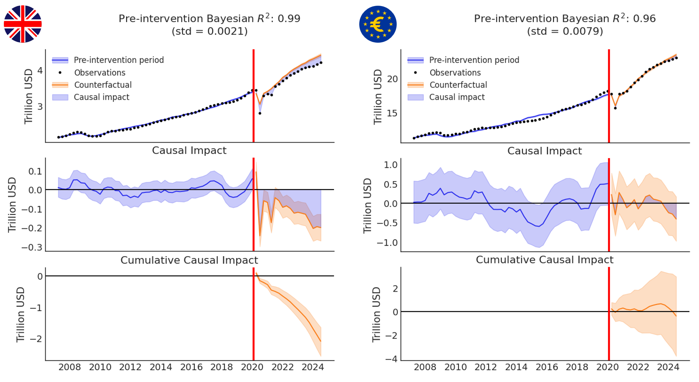

This gap in the conversation provides a great opportunity to try out a causal inference method from the [CausalPy](https://causalpy.readthedocs.io/en/latest/?s=09){target="_blank"} package, specifically, the [synthetic control method](https://en.wikipedia.org/wiki/Synthetic_control_method){target="_blank"} (with the caveat that its implementation is still a wip, so the outputs should be taken with a grain of salt). Generally, this technique constructs a weighted combination of control units to mimic the characteristics of a treated unit, enabling us to estimate the causal effect of an intervention without a traditional control group.

For the analysis, I looked at the combined GDP of 20 eurozone countries from 2007 to 2023 as the outcome of interest. To construct the synthetic control group for counterfactual comparison, I used GDP data from selected OECD countries (non-EU, non-eurozone, non-UK) over the same period.

<div style="text-align:center">
{width=100%}
</div>

To my surprise, the results for the eurozone countries contrast pretty starkly with those for the UK (see the charts above). There doesn’t seem to be strong evidence of a significant negative impact from Brexit on eurozone GDP. Of course, this is just one facet of Brexit’s potential effects. There may be many other consequences - beyond what GDP metrics reveal - that apply to the eurozone as well. Still, it’s interesting to observe such a stark difference using the same type of data and methodology. 

Maybe it reflects what we often see in personal relationships: divorce usually affects both sides, but the costs are only rarely distributed equally and/or in the same ways 🤔

P.S. If interested, the data from the [OECD Data Explorer](https://data-explorer.oecd.org/){target="_blank"} and the code for replicating this analysis are provided below.


```{r}

# reticulate library for running Python in .Rmd file
library(reticulate)
# libraries for data manipulation and visualization
library(tidyverse)
library(DT)

# uploading the data from the OECD Data Explorer at https://data-explorer.oecd.org/
df <- readr::read_csv("oecd_data.csv")

# table view of two rows of the data
DT::datatable(
  df,
  class = 'cell-border stripe', 
  filter = 'top',
  extensions = 'Buttons',
  fillContainer = FALSE,
  rownames= FALSE,
  options = list(
    pageLength = 2, 
    autoWidth = TRUE,
    dom = 'Bfrtip',
    buttons = c('copy', 'csv', 'excel'),
    buttons = c('copy'), 
    scrollX = TRUE, 
    selection="multiple"
  )
)

```

```{python eval=FALSE}

# uploading libraries for data manipulation, visualization, and causal inference
import numpy as np
import pandas as pd
import matplotlib.pyplot as plt
import arviz as az
import causalpy as cp
az.style.use("arviz-white")

# uploading the data from the OECD Data Explorer at https://data-explorer.oecd.org/
data = pd.read_csv('oecd_data.csv')
data.info()
data.head()

# keeping only relevant variables
data = data[[
    'Reference area',
    'TIME_PERIOD',
    'OBS_VALUE'
]]

# cleaning the quarter column
# function to calculate the last day of the quarter
def quarter_to_date(q):
    year, quarter = q.split('-')
    quarter_month_map = {
        'Q1': '03-31',
        'Q2': '06-30',
        'Q3': '09-30',
        'Q4': '12-31'
    }
    return f"{year}-{quarter_month_map[quarter]}"

data['TIME_PERIOD'] = data['TIME_PERIOD'].apply(quarter_to_date)
data['TIME_PERIOD'] = pd.to_datetime(data['TIME_PERIOD'], format='%Y-%m-%d')

# cleaning the country names
data['Reference area'] = data['Reference area'].str.replace('- ', '', regex=True).str.replace(' ', '_', regex=True).str.replace(r'[()]', '', regex=True)

# putting data on the trillion/billion (10^12) unit scale
data['OBS_VALUE'] = data['OBS_VALUE']/1000000

# getting data from long to wide format
melted_df = data.melt(id_vars=['Reference area', 'TIME_PERIOD'], var_name='Variable', value_name='Value')
pivoted_df = melted_df.pivot(index='TIME_PERIOD', columns='Reference area', values='Value')
pivoted_df.info()

# removing countries with missing values in the time series data
pivoted_df.drop(columns=['Saudi_Arabia', 'Russia'], inplace=True)

# removing row for date where we have data for only one country
pivoted_df = pivoted_df[pivoted_df.index != pd.to_datetime('2024-09-30')]

# identifying countries (that didn't left EU) GDP of which most strongly correlated with UK's GDP before actual Brexit (2020 January 31)
correlation_df = pivoted_df[pivoted_df.index <= pd.to_datetime("2020 January 31")].corr()
print(correlation_df[['United_Kingdom']].drop('United_Kingdom').sort_values(by='United_Kingdom', ascending=False))


# Analysis 1: The impact of Brexit on UK GDP

# target country of interest
target_country = 'United_Kingdom'
# control countries (top 15)
other_countries = [
    "United_States",
    "Costa_Rica",
    "Germany",
    "New_Zealand",
    "Sweden",
    "Austria",
    "Luxembourg",
    "Denmark",
    "Belgium",
    "Korea",
    "Canada",
    "Lithuania",
    "France",
    "India",
    "Estonia"
]

# formula
formula = target_country + " ~ " + "0 + " + " + ".join(other_countries)
print(formula)

# modeling data preparation
treatment_time = pd.to_datetime("2020 January 31")
modeling_data = pivoted_df.copy()
modeling_data = modeling_data[[target_country] + other_countries]
modeling_data.dropna(axis='rows', inplace=True, how='all')

# fitting the model
result = cp.SyntheticControl(
    modeling_data,
    treatment_time,
    formula=formula,
    model=cp.pymc_models.WeightedSumFitter(
        sample_kwargs={
        "random_seed": 2024, 
        "draws": 10000,
        "tune": 5000, 
        "target_accept": 0.99,
        "chains": 4 
      }
    )
)

# results summary
az.summary(result.idata, var_names=["~mu"])

# visualization of the posterior samples
az.plot_trace(result.idata, var_names="~mu", compact=False)
plt.show()

# visualization of the estimated causal effect
fig, ax = result.plot(plot_predictors=False)
for i in [0, 1, 2]:
    ax[i].set(ylabel="Trillion USD")
plt.show()


# Analysis 2: The impact of Brexit on the GDP of eurozone countries

# identifying countries (non-EU, non-eurozone, non-UK) GDP of which most strongly correlated with eurozone countries' GDP before actual Brexit (2020 January 31)
correlation_df = pivoted_df[pivoted_df.index <= pd.to_datetime("2020 January 31")].corr()
print(correlation_df[['Euro_area_20_countries']].drop('Euro_area_20_countries').sort_values(by='Euro_area_20_countries', ascending=False))

# target country of interest
target_country = 'Euro_area_20_countries'
# control countries (top 12)
other_countries = [
    "Costa_Rica",
    "New_Zealand",
    "United_States",
    "India",
    "Korea",
    "Colombia",
    "Canada",
    "Israel",
    "Iceland",
    "Switzerland",
    "Indonesia",
    "Australia"
]

# formula
formula = target_country + " ~ " + "0 + " + " + ".join(other_countries)
print(formula)

# modeling data preparation
treatment_time = pd.to_datetime("2020 January 31")
modeling_data = pivoted_df.copy()
modeling_data = modeling_data[[target_country] + other_countries]
modeling_data.dropna(axis='rows', inplace=True, how='all')

# fitting the model
result = cp.SyntheticControl(
    modeling_data,
    treatment_time,
    formula=formula,
    model=cp.pymc_models.WeightedSumFitter(
        sample_kwargs={
        "random_seed": 2024, 
        "draws": 10000,
        "tune": 5000, 
        "target_accept": 0.99,
        "chains": 4 
      }
    )
)

# results summary
az.summary(result.idata, var_names=["~mu"])

# visualization of the posterior samples
az.plot_trace(result.idata, var_names="~mu", compact=False)
plt.show()

# visualization of the estimated causal effect
fig, ax = result.plot(plot_predictors=False)
for i in [0, 1, 2]:
    ax[i].set(ylabel="Trillion USD")
plt.show()

```


