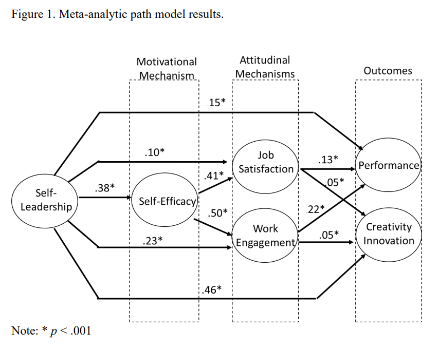

A recent meta-analysis by [Knotts et al. (2022)](https://www.tandfonline.com/doi/abs/10.1080/1359432X.2021.1953988){target="_blank"}, covering 57 studies with over 16K participants, put some numbers on just how important this skill may be when it comes to improving individual outcomes. Here are some of the key findings:

* **Pretty strong effect:** The overall relationship between self-leadership and individual outcomes is ρ = .38. It’s even stronger when it comes to creativity and innovation (ρ = .49) compared to basic task performance (ρ = .28).
* **It’s not just about actions — it’s about mindset too:** Behavioral strategies like goal-setting are helpful, but adding cognitive strategies like self-talk and mental imagery makes a big difference. People who use a combo of both have stronger results (ρ = .42) than those who focus only on behaviors (ρ = .27).
* **Self-efficacy is a key mediator:** The meta-analysis also found that self-leadership boosts self-efficacy — confidence in one’s ability to succeed. This, in turn, leads to better outcomes like job satisfaction, work engagement, and creativity.

{width=100%}

Caveat: Most of the studies included were correlational, meaning they show associations but don’t prove that self-leadership directly causes better performance. 

And here's some food for thought to end on: With companies implementing flexible work policies, it may be valuable for them to consider self-leadership as part of employee selection criteria. Do you already take this into account? If so, how do you assess this skill in candidates? Asking for a friend 😉