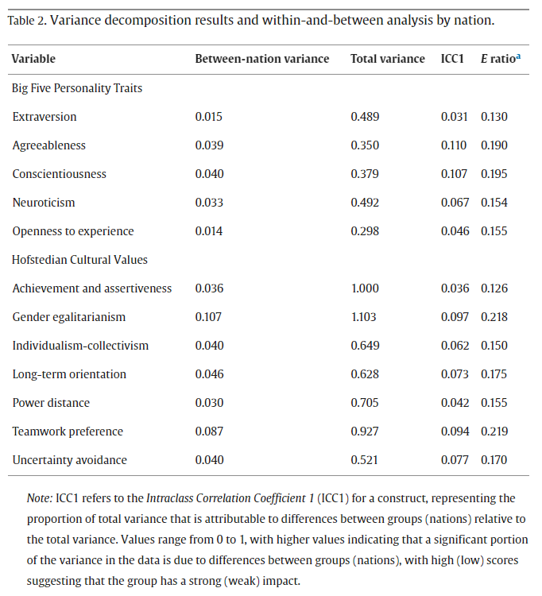
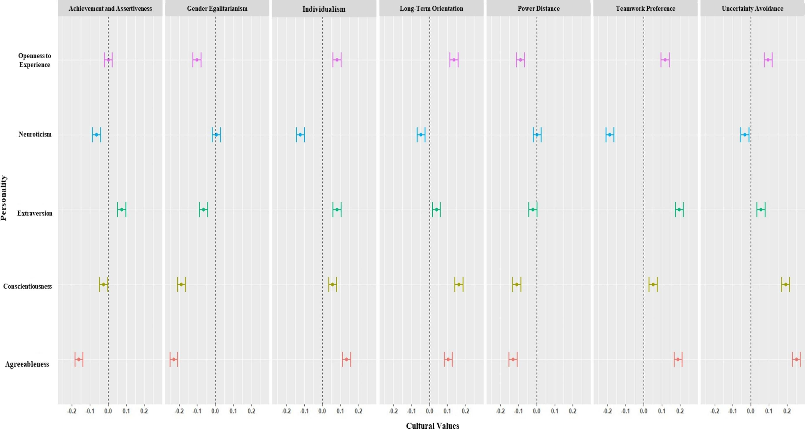

An interesting research paper by [Stackhouse et al. (2024)](https://www.sciencedirect.com/science/article/pii/S0191886924002551?ssrnid=4460757&dgcid=SSRN_redirect_SD){target="_blank"} looked at the sources of variance in people’s [Big Five personality](https://www.sciencedirect.com/topics/psychology/five-factor-model-of-personality){target="_blank"} and [Hofstede cultural values](https://en.wikipedia.org/wiki/Hofstede%27s_cultural_dimensions_theory){target="_blank"} (individual-level vs nation-level differences), and at the relationship between these two types of individual characteristics, while taking into account the multi-level nature of the data.

The authors used [intraclass correlation (ICC1)](https://en.wikipedia.org/wiki/Intraclass_correlation){target="_blank"} to decompose the source of variance in these two constructs. Unsurprisingly, they found that personality only shows small variability that can be attributed to differences between nations (for individual traits, it ranged between 3.1% and 11%). However, surprisingly, similar results were found also for cultural values (from 3.6% to 9.7%)! We thus differ in our cultural values within nations more than we would have expected.

{width=100%}

To assess the strength and direction of the association between personality and cultural values characteristics, the authors used [multilevel correlation analysis](https://www.sciencedirect.com/topics/psychology/multi-level-modeling){target="_blank"} and found that the correlations are much weaker than those suggested by previous studies that used only aggregated, nation-level data. The top three correlations - between uncertainty avoidance and agreeableness (*r* = 0.25), gender egalitarianism and agreeableness (*r* = −0.23), and teamwork preference and extraversion (*r* = 0.20) - made it only into the ‘weak effect’ area.

{width=100%}

*Multilevel associations between the Five Factor Model and cultural values.*

All this suggests that the next time you feel an urge to guess someone’s personality or cultural values from their nationality, or to infer one from another, think of this paper and maybe try to base your guess on other information about them 😉
