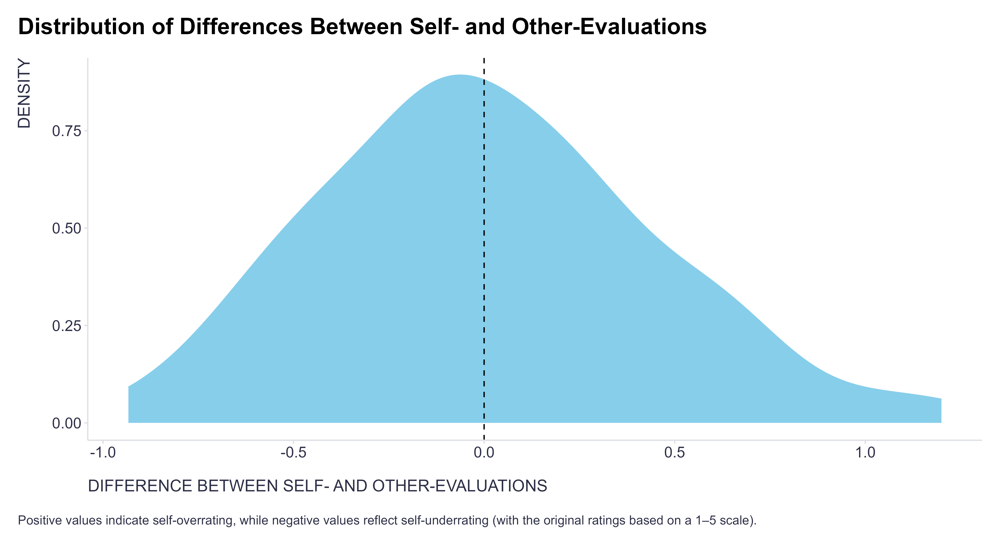
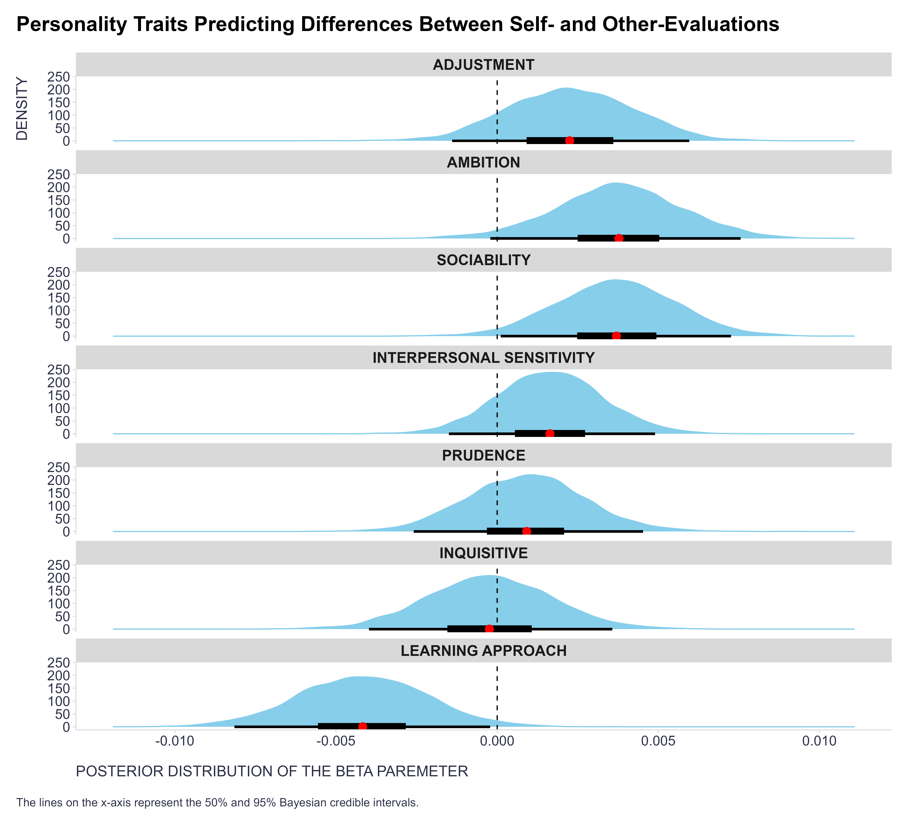
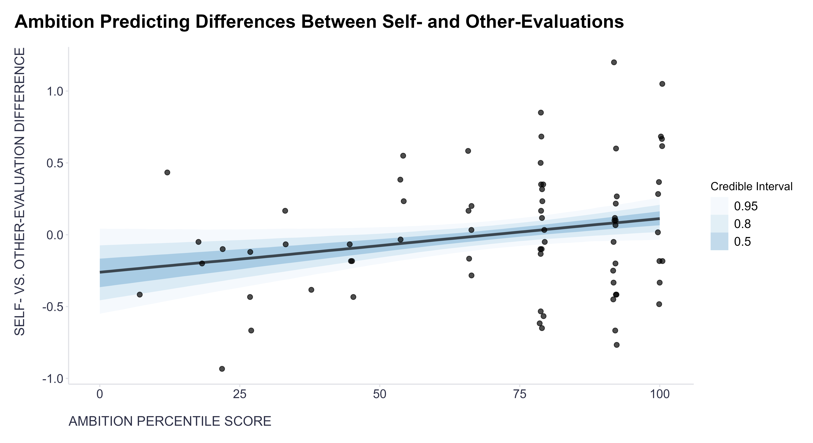
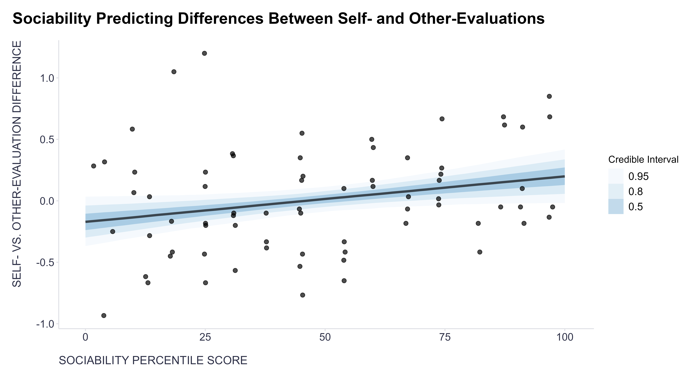
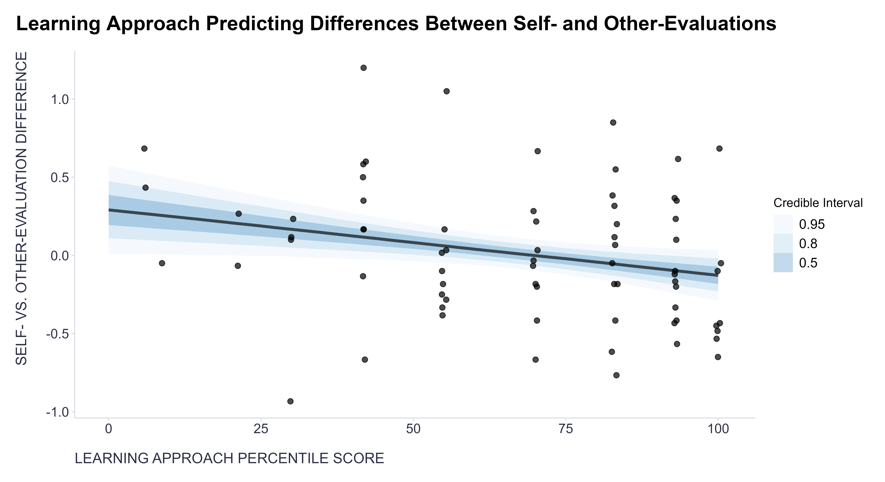
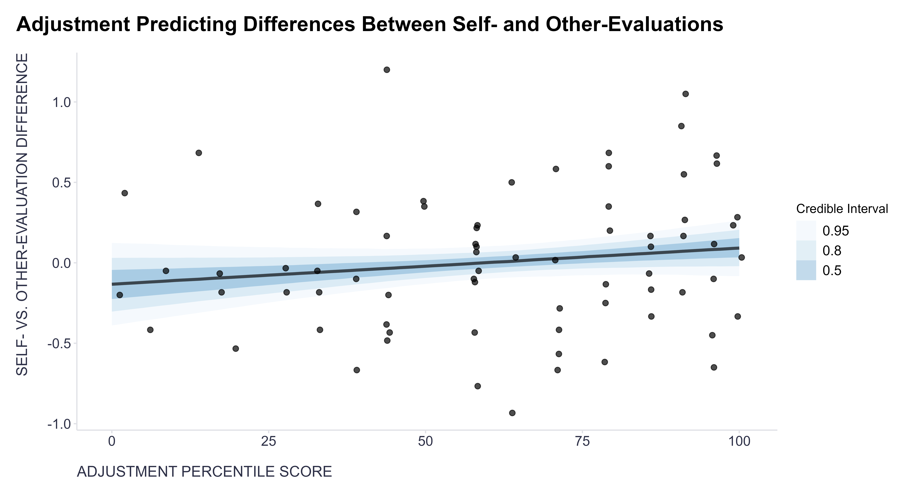

Many wise people (starting with Plato and his 'Know thyself' idea?) suggest that [self-awareness](https://journals.sagepub.com/doi/full/10.1177/1052562921990065){target="_blank"} is one of the key ingredients for psychological well-being, career success, and effective leadership, among other things.

If that’s true (see, for example, [this research paper](https://www.econstor.eu/handle/10419/251923){target="_blank"} on the impact of self-awareness on leadership behavior and effectiveness), it would be useful to understand what might get in the way of well-calibrated self-awareness. One potential obstacle could be our habitual patterns of feelings, thoughts, and behaviors, i.e., our personality.

But to explore this, we first need a way to measure self-awareness. One common (though imperfect) method in a business context is to compare self-evaluation with evaluations from others, such as through multi-rater feedback. The difference between these evaluations can then be analyzed alongside a valid personality measure.

In a small-scale project, I had the opportunity to conduct exactly this type of analysis. The individuals assessed—a selected group of 72 managers from a large CEE company—were distributed relatively symmetrically around the zero difference between their self-evaluations and the average evaluations by others across several competencies, measured on a 1–5 Likert scale. For personality, I had access to their data from the [Hogan Personality Inventory](https://www.hoganassessments.com/assessment/hogan-personality-inventory/){target="_blank"}, a business-oriented personality measure based on the [Five-Factor Model of personality](https://www.sciencedirect.com/topics/psychology/five-factor-model-of-personality){target="_blank"}.    

{width=100%}

When modeling the relationship between the discrepancy in self-evaluation and evaluation by others and individual personality traits, I employed a [generalized linear model](https://en.wikipedia.org/wiki/Generalized_linear_model){target="_blank"} with a Gaussian link function, and fitted it using the [brms package](https://github.com/paul-buerkner/brms){target="_blank"} for Bayesian modeling with its default priors. The results were as follows:

{width=100%}

1. People with higher ambition (assertive, competitive, goal-oriented) and higher sociability (outgoing, talkative, socially confident) tend to overrate their skills—and vice versa.
2. People with a stronger learning approach (curious, improvement-focused, achievement-driven) tend to underrate their skills—and vice versa.
3. There’s some, though not very strong, evidence that people with high adjustment (calm, resilient, stress-tolerant, and less receptive to feedback) also tend to overrate their skills—and vice versa.

To better understand the effects found, take a look at the scatter plots with fitted regression lines below:

{width=100%}

{width=100%}

{width=100%}

{width=100%}

These results are, IMO, pretty intuitive and not all that surprising—at least in hindsight 😉—though I personally expected a stronger effect of adjustment and inquisitive traits. What would be your take on it? Have you done a similar type of analysis? If so, what were your results? 

Caveat: The sample used was very small (just 72 people!) and highly specific—managers from a single company, industry, country, and region—so the results can’t be easily generalized to a broader population. Still, IMO, the findings offer some useful hints about when we should be more mindful of the possibility of misjudging our self-evaluation, whether by overestimating or underestimating ourselves. That said, we shouldn’t forget that overly optimistic self-deception can sometimes be useful, in the “fake it till you make it” spirit 😉
