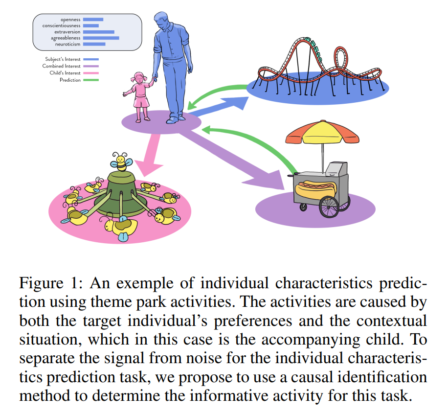
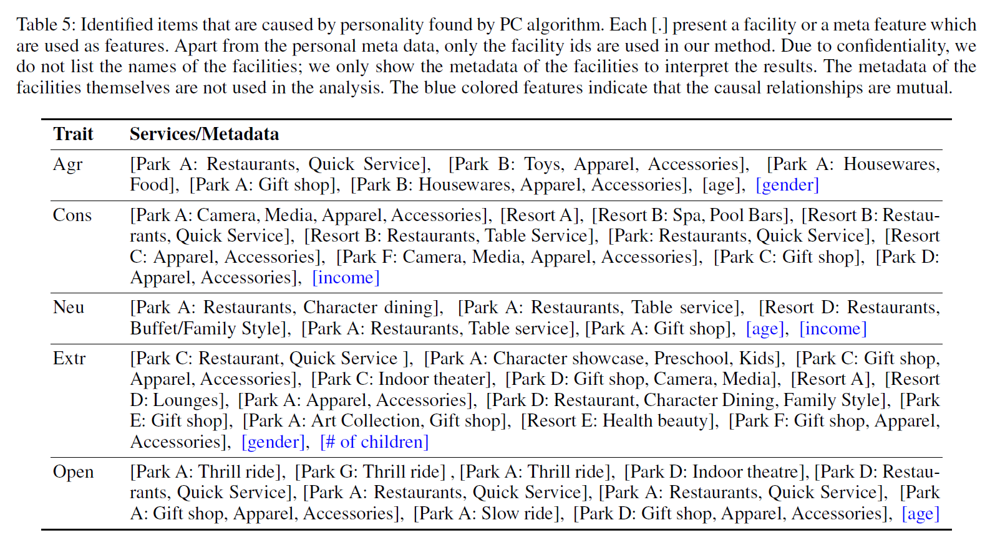

I just came across an interesting paper by [Ding, Zhang, & Bos (2018)](https://arxiv.org/abs/1712.07708?utm_source=chatgpt.com){target="_blank"}, who used automatic causal identification algorithms for feature selection and achieved better prediction performance with models based on these features than with models built in a more traditional way.

The authors specifically studied the experiences and choices of 3,293 visitors at a large theme park and attempted to use them to predict their Big Five personality characteristics. First, they applied two algorithms for causal identification—the [PC algorithm](https://mschauer.github.io/CausalInference.jl/latest/examples/pc_basic_examples/){target="_blank"} and the [Fast Greedy Equivalence Search algorithm](https://github.com/juangamella/ges?tab=readme-ov-file){target="_blank"}—to narrow down the candidate DAGs that explain the data. Then, they used the outputs from these algorithms to identify features that were causally impacted by the personality characteristic of interest. Finally, they built prediction models using only these features.

{width=80%}

The authors found that their ML pipeline, which incorporated causal identification for feature selection, outperformed baseline models in predicting individual characteristics (specifically, they used [LASSO linear regression](https://en.wikipedia.org/wiki/Lasso_(statistics)){target="_blank"}) as the baseline model, which also performs automatic feature selection). Beyond that, these models, according to the authors, provided more human-interpretable results. A win-win.

{width=100%}

For me, these results are quite surprising, as I would expect that if prediction performance were the only criterion, a purely “correlational” approach without causal constraints would perform better. I’m curious how these alleged benefits generalize to other types of situations—such as cases with less noise in the data. Definitely worth trying in one of my future projects.

Does anyone have experience with this specific approach to feature selection? Feel free to share your insights.