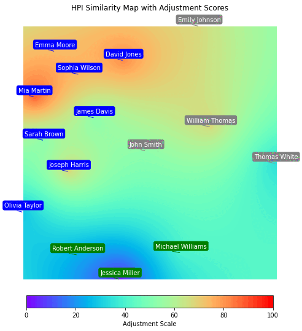

One of the most powerful and impactful ways to present team personality profiles during team development workshops—at least in my experience—is by allowing people to experience their similarities and differences as spatial distances in the real world.

A simple exercise for this is having the team stand in a line based on their scores for each personality dimension. This way, people can better see and "digest" how they relate to one another in psychological space.

This exercise can then be further supported with a multidimensional team map that translates individuals’ profile similarities and differences across all personality dimensions into an easily understandable spatial layout. The map visually represents these dis/similarities as distances, with color coding to indicate how each person scored on different personality traits.

This kind of dataviz can also help people recognize existing subgroups of like-minded individuals within the team. This process can even be automatized by applying a clustering algorithm to the personality profiles and displaying the results directly on the team map.

{width=75%}

*The GIF above shows several maps illustrating team members' psychological similarities across all HPI dimensions at once, their respective scores on individual HPI dimensions, and information about identified subgroups.*

To sum it up, if you run team development workshops, give it a try—your clients might find it valuable, and it could become a regular part of your practice.