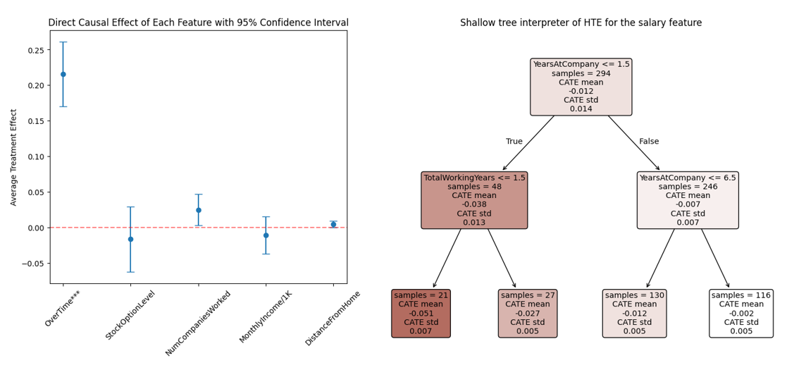

To be honest, whenever I see an analysis using the popular [IBM Employee Attrition dataset](https://www.kaggle.com/datasets/pavansubhasht/ibm-hr-analytics-attrition-dataset){target="_blank"}, I tend to ignore it and quickly skip to something more interesting and engaging. A classic search for shiny new things in action. 😉

Btw, did you know this dataset has already been with us for about 10 years? Pretty nice milestone anniversary! At least, that's what my OpenAI deep research found—it seems it was first released by IBM around September 2015 on its blog to showcase the IBM Watson Analytics platform's capabilities in an HR context. So, please take this finding with a grain of salt. However, after checking the sources (including my own memory), it seems pretty plausible to me. But feel free to correct me/us if I’m/we’re wrong.

Recently, however, I broke this habit when I came across a [Jupyter notebook on EconML’s GitHub](https://github.com/py-why/EconML/blob/main/notebooks/Solutions/Causal%20Interpretation%20for%20Employee%20Attrition%20Dataset.ipynb){target="_blank"} showcasing how to effectively combine classical ML—providing a list of strongest predictors—with their subsequent causal interpretation using [Double ML (DML)](https://docs.doubleml.org/stable/index.html){target="_blank"} and [Heterogeneous Treatment Effect (HTE)](https://www.sciencedirect.com/science/article/pii/S0049089X22001211){target="_blank"} estimation, nicely packaged into the [CausalAnalysis class](https://econml.azurewebsites.net/_autosummary/econml.solutions.causal_analysis.CausalAnalysis.html){target="_blank"}.

The entire pipeline includes the following steps:

1. Fine-tuning and training a traditional ML model.
2. Using [SHAP values](https://shap.readthedocs.io/en/latest/index.html){target="_blank"} for correlation interpretation of the results, identifying the top predictors highlighted by the ML model.
3. Employing DML combined with HTE to test whether these top predictors actually have a direct causal effect on attrition. While these may be strong predictors of employee departure, they don't necessarily drive employees to leave.
4. Using the HTE component for employee segmentation by specific risk factors, enabling individualized plans to reduce attrition. For instance, salary might have a higher causal impact on shorter-tenured employees, whereas overtime could show the opposite pattern.
5. Finally, cohort analysis, enabling assessment of causal effects of selected factors on new datasets, even down to the individual employee level.

{width=100%}

IMO, pretty cool stuff. It seems we indeed live not only in an AI revolution but also in a causal one ✊🙂

⚠️ Just a small (or big?) warning at the end: Despite the smooth and easy analytical workflow enabled by the CausalAnalysis class, it doesn't replace the need for strong domain knowledge and understanding which variables make sense to include in the model in the first place.