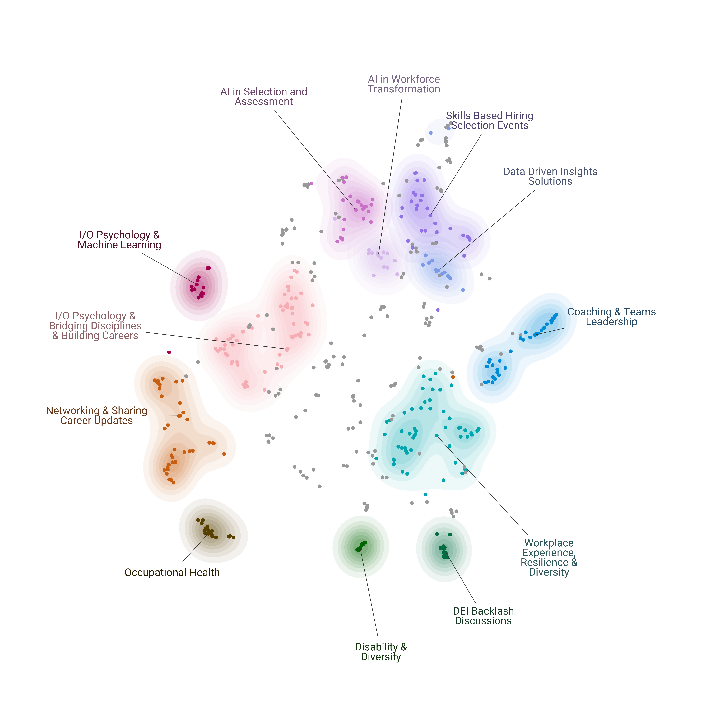

My LinkedIn bubble these days is full of posts from the [SIOP](https://www.siop.org/){target="_blank"} 2025 conference. Unfortunately, it’s too far for me to attend in person. So, to participate at least symbolically, I quickly ran a [BERTopic](https://maartengr.github.io/BERTopic/index.html){target="_blank"} pipeline on the SIOP event schedule to see what some of the major topics are and what I'll be missing. 😁

{width=100%}

Apparently, a large part is devoted to AI & ML, workplace experience, I/O psychology career-building, and networking—some really nice ones!

Fortunately, things aren't as hopeless as they might sound. We have a secret (or maybe not-so-secret) agent there: Marissa Post, our US colleague and an awesome member of our Sanofi People Insights team. She’s attending in person, so we'll at least get the industry news and gossip secondhand. 😉

To everyone attending, enjoy the conference—and please share some summaries on LinkedIn later! 🙏

