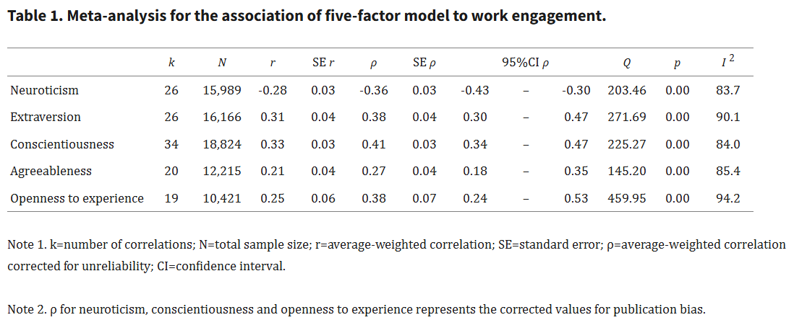

It's well-known that personality explains a large part of work engagement. For example, a recent meta-analysis by [Fokuzaki & Iwata (2022)](https://pmc.ncbi.nlm.nih.gov/articles/PMC8980698/?hl=en-US){target="_blank"} on this topic concluded that “*conscientiousness had the strongest association with WE (ρ=0.41), followed by extraversion and openness to experience (0.38), neuroticism (−0.36), and agreeableness (0.27). Moreover, 30% of the WE variance could be explained by the five-factor model (R^2^=0.33, 95%CI=0.26–0.49)*”.

{width=100%}

This pattern closely aligns with the theory of the general factor of personality (The Big One), a proposed basic, highest-level personality disposition characterized by high vs. low emotional stability, conscientiousness, agreeableness, extraversion, and openness, and associated with social desirability, emotionality, motivation, well-being, life satisfaction, and self-esteem [(Musek, 2007)](https://www.sciencedirect.com/science/article/pii/S0092656607000256){target="_blank"}.

But what about those of us who don’t fit the 'ideal' personality profile? Does that mean we're, on average, doomed to be less engaged at work? 🤔 Fortunately, no.

First, 30% of the variance is substantial but still leaves much unexplained. Therefore, other factors certainly play a role, many of which we can influence more easily than our personality traits. For instance, a recent meta-analysis on the antecedents (and outcomes) of work engagement by Mazzetti et al. (2023) found that closely following personal resources, which had the strongest effect of *r*=.48, were organizational (.47) and developmental resources (.45), with social (.36) and job resources (.37) slightly further behind.

{width=100%}

Second, various moderating mechanisms, such as workplace conditions, can be at play. For example, employees high in conscientiousness benefit more from increased job control, emotionally stable individuals respond better to higher job demands and greater autonomy, and introverted employees may derive more benefit from supervisor support compared to their extraverted counterparts [(Fokuzaki & Iwata, 2024)](https://www.mdpi.com/2076-328X/14/10/936){target="_blank"}.

{width=100%}

Third, the relationship between the two can be more complex, as suggested by [Narayanasami et al. (2023)](https://www.researchgate.net/publication/376263593_Disentangling_the_relationship_between_Big-Five_personality_characteristics_and_work_engagement_Evidence_from_India){target="_blank"}, who offered a more nuanced view by examining personality in relation to three specific facets of engagement—vigor, dedication, and absorption. Surprisingly, they found that “*contrary to what was hypothesized, the results suggest that (i) extraversion is negatively related to absorption, (ii) agreeableness is negatively related to dedication, (iii) neuroticism is positively related to vigor, and (iv) openness to experience is negatively related to dedication.*” 

{width=100%}

In short, personality matters, but it seems to be far from the one-ideal-personality-fits-all story. 😅

⚠️ A caveat to keep in mind: The studies referenced are primarily correlational and don't establish direct cause-and-effect relationships. Therefore, it's prudent to exercise caution when drawing causal conclusions.
