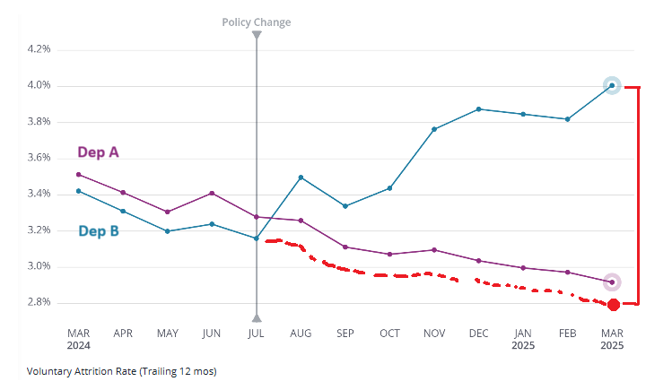

If there’s one causal inference method that is both intuitive and easy to explain—even to non-data folks—it’s difference-in-differences (DiD).

For those who haven’t come across it yet: DiD compares how things change over time for a group affected by an intervention (the treatment group) versus one that isn’t (the control group). The key assumption is that both groups would have followed similar trends if the intervention hadn’t occurred. This can be partially validated by checking whether their trends were similar *before* the change. If that holds, and we observe a notable shift in the treatment group *after* the intervention—beyond the usual trend—we can reasonably attribute the difference to the intervention.

Besides the “parallel trends” assumption, there are a few other important ones—like no spillover effects, no simultaneous interventions, common shocks, and stable group composition—but these can usually be assessed with solid domain knowledge.

Given the intuitive nature of DiD, even those who don’t work with data every day—like HRBPs and similar roles—can, IMO, apply a lighter, visual version of this method on their own in BI tools like Tableau, Power BI, or—specifically for people analytics—platforms like Visier or OneModel.

As an example, check out the chart below. It was created in one of those BI platforms just by picking a relevant metric and filtering for the right departments and time period. It shows the trailing 12-month voluntary attrition rate for two departments—only one of which was supposed to be affected by a policy change, based on the nature of their work. Before the policy change, Department A had slightly higher attrition than Department B, but both were trending downward in parallel. After the change, the trend diverged sharply: attrition in Department B went up, while it continued downward in Department A. If we can reasonably confirm the other DiD assumptions, this gives us pretty solid evidence that the policy change caused the increase in attrition in Department B.

{width=100%}

I'm definitely not saying this lighter version of DiD is a silver bullet for all causal questions in people analytics—especially since it depends on specific quasi-experimental setups, like the one shown above, and doesn’t deal with the uncertainty present in the data. That said, IMO, it can still help non-technical folks handle some of the lower-stakes cases on their own, giving data science teams more room to focus on the big stuff. 

What do you think? Could this be a useful piece of the puzzle in boosting data literacy among HR professionals? Do you see any substantial risks?