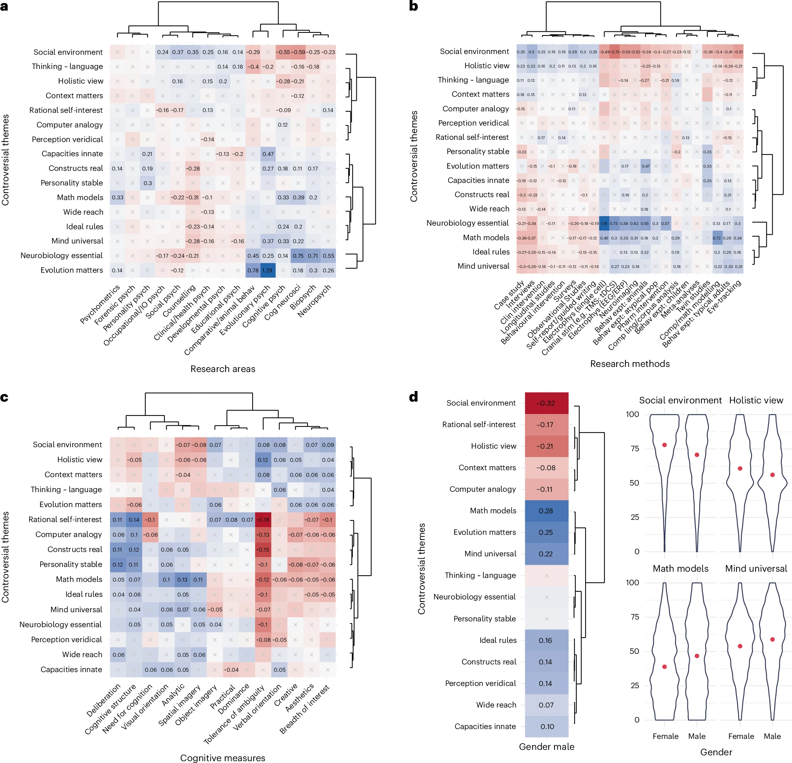

An interesting new study published in *Nature Human Behaviour* by [Sulik et al. (2025)](https://doi.org/10.1038/s41562-025-02153-1){target="_blank"} suggests the answer might lie within the psychologists themselves.

Researchers surveyed nearly 8,000 psychologists and found their positions on key scientific debates—such as whether behavior is best explained by biology or social context—were consistently (though modestly) linked to their cognitive traits.

For instance, psychologists with high tolerance for ambiguity favored holistic, context-driven explanations, while those preferring clear structure leaned toward clear-cut, rule-based models of mind.

{width=100%}

***a–d**,Regression coefficients for controversial themes as a function of research areas (**a**), research methods (**b**), cognitive traits (**c**) and gender (**d**). For tables of full numeric results, see Supplementary Tables 2–5. Cells marked ‘x’ are non-significant (with Bonferroni correction for multiple comparisons—the number of cells in each panel—yielding thresholds P < 0.000208 for a, P < 0.000142 for b and P < 0.000223 for c). All continuous variables are z-scored. Plot margins show hierarchical clusters (Ward’s method). d, In place of clusters for gender, given the low dimensionality of the space representing gender, two themes are shown where men gave lower scores than women and two with the reverse pattern (violin plots show full response distributions, with group means in red).*

Interestingly, these cognitive dispositions were also reflected in their publication patterns, collaborations, and theoretical preferences.

The study thus serves as a valuable reminder that scientific disagreements may not be just about facts, but also about how individual scientists think. It also highlights the importance of fostering cognitive diversity—both within and beyond scientific communities—to broaden research perspectives and enhance epistemic progress.