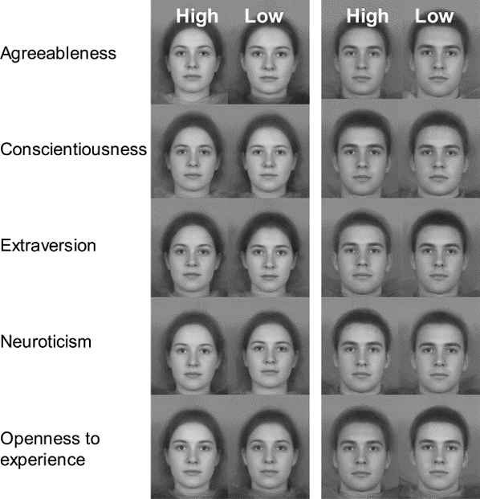
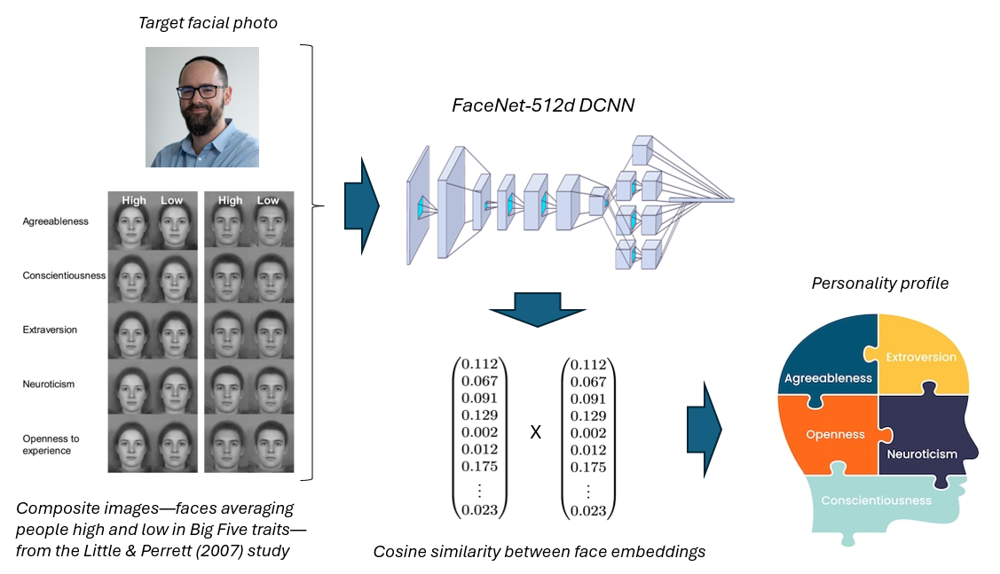

Recently, I happened to stumble across some data I collected during my general psychology lab sessions with my students, where we explored whether our faces really show detectable traces of our personalities.

It was a partial replication of the [Little & Perrett (2007)](https://bpspsychub.onlinelibrary.wiley.com/doi/10.1348/000712606X109648){target="_blank"} study on how accurately people can judge personality based purely on facial features. We re-used their pairs of composite images—faces averaging people high and low in Big Five traits (see the picture from the original research paper below). With this setup, the signal was artificially boosted, so the test situation wasn’t exactly ecologically valid. Plus, students  were only ever asked about the relevant trait, and they always saw the high/low images side by side. Still, it was interesting to see whether people (here, psychologists in training) could pick up the signal from these images, even under such idealized conditions.

<div style="text-align:center">
{width=85%}
</div>

The results? Since the task was binary (“*Who from this pair has a higher level of trait X?*”), an accuracy of 0.5 would mean pure random guessing with no skill involved. The students (*N*=382) actually did reliably better than chance, but not by much: their overall average accuracy was 0.6 (95% CrI [0.59, 0.61]), with the best results for openness (0.75, 95% CrI [0.72, 0.78]), agreeableness (0.7, 95% CrI [0.67, 0.73]), and extraversion (0.65, 95% CrI [0.61, 0.69]), and the worst for conscientiousness (0.53, 95% CrI [0.5, 0.56]) and neuroticism (0.42, 95% CrI [0.39, 0.45]). Interestingly, students were able to detect neuroticism in faces to some extent—but in the wrong direction; they consistently flipped the labels. Not the main topic of this post, but definitely something worth thinking about. Any guesses or working hypotheses as to why that might be?

```{r warning=FALSE, message=FALSE, fig.width=11, fig.height=11}

# uploading libraries
library(tidyverse)
library(brms)
library(bayesplot)
library(posterior)
library(patchwork)

# uploading collected data (number of successes from 5 traits x 4 trials)
data <- readxl::read_xlsx("scores.xlsx")

# glimpse(data)

# data enrichment for data modeling 
mydata <- data %>% 
  dplyr::mutate(
    trials_20 = 20,
    trials_4 = 4,
    respondent_id = stringr::str_glue("respondent_{row_number()}")
  )

# glimpse(mydata)

# function for running hierarchical binomial model
run_binomial_model <- function(df, successes, trials) {
  
  # constructing the formula dynamically
  formula <- brms::bf(
    as.formula(paste0(successes, " | trials(", trials, ") ~ 1 + (1 | respondent_id)"))
    )
  
  # fitting the model
  binomial_model <- brms::brm(
    formula = formula,
    data = df,
    family = binomial(link = "logit"),
    prior = prior(normal(0, 5), class = "Intercept"),
    chains = 4,
    iter = 2000,
    warmup = 1000,
    cores = 4,
    seed = 2025
  )
  
  return(binomial_model)
}


# fitting the model for all responses and by individual traits
# overall results
all_model <- run_binomial_model(
  df = mydata, 
  successes = 'overall_score', 
  trials='trials_20'
  )
# extraversion
ext_model <- run_binomial_model(
  df = mydata, 
  successes = 'extraversion_score', 
  trials='trials_4'
  )
# openness
ope_model <- run_binomial_model(
  df = mydata, 
  successes = 'openness_score', 
  trials='trials_4'
  )
# neuroticism
neu_model <- run_binomial_model(
  df = mydata, 
  successes = 'neuroticism_score', 
  trials='trials_4'
  )
# agreeableness
agr_model <- run_binomial_model(
  df = mydata, 
  successes = 'agreeableness_score', 
  trials='trials_4'
  )
# conscientiousness
con_model <- run_binomial_model(
  df = mydata, 
  successes = 'conscientiousness_score', 
  trials='trials_4'
  )

# summary(all_model)


# function for ploting posterior distribution of the success rate parameter
plot_post_distribution <- function(fitted_model, task){

  fitted_model %>%
    tidybayes::gather_draws(b_Intercept) %>%
    dplyr::rename(value = .value) %>%
    dplyr::mutate(prop = plogis(value)) %>%
    dplyr::select(prop) %>% 
    dplyr::reframe(
      Q025 = quantile(prop, probs = c(0.025)),
      Q975 = quantile(prop, probs = c(0.975)),
      mean = mean(prop)
    ) 
  
  g <- fitted_model %>%
    tidybayes::gather_draws(b_Intercept) %>%
    dplyr::rename(value = .value) %>%
    dplyr::mutate(prop = plogis(value)) %>% 
    ggplot2::ggplot(aes(x = prop)) +
    ggdist::stat_halfeye(
      fill = "lightblue",
      .width = c(0.5, 0.8, 0.95),
      interval_size_domain = c(1,4)
    ) +
    ggplot2::geom_vline(xintercept = 0.5, linetype='dashed', color='grey') +
    ggplot2::scale_x_continuous(limits = c(0,1)) +
    ggplot2::labs(
      title = stringr::str_glue("Posterior distribution of the success rate parameter for {task}"),
      y = 'Density',
      x = 'Success rate parameter'
    ) +
    ggplot2::theme_minimal() +
    ggplot2::theme(
      panel.grid.major    = element_blank(),
      panel.grid.minor    = element_blank(),
  
      # 2) Draw the x‐ and y‐axis lines
      axis.line.x         = element_line(color = "grey"),
      axis.line.y         = element_line(color = "grey"),
  
      # 3) Guarantee white everywhere
      panel.background    = element_rect(fill  = "white", color = NA),
      plot.background     = element_rect(fill  = "white", color = NA)
  )
  
  return(g)
}

# creating the plots  
all_g <- plot_post_distribution(fitted_model = all_model, task = 'all traits')
ext_g <- plot_post_distribution(fitted_model = ext_model, task = 'Extraversion')
ope_g <- plot_post_distribution(fitted_model = ope_model, task = 'Openness')
neu_g <- plot_post_distribution(fitted_model = neu_model, task = 'Neuroticism')
agr_g <- plot_post_distribution(fitted_model = agr_model, task = 'Agreeableness')
con_g <- plot_post_distribution(fitted_model = con_model, task = 'Conscientiousness')

# combining the plots into one chart
final_plot <- all_g / ope_g  / agr_g / ext_g / con_g / neu_g

final_plot + 
  plot_annotation(caption = "The output from a Bayesian hierarchical binomial regression model.\nThe horizontal lines represent the 50%, 80%, and 95% credible intervals, respectively.\nThe vertical lines represent the success rate corresponding to random guessing.")

```

That inspired me to put together a simple Python script that compares someone’s facial photo to the “prototypical” high/low trait faces, and then makes a guess about that person’s trait level—all powered by the [FaceNet-512d](https://huggingface.co/py-feat/facenet){target="_blank"} deep convolutional neural network (via the [deepface](https://github.com/serengil/deepface){target="_blank"} package), which generates 512-dimensional embeddings of facial images, capturing the unique features of a face, and facilitating tasks like face recognition, verification, and clustering. 

<div style="text-align:center">
{width=100%}
</div>

It worked surprisingly well given how simple the approach is—at least for me and a few friends—though I haven’t tested it more widely yet. I’m curious how it’ll work for you. If you feel like giving it a shot, you’ll find the script and all the supp files in this [GitHub repo](https://github.com/lstehlik2809/Estimating-personality-from-a-facial-photo.git){target="_blank"}. Let me know how it goes in the comments if you try it out.

⚠️ Caveat: I’m definitely not claiming this is a valid and reliable way to measure anyone’s personality. Sure, there may be some signal in faces, and we might be able to pick up on it a bit, but it’s so weak and noisy that it’s not very practical. There are far better tools for that. MBTI, for example (just kidding 🙃). Still, if you’re curious, have some fun and see what subtle signals your face might be broadcasting to the world 😉