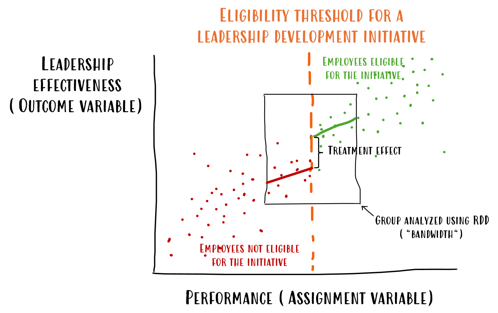

# Introduction
When we worked as consultants using the most common people analytics maturity model—you probably know the drill by now: moving from descriptive analytics (*what happened*), to diagnostic (*why it happened*), predictive (*what will happen*), and finally prescriptive analytics (*how to make it happen*)—one thing that always seemed odd to us was how predictive analytics was so heavily promoted as more advanced and desirable than diagnostic analytics. But as any analyst will tell you, figuring out the actual causes behind events is way tougher—and a lot more uncertain—than just making accurate predictions. Also, understanding why something happened is typically more practical and actionable than just having predictions. Knowing the causes not only allows you to forecast events—often in a more explainable and interpretable way—but also enables effective interventions to make those events actually happen. In fact, once you have the root causes nailed down, you're much closer to the “ultimate” prescriptive stage than you'd be by just having predictions.

This obsession with prediction might be part of the reason why people analytics still struggles to consistently deliver real business impact. Predictions (let alone descriptives) can only take us so far when it comes to actually changing our organizations in a meaningful way. Take the ever-popular employee attrition prediction use case. Sure, knowing which parts of the organization are at higher risk of voluntary turnover is better than flying blind—but if that’s all you bring to the table, the typical response from HRBPs or business stakeholders is something like, “Okay, that’s interesting. We kind of suspected that already, but what should we actually do about it?” The real impact of your predictive insight hinges on your ability to answer that question clearly and convincingly. And the truth is, in many, if not most, situations, you can only do that through causal inference: a systematic and principled approach to answering “why” questions. 

## The Trouble with Experiments
The good news is, we do have a method for answering causal, or “why”, questions. The less good news? In practice, causal inference is harder and less straightforward than making predictions. If you have a background in the social sciences, you probably remember from your methods classes that the gold standard for establishing causality is the experiment—specifically, the *randomized controlled trial* (RCT), also known in the business world as *A/B testing*. RCTs are powerful because they can effectively simulate comparison between factual and counterfactual scenarios—imagine being able to see what would happen to your headache both *with* and *without* taking aspirin. They do this by randomly assigning interventions to people (or other units of analysis), which helps break any systematic link between the outcome and all factors other than the intervention itself. 

{width=85%}

*Fig. 1: A diagram illustrating the design of a Randomized Controlled Trial (RCT). Patients are randomly assigned to either a treatment group receiving an intervention or a control group receiving a comparison, allowing for the assessment of the intervention's causal effect on outcomes. Randomization helps balance both known and unknown confounding variables across groups, reducing bias and making it more likely that any observed differences in outcomes are due to the intervention itself—not other factors. (Source: [SimplyPsychology](https://www.simplypsychology.org/randomized-controlled-trial.html){target="_blank"})*

But as you can imagine, this kind of setup is often impractical, unethical, or technically or politically unfeasible in real organizational settings—especially when it involves employees. For example, try convincing your L&D colleagues to randomly assign eligible employees to either an expensive training program or a waiting list, just to estimate the program’s effectiveness, and see how that conversation goes. That said, if you’re on the other side of this imaginary barricade, like those hypothetical L&D folks above, it’s worth remembering that rolling out a program without testing it properly is still an experiment, just a sloppy and uncontrolled one. So if it’s feasible, running an RCT is at least worth considering.

## Correlation ≠ Causation (Still True, Still Annoying)
So, if we often can’t run experiments, what are we left with? Observational data—a lot of it. Most organizations today are sitting on heaps of information about their employees and their behavior, coming from HRIS, survey platform, LMS, CRM systems, recognition tools, collaboration platforms like calendar, chat, email—you name it. However, at this point, many of you are probably hearing a mental alarm bell and recalling the age-old warning: “*Correlation is not causation.*” And you’d be absolutely right. Sifting through this kind of data is a bit like staring at a clear night sky, looking for familiar shapes—you’ll always find some patterns that resemble real things, but it’d be naive to think they’re actually up there. Same goes for observational data: We can’t just simply assume that any relationship we spot is causal. What could possibly go wrong?

There could easily be a third, unmeasured variable, a so-called *confounder*, lurking in the background—driving two variables of interest and creating the illusion of a causal link between them (e.g., at first glance, it looks like remote employees chat with their coworkers less than their in-office peers, but it may be that the kind of work, some jobs needing more back-and-forth, others less, drives both the choice to work remotely and the overall volume of communication). Or the relationship might be causal, but in the opposite direction from what we assume (e.g., are people performing well because they’re engaged, or just more engaged because they keep winning Employee of the Month?). 

Then there’s the infamous *self-selection* effect: When people opt into a program for reasons tied to the very issue the program is meant to fix. That can make even a solid intervention look like it’s backfiring—not because it doesn’t work, but because those who join are systematically different from those who don’t, especially when it comes to the outcome of interest (e.g., if an optional manager coaching program seems to lower team satisfaction, it’s probably not the coaching that’s the problem—more likely, the only managers signing up are already struggling, and their teams were less satisfied from the start). 

{width=85%}

*Fig. 2: A lighthearted illustration of the self-selection effect—where only a specific type of person ends up in the sample. (Source: [sketchplanations](https://sketchplanations.com/sampling-bias){target="_blank"})*

Even if we try to get clever and use our good old friend, regression analysis, to statistically control for everything we can measure, we might still end up with biased estimates—not despite controlling for variables, but because we’re controlling for variables we shouldn't. For instance, if we control for a *collider*—a variable influenced by both the outcome and the intervention—we can actually introduce bias rather than eliminate it (e.g., when looking at the relationship between technical and teamwork skills in job candidates, both might independently boost their chances of getting selected; but if we only analyze those who got through, we’re effectively controlling for selection, which can create a fake negative link between technical and teamwork skills, even if there’s no such relationship in the broader pool of applicants; see *Fig. 3*).

{width=100%}

*Fig. 3: Here we’ve plotted normally distributed technical versus teamwork scores for 1,000 simulated candidates—blue dots are all candidates, red dots are the selected candidates (you needed at least a 115 on one skill and no less than 100 on the other). The blue regression line is basically flat, but once we cherry-pick by our “either/or” rule (i.e., condition on selection), the red line tilts downward, showing a fake trade-off between skills that only crops up because of how we picked people, not because the skills are actually at odds.*

Another potential trap in this category is controlling for a *mediator*—a variable that legitimately carries part of the causal effect. Doing so blocks a real causal pathway and biases the estimated effect downward (e.g., one way flexible work arrangements may help reduce unplanned absenteeism is by lowering occupational stress for employees who have more control over their time; in this case, stress acts as a causal middleman between the policy and absenteeism—if we control for it, we block this indirect pathway and risk biasing our estimates toward “flex time has little or no effect.”)

## Getting Clever with Observational Data
But things aren’t as bleak as they might seem. When we enrich observational data with some well-grounded assumptions—based on how we understand the data-generating process—we can get pretty close to simulating the counterfactual scenarios needed for causal inference. Some of these assumptions come from our general knowledge about how the world works (like the fact that causes precede effects). Others are rooted in our domain-specific knowledge drawn from prior research (for example, goal-setting typically boosts performance). And some come from nitty-gritty, context-specific knowledge about the details of how the data were collected (say, participants only got assigned to a training program if they met a certain cutoff score). By combining these assumptions with the data, we can start to rule out alternative, purely correlational explanations for the patterns we see—and, with some caution, move closer to a causal interpretation. It’s not unlike what the famous fictional detective Sherlock Holmes did to solve his cases: piecing together bits of evidence, applying prior knowledge, and methodically ruling out false leads—until only one plausible explanation remained.

{width=100%}

*Fig. 4: Researchers and analysts looking to figure out causal effects often use Directed Acyclic Graphs (DAGs) to lay out their assumptions about how different variables might be causally connected. A DAG is a visual and formal tool that shows the assumed causal relationships—where the nodes stand for variables and the arrows (or edges) indicate which ones are influencing others. By building a DAG, researchers can more clearly think through their causal claims, spot potential confounders, and figure out the right way to adjust their analysis. This approach helps make assumptions more transparent and supports solid causal reasoning from observational data. While most DAGs are manually constructed based on domain expertise, there is a growing body of work around causal discovery—automated methods that attempt to infer plausible causal structures directly from data. These algorithms (e.g., PC, FCI, GES, or more recent neural-based models) can be helpful for generating hypotheses, especially when theory is sparse or data complexity is high. That said, causal discovery comes with its own assumptions and limitations, and a full discussion is beyond the scope of this article. The attached example DAG shows the assumed causal structure for estimating the average treatment effect of training performance on productivity. It was created using [DAGitty](https://www.dagitty.net/dags.html){target="_blank"}—a great browser-based tool for building and analyzing causal diagrams.*

By the way, this kind of knowledge, rooted in the rich, nuanced world models we carry around in our heads, might be one reason current AI still struggles to fully replace (good) business analysts. Their grasp of the world is in many respects still pretty shallow in comparison with humans—at least for now. But who knows what’ll be true by the time this article comes out… or even a month later. 

# Spotting Quasi-Experiments in the Wild
In the rest of this article, we’ll focus on the third type of assumptions mentioned above. Specifically, we’ll look at several common organizational events and practices—and the analytical techniques that go with them—that often provide a natural foundation for robust causal analysis. This won’t be a comprehensive overview, but it still should give HR professionals a useful lens for spotting and leveraging these naturally occurring quasi-experiments for better, more impactful decision-making. For those more technically inclined, an accompanying public [GitHub repository](https://github.com/lstehlik2809/Beyond-Prediction-Exploiting-Organizational-Events-for-Causal-Inference-in-People-Analytics.git){target="_blank"} contains example Python and R code with dummy data illustrating some of these scenarios. Without further ado, let’s dive into the first type of events.

## Selectively Affected Teams (When Change Plays Favorites)
Despite ongoing efforts to standardize operations, employees in modern organizations often experience very different levels of exposure to various company policies and processes. A major driver of this variability is simply the nature of the role. A software developer, for example, might fully embrace the perks of a remote-work policy—coding in pajamas from a cabin in the woods—while a facilities manager still commutes daily to keep the lights on, the plumbing working, and the office ready for the inevitable “team-building week” return. Another common source of variability is the widespread practice of piloting new programs on a small scale before rolling them out company-wide, allowing organizations to test the waters, gather feedback, and fine-tune everything from design to implementation.

While variability is often seen as something to be minimized—especially in contexts like manufacturing or quality control—it can be a real asset when it comes to causal inference. These natural differences can create for us groups that differ in one key aspect of interest (e.g., exposure to a policy), while remaining comparable in many other important ways, making them valuable for identifying potential causal effects.

Take, for example, the much-debated and often controversial return-to-office (RTO) initiatives. Suppose a tech company rolls out an RTO policy and starts noticing that employees in the Digital department, who previously enjoyed full remote flexibility, are now quitting at higher rates. Leadership wants to know: Is this spike in attrition actually caused by the RTO policy, or is it just part of a broader company-wide trend? We dig into the data and see that voluntary attrition in the Digital department is indeed climbing. But that alone doesn't tell us much—maybe attrition is up across the board, driven by other factors. To answer the question properly, we need a fair comparison—an apples-to-apples scenario. That means finding a suitable reference group: ideally, a department less affected by the RTO shift due to the nature of their work (say, Facilities), and one that historically followed a similar attrition pattern before the policy change. And just like that, we land on a well-established method for causal inference: *Difference-in-Differences* (DiD).

### Difference-in-Differences
DiD looks at how things change over time for a group exposed to an intervention (the treatment group) compared to a group that isn’t (the control group). The core assumption is that, if the intervention hadn’t happened, both groups would have followed similar trends. We can get a sense of whether this holds by checking if their trends were roughly parallel before the intervention. If they were—and we then see a distinct shift in the treatment group that goes beyond what we’d expect from the usual pattern—it’s reasonable to attribute that change to the intervention. Beyond the “*parallel trends*” assumption, there are a few other key ones to keep in mind—like no spillover effects between groups, no overlapping interventions, shared external conditions (common “shocks”), and stable group composition over time—but these can usually be assessed with solid domain knowledge.

Let’s bring this back to our RTO example. The chart below shows the trailing 12-month voluntary attrition rate for our two departments—only one of which was supposed to be affected by a remote-work policy change, based on the nature of their work. Before the policy change, Department A (Facilities) had slightly higher attrition than Department B (Digital), but both were trending downward in parallel. After the change, the trend diverged sharply: attrition in Department B went up, while it continued downward in Department A. If we can reasonably confirm the other DiD assumptions, this gives us pretty solid evidence that the policy change caused the increase in attrition in Department B.

{width=100%}

*Fig. 5: A figure showing the DiD method’s “parallel trends” assumption (red dotted line), which helps us imagine what would have happened in department B if the policy change hadn’t taken place. By comparing that hypothetical, counterfactual scenario to what actually happened (red vertical line), we can estimate the effect of the policy change on voluntary attrition in department B.*

### Synthetic Control
If it seems to you that relying on just one comparison group (like department A in our earlier example) is a bit shaky, you can reach for a more robust alternative: *Synthetic control* method. Instead of using a single control group, this method constructs a synthetic version of the control group by combining multiple control units, each weighted based on how closely they mirror the treatment group’s behavior prior to the intervention. The principle is similar to what we already saw with DiD: we still want to estimate what department B’s attrition would have looked like had the policy not changed, and then compare that counterfactual to what actually happened. But rather than relying solely on department A, we bring in several departments whose historical attrition trends most closely align with department B’s. Using a method like linear regression—or another machine learning (ML) algorithm—we assign weights to these control units based on how well they predict department B’s attrition before the policy change. We then use this weighted combination to forecast department B’s attrition after the policy shift, creating a counterfactual baseline to compare against the actual outcomes.

Below is an example of how this method was used to estimate the negative impact of Brexit on the UK’s economic performance, using GDP as the outcome measure. To model the UK’s pre-Brexit GDP, we used data from countries unlikely to be strongly affected by Brexit but whose GDP trends closely mirrored the UK’s during the pre-Brexit period (e.g., the US, Costa Rica, Germany, New Zealand, Sweden, Austria, etc.). As shown in the top chart, the model explains 99% of the variability in UK’s GDP from 2008 to 2020. This model was then used to predict what UK’s GDP would have looked like after Brexit (January 31, 2020) if Brexit hadn’t happened, and these predictions were compared to the actual observed values. The second and third charts from the top show how the predicted and actual values diverge—quarter by quarter and cumulatively over time—including uncertainty around the estimates. From these charts, it's clear that the data and the analysis support the hypothesis that Brexit had a negative effect on the UK economy, as measured by GDP.

{width=85%}

*Fig. 6: A set of charts showing the estimated causal impact of Brexit on the UK’s GDP using a Bayesian synthetic control method implemented in the [CausaPy](https://causalpy.readthedocs.io/en/stable/){target="_blank"} package. Top chart: It compares actual UK’s GDP (black dots) with a counterfactual scenario (orange line) — i.e., what GDP would likely have looked like had Brexit not occurred. The vertical red line marks the Brexit date (January 2020). The fit before that is very tight (R² = 0.99), indicating a very good approximation. Middle chart: This shows the instantaneous causal impact — the difference between actual and counterfactual GDP for each quarter. Post-Brexit, GDP is consistently below what it would have been otherwise, shown by the orange shaded area. Bottom chart: This plots the cumulative causal impact — essentially, how much GDP has been “lost” over time due to Brexit. By 2024, the cumulative loss reaches over 2 trillion USD.*

## Staggered Rollouts (When Change Doesn’t Happen All at Once)
When HR teams launch new programs—like a transformation training for senior managers designed to boost their change readiness—they rarely implement them company-wide all at once. Organizational and technical constraints typically get in the way: A limited number of trainers, room availability, scarce training materials, and the need to keep business operations running smoothly, just to name a few. Instead, these programs are usually implemented in a staggered fashion, meaning different employee groups participate at different times. This staggered rollout presents us with a valuable opportunity: we can compare more or less similar employees who have participated in the program to those who haven’t—yet.

The “more or less similar” part is key. We can only make valid causal claims about a program’s impact if the groups we’re comparing are similar in factors that could influence both their participation and the outcome of interest. And we should never assume that this similarity holds by default. We need to test for it and/or adjust for relevant differences in the analysis. As program managers, we have an advantage. We’re close to the nomination process and usually have a solid understanding of the selection criteria. That puts us in a good position to spot which factors need to be accounted for. However, when self-selection comes into play, things get trickier. There may be hidden factors influencing both participation and outcomes, so we should be cautious in drawing final conclusions.

To illustrate this kind of scenario, imagine that—due to the capacity constraints mentioned earlier—a subgroup of managers starts and completes the transformation training before the regular annual employee survey is administered, while another subgroup begins and finishes it only afterward (see *Fig. 7*). In this case, only the first subgroup could potentially show a causal effect of the training in their survey scores for that year. That gives us a good opportunity to compare the change and transformation scores between the two groups. 

{width=100%}

*Fig. 7: An illustration of a possible staggered rollout scenario, where one group of training participants started and completed the training before the employee survey was administered, and the second group did so afterward. Only for the first group (A) could a potential causal effect of the training be reflected in the survey results.*

However, we need to make sure these groups are comparable in terms of factors that might influence both the timing of their training and their survey outcomes. For example, if all senior managers from Sales—where employee satisfaction is generally lower in our hypothetical organization—were scheduled to take the training later, it could bias the comparison. The same applies if managers who were already less satisfied with transformation efforts were more motivated to start their training earlier. We can address these issues by adjusting for such differences in the analysis.

### Adjusting
When we “adjust” for a variable, we’re statistically controlling for it in the analysis—basically holding it constant so it doesn’t muddy the waters when we’re trying to see what really drives the outcome. The way we do this can vary depending on the specific analytical technique, but within causal inference the goal is always the same—to approximate random assignment as closely as possible. For instance, we might include the variable as a covariate in a regression model, match individuals based on that variable (see *Fig. 8*), re-weight the data with *Inverse-Probability-of-Treatment Weighting* (IPTW), where the weights are the inverse of each person’s estimated probability of receiving the treatment they actually got (see *Fig. 9*), split the data into subgroups (stratification), or condition on the variable in a ML model. With such adjustment, we can be more confident that we're comparing apples to apples and make some causal conclusions.

{width=85%}

*Fig. 8: An illustration of matching based on two covariates (X1 and X2). Each dotted circle represents a matched set containing individuals from the treated (red) and control (blue) populations with similar characteristics (X1 and X2), facilitating a fair, apple-to-apple comparison. (Source: [Applied Causal Inference](https://appliedcausalinference.github.io/aci_book_kr/03-causal-estimation-process.html){target="_blank"})*

{width=100%}

*Fig. 9: An illustration of the Inverse-Probability-of-Treatment Weighting method (IPTW). Each person is given a weight equal to the inverse of the estimated probability—based on their observed characteristics—of receiving the treatment they actually received. After weighting, the treated and control groups look alike on those characteristics, so we can learn about cause and effect from observational data (assuming two extra assumptions hold: ignorability—i.e. there aren’t hidden factors that influence both treatment and outcome—and positivity—i.e. everyone had some chance to get each option). A chart: Observed data before reweighting. B chart: Observed data after reweighting. (Source: [Applied Causal Inference](https://appliedcausalinference.github.io/aci_book_kr/03-causal-estimation-process.html){target="_blank"})*

### Staggered Adoption DiD Model
Another technique that can be used for causal analysis of staggered rollout data is a specific type of DiD model tailored to handle the fact that we implemented changes or interventions at different times across various parts of an organization. The classic DiD works best when all members of the treatment group are exposed to the intervention at the same time. But what if, like in many real-world situations, a new policy is rolled out gradually? Imagine that Department A adopts it in January, Department B in April, Department C in July, and Department D either never adopts it—or does so much later (see *Fig. 10*). 

{width=100%}

*Fig. 10: An illustration of a staggered rollout of a new policy across several departments: Department A adopts it in January, Department B in April, Department C in July, and Department D either never adopts it—or does so much later.*

If we tried to use the simple DiD method here, we might get confusing or misleading results. Why? Because who are we comparing Department A to in February? Department B hasn't adopted the policy yet, so they seem like a good control. But by May, Department B has also adopted the policy, so they're no longer a clean "untreated" comparison group for Department A. The Staggered Adoption DiD model is specifically built to handle these kinds of messy, real-world rollouts. It introduces several key adjustments to give us a clearer and more accurate picture:

1. *Everyone starts at their own "day zero":* Instead of aligning all departments by calendar date, the analysis aligns them based on when they actually adopted the policy. So, Department A's "Month 1 after adoption" is January, while for Department B it's April. This allows a fair comparison of each department’s progress relative to its own start.
2. *Using the "not yet treated" as a proper control group:* At any given time point, the model compares departments that have already adopted the policy to those that haven’t yet. For example, in February (one month after Department A's adoption), Departments B, C, and D—who are still untreated—can serve as the control group. By May, when Department B is in its first post-policy month, Department A is already treated, but Departments C and D still haven’t adopted the policy and can act as the comparison group. This ensures we're always making the best possible comparison given who’s received the policy and who hasn’t.
3. *Tracking the effect over time for different "waves":* The model doesn’t just provide a single estimate. It tracks the average effect of the policy for each wave of adopters (e.g., January adopters, April adopters), and how that effect evolves over time. This helps us understand whether the policy’s impact is immediate, builds up, or fades as time goes on.

By implementing these adjustments, the Staggered Adoption DiD model provides a more accurate and nuanced understanding of the intervention's impact over time and across various units. However, as with traditional DiD, we still rely on the assumption that, in the absence of the intervention, the treated and control groups would have followed similar trends over time.

## Policy Thresholds and Eligibility Cutoffs (When a Small Step Can Mean a Big Shift)
Another type of situation that can help us obtain comparable groups—differing only in exposure to the intervention of interest—involves scenarios where employees must surpass a specific threshold or cutoff to qualify. For instance, eligibility for a coaching program might require not only a minimum management level but also a certain tenure. Or consider a case where employees become eligible for a leadership development initiative only if their performance evaluation score exceeds 85 on a scale from 0 to 100. In such situations, individuals just above and just below the threshold are likely similar in most respects, except for their exposure to the intervention. This setup is ideal for applying a *Regression Discontinuity Design* (RDD), which allows for estimating the causal effect of the intervention by comparing outcomes around the cutoff point (see *Fig. 11*).

### Regression Discontinuity Design
To implement RDD, we start by identifying a continuous assignment variable (like tenure or performance score) and the specific cutoff that determines who gets the intervention. Then we collect data on individuals just above and just below that threshold (in a region called the "bandwidth")—people who are otherwise very similar except for whether they received the intervention. Next, we visualize the relationship between the assignment variable and the outcome to see if there's a clear jump at the cutoff. If there is, that’s a signal the treatment may have had an effect. To formally estimate this, we fit two separate regression lines—one on each side of the cutoff—using only data near the threshold, and then calculate the size of the jump between them at the cutoff. This estimated difference gives us the treatment effect.

{width=100%}

*Fig. 11: An illustration of the Regression Discontinuity Design (RDD) method using a hypothetical leadership development initiative where eligibility is determined by employee performance (the assignment variable, x-axis) crossing a specific threshold. Employees below the threshold (red dots) were ineligible, while those above (green dots) were eligible. RDD isolates the program's impact by comparing the leadership effectiveness (the outcome variable, y-axis) of employees just below the threshold to those just above it; the distinct jump, or discontinuity, observed between the fitted regression lines (red and green) precisely at the threshold represents the estimated treatment effect of the initiative.*

Given the somewhat arbitrary nature of the chosen bandwidth, it’s often a good idea to run robustness checks—like varying the bandwidth—to make sure the estimated effect isn’t overly sensitive to those choices. We should also run a few validity checks to make sure the assumptions behind RDD hold up, because even RDD-based causal inference doesn’t come for free—it relies on three key assumptions. First, the relationship between the assignment variable and the outcome should be smooth; any sharp jump at the cutoff should be caused by the treatment itself, not some other factor. Second, people shouldn’t be able to game the system to end up just above or below the cutoff. And third, individuals near the cutoff should be very similar in all other respects, making the comparison almost like random assignment (ironically, this might be one of the few cases where having a somewhat noisy performance evaluation can actually be helpful). Even when these assumptions hold, it’s important to remember that RDD estimates a *Local Average Treatment Effect* (LATE)—the observed causal effect applies specifically to individuals near the cutoff and may not generalize to the broader population. 

## Abrupt Organizational Changes (Breaking the Routine with a Bang)
A great way to explore causal relationships is by looking at sudden, discrete organizational changes that disrupt the usual way of doing things—especially in systems that have been relatively stable or at least somewhat predictable over time. One timely example is the introduction of advanced, AI-driven automation to help employees get support for administrative or technical issues they face at work. Another example in this category is a company-wide initiative to support employees in using GenAI tools to generate their personal goals in alignment with the organization’s strategic objectives, hoping to improve goal cascading—a known weak spot in many performance management systems.

We can make use of these abrupt changes—and the stable/predictable patterns that came before them—to get a rough idea of the counterfactual comparison we need for causal inference. But that only works if it makes sense to think that, without the change, things would’ve just kept going as usual. And if that’s not the case, we at least need a good sense of what else might’ve thrown things off, so we can factor that into the analysis.

### Segmented Regression Analysis of Interrupted Time Series
One useful method for analyzing data in this kind of scenario is *segmented regression analysis of interrupted time series*. It lets us model changes in outcomes that happen after a specific intervention at a known point in time, while also accounting for other possible influences—like seasonal patterns that would’ve happened anyway, or external “shocks” that might explain the changes too. In effect, it helps us spot shifts in both level and trend, and see how things played out compared to how they likely would’ve gone if nothing had been introduced at all (see *Fig. 12*).

{width=100%}

*Fig. 12: A general structure of the segmented regression model. The β0 coefficient estimates the baseline level of the outcome variable at time zero; β1 coefficient estimates the change in the mean of the outcome variable that occurs with each unit of time before the intervention (i.e. the baseline trend); β2 coefficient estimates the level change in the mean of the outcome variable immediately after the intervention (i.e. from the end of the preceding segment); and β3 estimates the change in the trend in the mean of the outcome variable per unit of time after the intervention, compared with the trend before the intervention (thus, the sum of β1 and β3 equals to the post-intervention slope). Since time series data often exhibit autocorrelation and seasonal patterns, the model should include terms to account for both—such as an autoregressive term to handle autocorrelation, and a seasonal indicator (e.g., month) to capture recurring seasonal effects. If we know that other external 'shocks' may have occurred around the same time as the main intervention, we should also include those as additional covariates to isolate their potential impact. (Source: [Turner et al. (2021)](https://bmcmedresmethodol.biomedcentral.com/articles/10.1186/s12874-021-01306-w){target="_blank"})*

Let’s illustrate this kind of analysis by looking at the supposed impact of GenAI on how people write emails. Since plenty of [studies](https://seosandwitch.com/microsoft-copilot-statistics/){target="_blank"} show that one of the most common business uses of GenAI is helping with email writing, it makes sense to think that people might be turning to the internet less often for advice on the topic. One way to check that is by looking at [Google Trends](https://trends.google.com/trends/){target="_blank"} data for searches like “how to write an email” and seeing if there’s a noticeable drop after ChatGPT was officially released. As the output charts from the Bayesian interrupted time series analysis below show, there’s indeed a clear decline in this type of search activity. In fact, the shift is so pronounced that even a quick eyeballing analysis picks it up. Sure, we could imagine alternative explanations—maybe people are just sending fewer emails because they’re relying more on tools like Slack or Teams—but [other available stats](https://financesonline.com/email-statistics/){target="_blank"} suggest that’s more wishful thinking than reality. 

{width=100%}

*Fig. 13: Charts showing the estimated causal impact of ChatGPT availability on the popularity of Google searches for 'how to write an email.', using a Bayesian interrupted time series analysis implemented in the [CausalPy](https://causalpy.readthedocs.io/en/stable/){target="_blank"} package. Top chart: This compares the actual popularity of the search term (black dots) with a counterfactual scenario (orange line)—basically, an estimate of what search interest would have looked like if ChatGPT hadn’t been released. The vertical red line marks the official release of ChatGPT (November 2022). The model fits the pre-release data fairly well (R² = 0.66), suggesting it’s a good approximation. Middle chart: This shows the immediate causal impact—week by week, it displays the difference between actual search interest and the counterfactual. After ChatGPT’s release, the actual search interest stays consistently below the expected level, as shown by the orange shaded area. Note: As far as we know, the InterruptedTimeSeries class from the CausalPy library used here assumes independent observations and does not account for autocorrelation, which may lead to underestimated and time-insensitive uncertainty. The model also does not consider the truncated nature of the data, with possible values limited to the 0–100 range. These specifics could be better addressed in a more flexible modeling environment, such as the brms library in R or the PyMC library in Python.*

## Instrumental Variables (The Hard-to-Find Helpers of Causal Inference)
Suppose we're trying to estimate the causal impact of a leadership training program on team productivity. While it may sound straightforward, in practice, people are rarely selected into such programs at random—those who participate may already be more motivated, capable, or open to change. These unobserved traits could independently influence both their likelihood of attending the training and their team’s productivity. That introduces *unmeasured confounding*, which can bias even the most sophisticated statistical models, including many we covered in the previous causal inference examples.

Fortunately, all is not lost. There’s a clever workaround that can help us untangle causality even when lurking variables like motivation or inherent ability are hiding in the background: *instrumental variables* (IVs). We can think of them as hidden helpers—factors that push people toward receiving a certain treatment or policy but don’t influence the outcome in any other direct or indirect way, except through the treatment or policy of interest.

A valid instrument affects the *likelihood of receiving the treatment* (e.g., joining a program) but doesn’t have a *direct effect* on the outcome (e.g., team productivity)—only an *indirect one*, through the treatment itself. In other words, if we find a factor that moves treatment status without independently moving the outcome, we’ve got a potential instrument. How does this help? By leveraging this instrumental variable, we can estimate what the effect of the treatment would be in a world where it was randomly assigned. And we can do this using a technique called *two-stage least squares* (2SLS). In the first stage, we predict treatment assignments based on the instrument. In the second stage, we use this predicted treatment (now purged of confounding) to estimate the effect on the outcome. 

But there’s a catch (or two). Finding good instruments is hard. There are two big boxes to tick:

1. *Relevance:* The instrument must strongly influence the treatment. If it doesn’t move the needle, it won’t help us identify anything.
2. *Exclusion restriction:* The instrument must affect the outcome only through the treatment—not directly or via some other variables.

Relevance can often be tested statistically, but the exclusion restriction leans heavily on domain expertise and theoretical justification, as it often can’t be empirically verified. As a result, using IVs demands careful scrutiny and well-defended assumptions. In practice, satisfying both conditions is pretty tough. In fact, it’s so tough that IV-based methods are used relatively rarely—not just in organizational research, but across the board. Still, when we get lucky, IVs can be a powerful addition to our causal toolbox. So be on the lookout! 

As an example of this analytical approach, consider a study by [Chang & Kang (2019)](https://link.springer.com/article/10.1007/s12122-018-9273-z#:~:text=crucial%20factors%20to%20improve%20firm,the%20ordinary%20least%20square%20estimation){target="_blank"}, which tackled the classic chicken-or-egg problem in organizational research: Do better management and HR practices actually cause higher productivity, or do already successful firms simply tend to adopt them? The researchers suspected *endogeneity*—unobserved factors like culture or leadership quality might drive both. To get around this, they used firms’ historical change experiences as instrumental variables—specifically, whether the company had previously undergone major reorganizations, implemented empowerment programs, invested in IT, or had strong motivation for change. These factors predicted current management practices but were unlikely to directly affect present-day productivity except through those practices (see *Fig. 14*). Using 2SLS, they found that once this endogeneity was accounted for, structured HR and management practices had a clear, positive impact on productivity—an effect that standard regression analysis had missed entirely.

{width=100%}

*Fig. 14: A DAG capturing Chang & Kang’s (2019) IV-based approach to answering the causal question of whether better management and HR practices actually cause higher productivity. For more context, see the details in the main text.*

A second, more unexpected example comes from the world of CEO succession. [Bennedsen et al. (2007)](https://papers.ssrn.com/sol3/papers.cfm?abstract_id=925650){target="_blank"} examined whether appointing a family member as CEO in family-owned firms impacts firm performance. The catch? Succession choices aren’t random—stronger firms might be more (or less) inclined to keep leadership in the family, and hidden factors like founder legacy or firm culture could influence both who gets the top job and how the firm performs. To isolate a source of random variation, the researchers used a surprisingly clever instrument: the gender of the outgoing CEO’s firstborn child. In Denmark, because of the societal preference for male heirs at the time, having a firstborn son significantly boosted the chances of a family CEO being appointed—by around 30%—but was otherwise unlikely to affect firm performance, either directly or through any other indirect channels (see *Fig. 15*). With this instrument, their 2SLS analysis revealed that family CEO appointments caused a substantial drop in firm performance—at least 4 percentage points in operating return on assets, especially in fast-growing or large firms. Once again, the IV approach helped cut through the noise, showing that what might look like a neutral or even positive correlation at first glance actually hides a meaningful causal effect in the opposite direction.

{width=100%}

*Fig. 15: A DAG capturing Bennedsen et al.’s (2007) IV-based approach to answering the causal question of whether appointing a family member as CEO in family-owned firms impacts firm performance. For more context, see the details in the main text.*

## Tailoring Impact (One Size Usually Doesn’t Fit All)
While estimating an overall treatment effect can be informative, it misses a key point: HR interventions likely don’t affect all employees in the same way. That’s where *Heterogeneous Treatment Effect* (HTE) or *Conditional Average Treatment Effect* (CATE) come in—they help us understand how treatment effects vary across subgroups or individual characteristics. Instead of just asking “what works?”, this approach shifts the question to “what works for whom?” The key added value is that, by estimating HTE, organizations can target interventions more precisely, reduce unnecessary costs, and boost overall impact.

Imagine a situation where a company rolls out a new leadership training program aimed at boosting managerial effectiveness. While the average results might suggest a modest improvement in leadership ratings, a deeper HTE analysis could reveal that the program had a much stronger impact on first-time managers in technical departments than on seasoned leaders in sales. This kind of insight allows HR to refine the rollout strategy—perhaps focusing future training efforts on those likely to benefit most, adapting the content for other groups, or even discontinuing the program where it shows little effect.

### Traditional Econometric Approaches
One straightforward way to implement this type of analysis is by running a subgroup analysis—i.e., estimating treatment effects within predefined subgroups (e.g., age bins). Another option is to include interaction terms between the intervention and the characteristics of interest in the adjustment formula of the regression analysis, along with other relevant control and precision variables. The downside of these approaches is that they typically assume linearity and often lack flexibility when dealing with a large number of confounding variables.

### Machine Learning-Based Approaches
ML-based approaches—often referred to as *Causal ML*—can help overcome these limitations. For example, methods like *Causal Forests* are specifically designed to estimate heterogeneous treatment effects in a flexible, data-driven way. A Causal Forest is an adaptation of the traditional *Random Forest* algorithm, repurposed for causal inference rather than prediction. Instead of minimizing prediction error, it focuses on partitioning the data to uncover subpopulations where treatment effects vary. At a high level, the algorithm builds many decision trees, each recursively splitting the data based on covariates to maximize differences in estimated treatment effects—not just differences in outcomes. Each tree acts as a “weak learner” that captures local treatment heterogeneity. These are then aggregated to produce stable HTE estimates for each observation—effectively answering the question: given this person’s characteristics, what is the likely effect of the treatment on them? A key strength of Causal Forests is their ability to automatically model complex, nonlinear interactions between variables without the need to predefine subgroups or interaction terms—especially handy when dealing with high-dimensional confounding in the data. 

A nice example of repurposing ML for causal inference is available on [EconML’s GitHub](https://github.com/py-why/EconML/blob/main/notebooks/Solutions/Causal%20Interpretation%20for%20Employee%20Attrition%20Dataset.ipynb){target="_blank"}. It showcases, in the context of employee attrition analysis using the popular [IBM Employee Attrition dataset](https://www.kaggle.com/datasets/pavansubhasht/ibm-hr-analytics-attrition-dataset){target="_blank"}, how to effectively combine classical ML—providing a list of strongest predictors—with their subsequent causal interpretation using *Double ML* (DML) and the HTE estimation. The entire pipeline includes the following steps:

1. Fine-tuning and training a traditional ML model.
2. Using SHAP values for a purely correlational interpretation of the results—identifying the top predictors flagged by the ML model and helping to surface candidates for follow-up causal exploration (see *Fig. 16*).

{width=100%}

*Fig. 16: A SHAP (SHapley Additive exPlanations) summary plot illustrating feature importance and impact on the ML model's prediction of employee attrition. Features are ranked by decreasing importance vertically, with "OverTime_Yes" appearing as the most impactful and "HourlyRate" as the least impactful. Each point represents an individual observation; its horizontal position indicates the feature's impact on the model's prediction of attrition (positive values increase the prediction, negative values decrease it). The color indicates the feature's value for that observation, with red representing high values and blue representing low values. For example, high values for "OverTime_Yes" (indicating an employee works overtime) and low values for features like "JobSatisfaction," "MonthlyIncome/1K," or "StockOptionLevel" generally show a positive SHAP value, thus contributing to a higher predicted risk of attrition. (Source: [EconML](https://github.com/py-why/EconML/blob/main/notebooks/Solutions/Causal%20Interpretation%20for%20Employee%20Attrition%20Dataset.ipynb){target="_blank"})*
3. Employing DML—which uses ML with sample splitting to control for confounders in treatment and outcome models—combined with HTE estimation to test whether these top predictors actually have a direct causal effect on attrition. While these might be strong predictors of employee departure, that doesn’t mean they’re actually driving people to leave.
4. Using the HTE component to segment employees by specific risk factors, enabling individualized plans to reduce attrition. For instance, salary might have a higher causal impact on short-tenured employees, whereas overtime could matter more for long-tenured ones.

{width=100%}

*Fig. 17: Causal analysis of employee attrition. The left chart displays the estimated ATE of five strong attrition predictors (e.g., "OverTime", "StockOptionLevel"), along with their 95% confidence intervals; from these, "OverTime" demonstrates the most pronounced positive causal impact on attrition. The right chart presents a shallow tree interpreter for the HTE of a salary-related intervention. Despite salary (represented as "MonthlyIncome/1K" on the left, showing a non-significant average effect) not being universally impactful, this HTE analysis identifies subgroups who may respond more favorably to an income raise (i.e., exhibit a greater reduction in attrition risk). The tree illustrates how the CATE mean of this salary intervention on attrition varies across subgroups defined by "YearsAtCompany" and "TotalWorkingYears," suggesting that the impact of salary adjustments differs depending on employee tenure and overall experience. Specifically, the intervention appears most effective in reducing attrition (CATE mean = -0.051) for employees with 1.5 years or less at the company and 1.5 years or less of total working experience. Conversely, its effect is minimal (CATE mean = -0.002) for employees with more than 6.5 years at the company. (Source: [EconML](https://github.com/py-why/EconML/blob/main/notebooks/Solutions/Causal%20Interpretation%20for%20Employee%20Attrition%20Dataset.ipynb){target="_blank"})*

Just a small (or big?) warning to end on: Despite the smooth and easy analytical workflow enabled by tools like this, it doesn’t replace the need for solid domain knowledge—and a clear understanding of which variables actually make sense to include in the model to begin with.

# Conclusion
Causal inference is the next frontier in people analytics. We have not yet mastered it as a discipline and it’s a reliable path to actionable insight and business impact. While predictive models can tell us who might leave, who might perform well, or who might engage, they often leave HR leaders and business partners stuck at the “so what?” moment. To truly move from insight to intervention, we need more than pattern recognition—we need **causal understanding**. And the good news is, organizations are full of opportunities to generate it. Whether it’s staggered rollouts, policy thresholds, sudden organizational shocks, or naturally occurring differences across teams and roles, real-world business operations frequently provide the ingredients for quasi-experiments. We just need to be ready, and trained, to recognize them, model them correctly, and extract causal lessons with care.

But we must also be wary. Causal inference from observational data is never perfect. It’s a practice rooted in informed assumptions, careful testing, and relentless scrutiny—not just sophisticated math or cutting-edge algorithms. It requires both statistical know-how and deep domain understanding. And frankly, sometimes it just takes too long for the process of business decision making. The goal isn’t to replace randomized experiments entirely (when possible, they’re still the gold standard), but to make the most of the messiness of the real world. In doing so, we can shift people analytics from being interesting to being indispensable to organizational decision making—from being merely predictive to being powerfully diagnostic. And that’s the difference between analytics that sits on a dashboard and analytics that shapes the future of work.

# Further Resources and Readings
Looking to go deeper? Here are some tips on resources for expanding your understanding of causal inference methods and their application in organizational contexts.

## Foundational Concepts

* *The Book of Why: The New Science of Cause and Effect* by Judea Pearl and Dana Mackenzie
* *The Effect: An Introduction to Research Design and Causality* by Nick Huntington-Klein
* *Causal Inference: The Mixtape* by Scott Cunningham
* *Causal Inference* by Paul R. Rosenbaum
* *Mastering 'Metrics: The Path from Cause to Effect* by Joshua D. Angrist & Jörn-Steffen Pischke
* *Mostly Harmless Econometrics: An Empiricist's Companion* by Joshua D. Angrist & Jörn-Steffen Pischke
* *[Mastering Econometrics](https://www.youtube.com/playlist?list=PL-uRhZ_p-BM5ovNRg-G6hDib27OCvcyW8){target="_blank"}* video series by Joshua Angrist
* *Statistical Rethinking: A Bayesian Course with Examples in R and Stan* by Richard McElreath
* *Causal Inference for Data Science* by Aleix Ruiz de Villa

## Technical Toolkits
Python:

* *Causal Inference and Discovery in Python* by Aleksander Molak
* *Causal Inference in Python: Applying Causal Inference in the Tech Industry* by Matheus Facure
* *[Causal Inference for the Brave and True](https://matheusfacure.github.io/python-causality-handbook/landing-page.html){target="_blank"}* by Matheus Facure
* `DoWhy`: A causal inference framework supporting DAGs, propensity scores, and IVs.
* `EconML` by Microsoft: A package implementing Double Machine Learning (DML) and other modern estimation techniques.
* `CausalPy`: A package focussing on causal inference for quasi-experiments allowing users to use different model types.
* `DoubleML`: A package implementing the double / debiased machine learning framework.

R:

* *Causal Analysis: Impact Evaluation and Causal Machine Learning with Applications in R* by Martin Huber
* *Impact Evaluation in Firms and Organizations With Applications in R and Python* by Martin Huber
* *Causal Inference in R: Decipher Complex Relationships with Advanced R Techniques for Data-Driven Decision-Making* by Subhajit Das
* `causalimpact`: A package useful for ITS designs.
* `ivreg`: A package for instrumental variable analysis.
* `ptetools`: A package streamlining causal inference based on panel data.
* `DoubleM`L: A package implementing the double / debiased machine learning framework.
* [DAGitty](https://www.dagitty.net/){target="_blank"}: A browser-based environment for creating and analysing causal diagrams (but is available also via R).

A [GitHub repository](https://github.com/lstehlik2809/Beyond-Prediction-Exploiting-Organizational-Events-for-Causal-Inference-in-People-Analytics.git){target="_blank"} with example Python and R code and dummy data illustrating some of the scenarios discussed in this article. (Note: Individual examples will be added gradually over time.) 