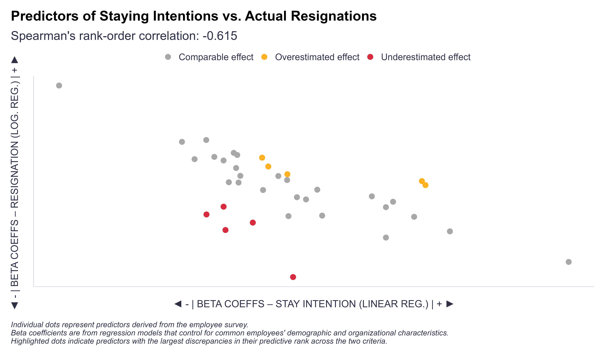

At least since [Richard LaPiere’s 1934 study](https://academic.oup.com/sf/article-abstract/13/2/230/1989679?redirectedFrom=fulltext&login=true){target="_blank"} comparing what hotel and restaurant staff said about ethnic minorities with how they actually treated them*, we’ve known that people’s stated attitudes and intentions can be worlds apart from their actual behavior.

A recent revisit of that study got me thinking about a similar disconnect: the relationship between employees’ declared intention to stay and their actual quitting behavior. But I wasn’t interested in whether intention to stay can predict attrition—that’s already fairly well established, with loyalty-related survey items ranking among the strongest predictors of resignations (though even those, unfortunately, tend to be relatively weak in absolute terms 🫤).

Instead, I wanted to see whether the drivers of intention to stay—the strongest predictors among other survey items—are also the top predictors of actual resignations (while controlling for standard demographic and organizational variables in both cases).

The idea was to spot potential blind spots—where employees might be over- or underestimating the influence of specific workplace experiences on their actual decision to stay or leave. Kind of like those classic findings on how bad we are at predicting what really makes us happy or unhappy (a.k.a. *[affective forecasting](https://en.wikipedia.org/wiki/Affective_forecasting){target="_blank"}*).

Preliminary results? The rank-order correlation between the estimated predictive strength of these factors for the two criteria was fairly high—around -0.6—but far from perfect, with a few notable outliers suggesting interesting mismatches between perceived and actual “impact”.

{width=100%}

Curious if anyone has done a similar analysis on their data and put the findings to practical use. Feel free to share your experiences in the comments.

\* *LaPiere famously traveled across the United States with a young Chinese couple, visiting 251 hotels and restaurants. They were refused service only once. However, six months later, when he sent a questionnaire to these same establishments asking, 'Will you accept members of the Chinese race as guests in your establishment?', over 90% of those who responded said 'No'.*
