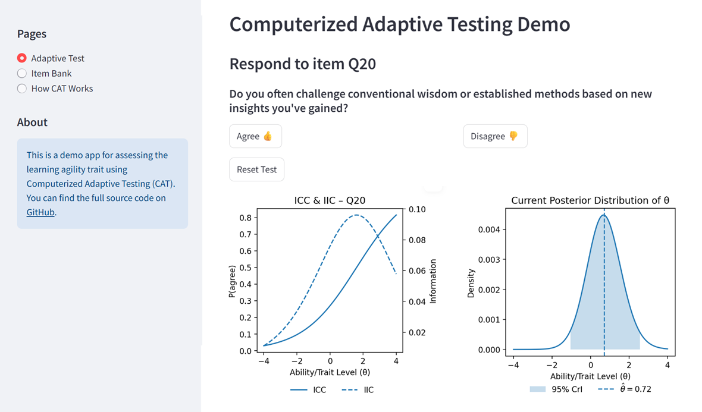

Specifically, I decided to reimplement in [Streamlit](https://streamlit.io/){target="_blank"} a [Computerized Adaptive Testing (CAT)](https://en.wikipedia.org/wiki/Computerized_adaptive_testing){target="_blank"} and [Item Response Theory (IRT)](https://en.wikipedia.org/wiki/Item_response_theory){target="_blank"} demo I originally built years ago in good old Excel. 

The app illustrates the estimation of a psychological trait of [learning agility](https://psycnet.apa.org/buy/2022-19273-004){target="_blank"} and showcases several key ideas behind CAT and IRT-based testing:

* **Item-level modeling** – how individuals respond to questions is modeled based on both the characteristics of each item (e.g. difficulty, discrimination) and the test-taker’s underlying trait or ability.
* **Continuous ability estimation** – the app updates the trait estimate in a Bayesian way after each response, rather than only at the end of the test.
* **Adaptive item selection** – items are chosen based on how informative they are given the test-taker’s current estimated trait level.
* **Efficiency and precision** – fewer items are needed to reach a reliable estimate compared to traditional fixed-form tests.

{width=100%}

Here’s the [link](https://cat-irt-demo.streamlit.app/){target="_blank"} to the app (it may ). If you’re interested, you can copy the full code from [GitHub](https://github.com/lstehlik2809/Computerized-Adaptive-Testing-Demo.git){target="_blank"} and customize the app to better suit your needs.

⚠️ Caveat: The app isn't intended as a valid and reliable measure of learning agility - it's purely for illustration purposes!

