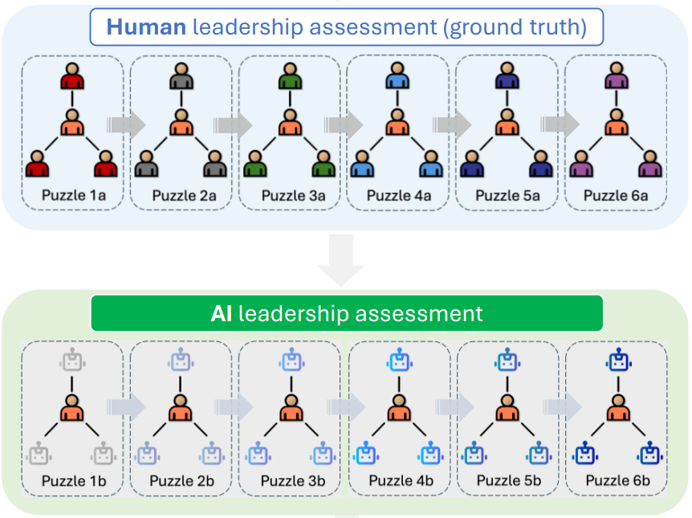

It never occurred to me that causal inference principles could be used effectively to measure something like leadership skills, but two pre-registered WIP studies by Weidmann et al. ([2024](https://www.nber.org/system/files/working_papers/w32699/w32699.pdf){target="_blank"}, [2025](https://www.nber.org/system/files/working_papers/w33662/w33662.pdf){target="_blank"}) illustrate it actually could make good sense.

The authors aimed to identify the causal contribution of managers to team performance by repeatedly randomly assigning managers to multiple teams of human followers and controlling for all individuals’ task-specific skills and fluid intelligence. Each time a leader was assigned to a team, a prediction was made about team performance based on the individual skills of the leader and the followers. Actual team performance was then compared to these predictions—leaders who drove performance above expectations were deemed to have strong leadership skills. In other words: a good manager consistently helps their team outperform the sum of its parts.

Those familiar with [causal inference](https://matheusfacure.github.io/python-causality-handbook/01-Introduction-To-Causality.html?highlight=counterfactual){target="_blank"} can clearly hear in this an echo of its central logic—constructing a counterfactual scenario and comparing it to what actually happened. Here, the counterfactual imagines team performance based solely on individual skills, without any added effect from the leader’s leadership skills.

Given the logistical difficulty of arranging such testing situations with human team members, the authors explored whether large language model (LLM) agents could stand in for real people. So, in a second pre-registered study, they tested this idea and found that leadership skill estimates based on teams consisting of human followers and AI-simulated followers correlated strongly (*ρ* = 0.81), which could make this assessment method much more practical and scalable.

{width=85%}

*Illustration of the part of the experiment where half the leaders completed 6 group puzzles with human teammates followed by 6 group puzzles with AI teammates (the other half of the leader sample completed the group puzzles in reversed order - not shown here).*

Besides that, the studies also uncovered several other interesting insights underlying the value and importance of objective, skill-based selection of future leaders:

* Good managers had roughly twice the impact on team performance compared to good individual contributors.
* People who put themselves forward as leaders tended to perform worse than those chosen at random—partly because self-nominated managers (correlated with extraversion and self-reported people skills) were often overconfident, especially about their social skills.
* Managerial performance was positively linked to economic decision-making ability, social intelligence, and fluid intelligence—but not to gender, age, ethnicity, or education.
* Skills were stronger predictors of managerial performance than personality traits or personal preferences.
* Strong leaders tended to ask more questions and engage more actively in conversational turn-taking.  
* Good managers boosted group performance by monitoring workers to prevent wasted time, assigning tasks based on comparative advantage, and motivating team members to put in their best effort.

⚠️ Caveat: The papers referenced were intended for discussion and comment, and have not undergone peer review. 

P.S. Thanks to my boss, Nadzeya Laurentsyeva, for pointing me to this interesting research.

