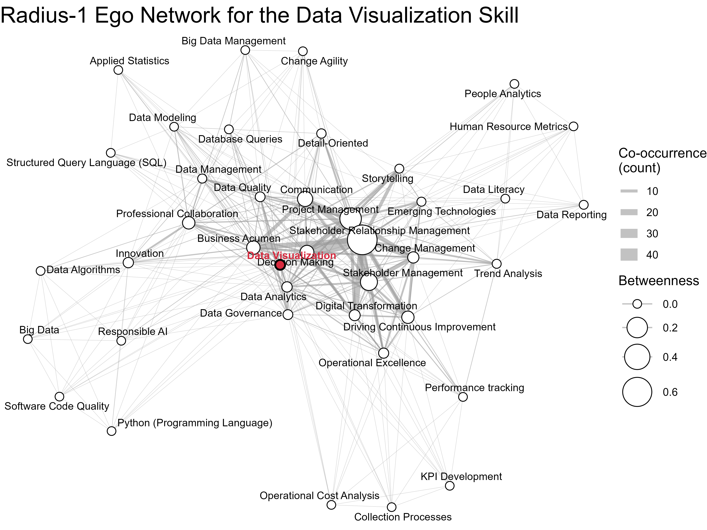

What if ONA could help us explore the skill space—finding more viable and/or more strategic development paths within it? Just like we use ONA to understand how long or “passable” the connections between people are in social networks, or who might be the informal influencer to involve in strategic transformation efforts, maybe we could apply the same approach to connections between skills—based on how often certain skills show up together across jobs or individual employees’ profiles.

Picture visualizing a skill’s ego-network (with radius = 1), centered on something you’ve already mastered, to spark ideas for other skills often developed alongside it and that have high closeness centrality—i.e., skills you might pick up fairly easily and through which you can reach a wide swath of other skills in just a couple of steps—ideal for incremental growth (see the attached dataviz skill ego-network for illustration).

{width=100%}

Or flip it around and imagine exploring weaker ties, "high-betweenness" bridging skills connecting disparate skill domains, or more distant parts of the skill network to uncover less common or totally unexpected skills to go after.

Curious if anyone’s already used ONA techniques with skill data like this—especially to uncover patterns of skill adjacency or learning pathways—or in any other creative way. Feel free to share your experiences or ideas in this area in the comments.
