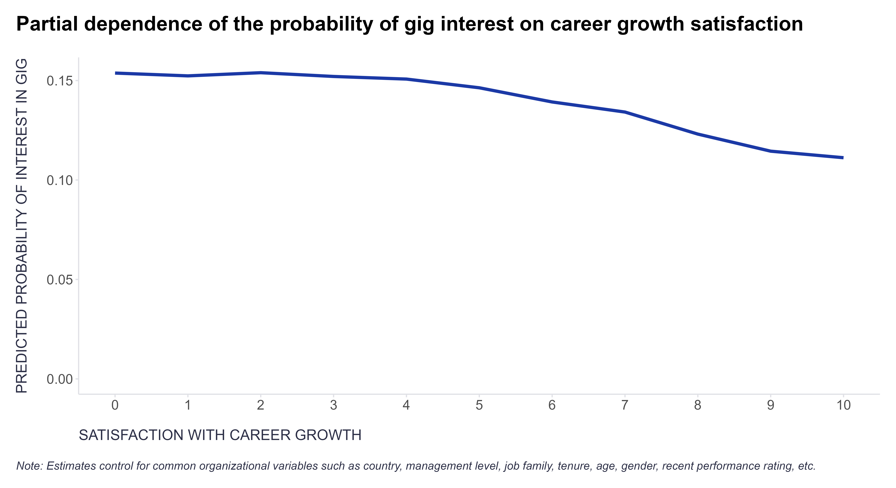

Situations where people act on their own can be a nightmare for a researcher trying to tease apart the causal effects of specific factors of interest. At the same time, though, such situations can be a valuable opportunity to indirectly tap into people’s otherwise unobserved characteristics or states that may impact or predict outcomes of interest.

Here are just a few examples from my own recent analytical practice:

1. Shown interest in gig participation as a signal of lower satisfaction with career development opportunities (see illustrative PDP plot below).
2. The number of self-reported job skills as a proxy for a mix of traits—probably ambition, conscientiousness, learning agility, and others—that predict future performance evaluations.
3. Having completed an individual development plan as another proxy for internal drivers like ambition and learning orientation.
4. Team non/participation in the employee survey as a proxy for team engagement, which in turn predicts individual-level voluntary attrition.

{width=100%}

Sure, such proxy measures aren’t perfect or clean representations of the variables of interest and, as such, require careful interpretation—ideally supported by empirical validation. That said, their imperfections usually don’t stop them from being useful, to paraphrase the famous George Box’s aphorism.

Curious to hear how you have used indirect or behavioral indicators in your work—what creative proxies have you leveraged? Feel free to share in the comments for inspiration.