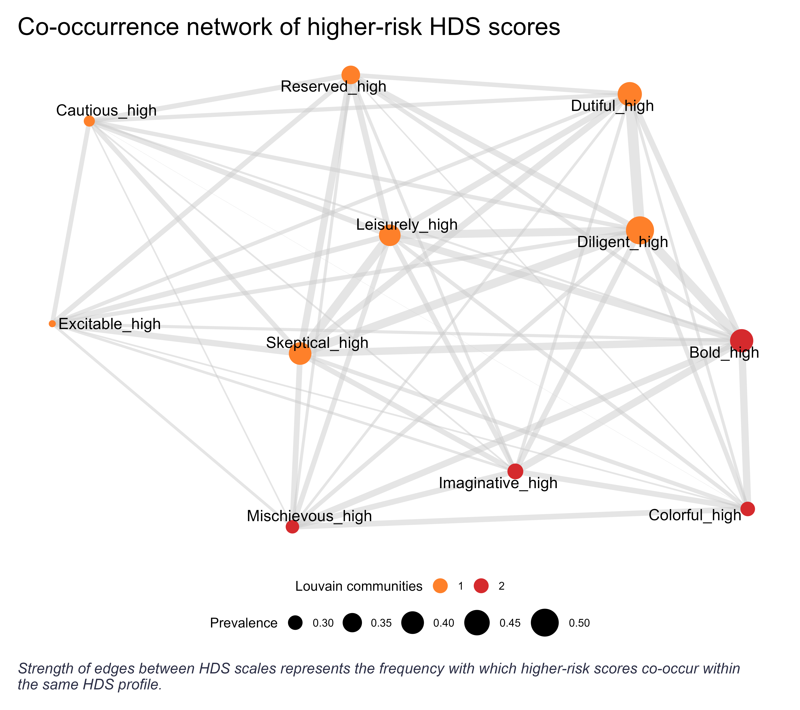

Some of you might be familiar with the psychometric tool [Hogan Development Survey (HDS)](https://www.hoganassessments.com/assessment/hogan-development-survey/){target="_blank"}, which measures the so‑called “dark side” of personality—essentially strengths overused under stress or when self-control wears thin, leading to behaviors that can derail performance, relationships, and leadership effectiveness. For example, a skeptical person’s vigilance and critical thinking can morph into distrust, negativity, or expecting betrayal, while a colorful person’s charisma and expressiveness can shift into being dramatic, attention-seeking, and overly bold.

{width=100%}

HDS scale descriptions taken from a sample HoganLead (Challenge) report found online.

While working on a team report based on HDS results, I got curious about how higher-risk scores (70th percentile and above)—both individually and in combos—tend to show up across HDS profiles in the broader population. Luckily, I had access to a recent large HDS dataset (N = 33,078) from the CEE region, drawn predominantly, though not exclusively, from current or aspiring managers, which allowed me to dig into the data and run some descriptive stats. 

Here are some quick highlights from the data:

* **Top three derailers**: Diligent (50%), Dutiful (43%), Bold (41%). IMO, not a big surprise given that succeeding as a manager often requires delivering high-quality work, playing it nice with people in power, and showing confidence.   
* **Bottom three derailers**: Excitable (27%), Cautious (28%), Mischievous (29%). Personally, I would’ve expected a higher prevalence of Excitable and Mischievous among managers… though maybe that’s just the availability heuristic at work 😉
* **Top three pairs**: Diligent + Dutiful (26%), Diligent + Bold (24%), Skeptical + Leisurely (23%). Congruent with the first point, but interesting to see a combo of distrust and passive-resistance here.
* **Top three triplets**: Diligent + Skeptical + Leisurely (14%), Bold + Skeptical + Leisurely (13%), Bold + Skeptical + Diligent (12%). Interesting patterns reinforcing the central role of distrust and independence, paired with excessive assertiveness and control.
* **Top derailers based on the strength centrality measure** (i.e., derailers that co-occur with others most often—you can easily spot them in the center of the network graph below): Diligent, Skeptical, Leisurely, and Bold. Consistent with the pattern above.
* Community detection algo partially reconstructed—for those familiar with HDS, well-known—three clusters of behaviors: **Moving Against** (Bold, Mischievous, Colorful, and Imaginative) VS. **Moving Away** (Excitable, Skeptical, Cautious, Reserved, and Leisurely) + **Moving Toward** (Diligent and Dutiful).

{width=100%}

Anything that surprised you or caught your attention?