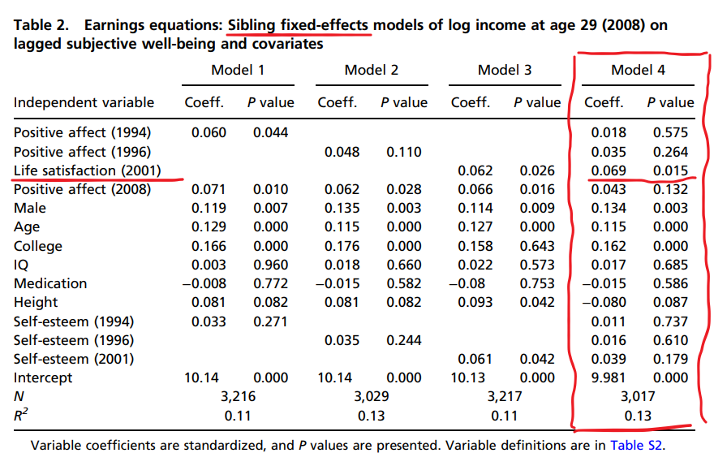

My personal "edu bot", whose task is to supply me with engaging articles from behavioral science, recently served me - quite fittingly for the summer season (at least here in the Northern Hemisphere) - an interesting study by [De Neve & Oswald (2013)](https://www.pnas.org/doi/10.1073/pnas.1211437109){target="_blank"} that flipped the usual question from "*Does money buy happiness?*" to "*Does happiness create money?*". The study measured two key components of well-being - *positive affect* (everyday positive emotions) and *life satisfaction* (overall life evaluation) - to see if they influenced later income.  

The authors used several methodological tweaks to get as close as possible to making a causal claim:

* **Longitudinal panel data:** The study tracked the same people (adolescents and young adults) for years, measuring their happiness multiple times before recording their income, thereby reducing the risk of reverse causality.
* **Sibling fixed-effects model:** Instead of comparing unrelated people, the study compared siblings, effectively controlling for family background, parenting style, and even genetic factors.
* **Rich controls:** Factors such as IQ, education, physical health, height, gender, ethnicity, and self-esteem were included to isolate happiness from other potential drivers of financial success - with self-esteem, interestingly, helping to disentangle happiness from feelings rooted in anticipated future success.
* **Later happiness control:** Happiness was also measured at the same time as income to control for stable, latent "happy personality" trait.
* **Mediation analysis:** The authors also examined which mechanisms may mediate the effect of happiness on income.

And here are their key findings:

* **Happiness provides a direct financial edge:** When comparing siblings, a one-standard-deviation increase in an individual's life satisfaction at age 22 boosted their earnings at age 29 by 6%. 
* **The monetary value is substantial:** A single-point increase in life satisfaction (on a 5-point scale) translated into nearly $4,000 more in annual income compared to a less happy sibling, even after accounting for other factors.
* **Happiness works through multiple pathways:** Significant indirect/mediating pathways include a higher probability of obtaining a college degree, getting hired and promoted, having higher degrees of optimism and extraversion, and less neuroticism. Collectively, these factors explain a massive 68-78% of the total effect. 

{width=100%}

These results thus suggest that happiness isn’t merely a byproduct of financial success or a simple ‘feel-good’ state - it also appears to create the psychological and social conditions that make higher earnings more likely.

⚠️ Sure, there are limitations - e.g., income was measured only once and early in the career, so we don’t know if the effect lasts, not all unobserved factors could be completely ruled out, even with sibling comparisons, etc. But here’s the good news: even if the causal link is weaker than it seems, boosting our happiness is still worth it for its own sake. Right? 😉 #HappySummer 

