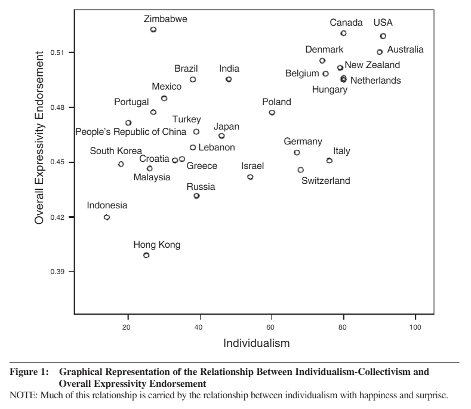

I know the summer holidays - often spent abroad, outside our home countries - are wrapping up for many of us, but some of you might still find it handy to know what research by [Matsumoto et al. (2008)](https://www.researchgate.net/publication/259383504_Mapping_expressive_differences_around_the_world){target="_blank"} says about cultural differences in emotional expressivity.

They found some universal patterns - for example, pretty much everywhere, people tend to show more emotion with close friends (in-groups) than with acquaintances (out-groups). But there are also clear cultural differences. Folks from more individualistic cultures often express emotions more openly, especially positive ones like happiness and surprise, and may show more warmth toward out-groups than people from more collectivistic cultures (see chart from the paper below).

{width=90%}

Sure, there’s still a lot of variation within each country, and individual differences can be as big as the ones between countries. Still, keeping these broad patterns in mind and adjusting the priors on your “emotional radar” a little when you’re interacting across cultures may help you be less likely to over- or underestimate what someone’s really feeling. 

#HappySummer 😎

