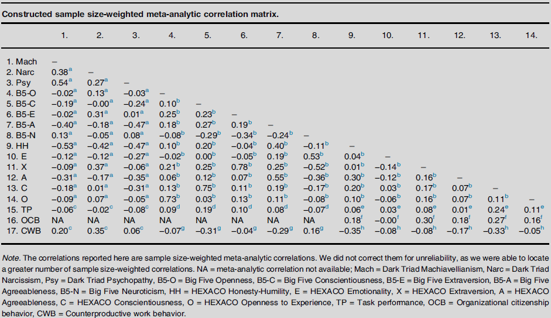

One of my old work friends asked me recently whether I’d recommend a [Big Five–](https://en.wikipedia.org/wiki/Big_Five_personality_traits){target="_blank"} or [HEXACO](https://en.wikipedia.org/wiki/HEXACO_model_of_personality_structure){target="_blank"}-based psychometric tool for employee selection, with predictive validity as the main criterion. Not being a super-expert on this topic, I told her that AFAIK they’re more or less equivalent, with HEXACO having that extra Honesty–Humility dimension, so if counterproductive work behavior (CWB) is a big deal for them, HEXACO might have a slight edge over the Big Five.

To double-check my reasoning and advice, I dug into the available evidence and luckily came across a solid meta-analytic review by [Pletzer & Abrahams (2025)](https://www.sciencedirect.com/science/article/pii/S2352250X25000673){target="_blank"} that compares the predictive validity of these two models for task performance and CWB, among other things.

Interestingly, when you look at the overlapping dimensions one by one, the Big Five seems to have a slight edge in predicting both task performance and CWB—see the charts based on the paper’s data below. 

```{r warning=FALSE}
# uploading library for using Python in RMarkdown
library(reticulate)
```

```{python warning=FALSE}

import numpy as np
import matplotlib.pyplot as plt

def create_dumbbell_chart_combined(ax, data, title):
    """
    Creates a dumbbell chart on the provided Axes object.
    """

    # Extract data
    traits = list(data.keys())
    b5_values = np.array([v[0] for v in data.values()], dtype=float)
    hexaco_values = np.array([v[1] for v in data.values()], dtype=float)

    # Sort by mean (ignoring NaNs)
    mean_values = np.array([np.nanmean(v) for v in data.values()], dtype=float)
    sorted_idx = np.argsort(mean_values)

    sorted_traits = [traits[i] for i in sorted_idx]
    sorted_b5 = b5_values[sorted_idx]
    sorted_hexaco = hexaco_values[sorted_idx]
    y = np.arange(len(sorted_traits))

    # Masks for finite values
    finite_b5 = np.isfinite(sorted_b5)
    finite_hex = np.isfinite(sorted_hexaco)
    finite_both = finite_b5 & finite_hex

    # Lines only where both ends exist
    ax.hlines(y=y[finite_both],
              xmin=sorted_b5[finite_both],
              xmax=sorted_hexaco[finite_both],
              color='grey', alpha=0.6)

    # Points (each side independently)
    ax.scatter(sorted_b5[finite_b5], y[finite_b5], color='#3c78d8', s=150, label='Big Five', zorder=3)
    ax.scatter(sorted_hexaco[finite_hex], y[finite_hex], color='#e06666', s=150, label='HEXACO', zorder=3)

    # Value labels — only when finite
    for i in range(len(sorted_traits)):
        if np.isfinite(sorted_b5[i]):
            ax.text(sorted_b5[i], y[i] + 0.2, f'{sorted_b5[i]:.2f}', ha='center', va='bottom', fontsize=10)
        if np.isfinite(sorted_hexaco[i]):
            ax.text(sorted_hexaco[i], y[i] + 0.2, f'{sorted_hexaco[i]:.2f}', ha='center', va='bottom', fontsize=10)

    # Formatting
    ax.set_yticks(y)
    ax.set_yticklabels(sorted_traits, fontsize=12)
    ax.set_xlabel('Absolute Value of Meta-Analytic Correlation Coefficient', fontsize=12)
    ax.set_title(title, fontsize=16, pad=50)
    ax.legend(loc='lower center', bbox_to_anchor=(0.5, 1.02), ncol=2, frameon=False, fontsize=12)
    ax.axvline(x=0, color='black', linestyle='--', linewidth=1, alpha=0.7)
    ax.grid(axis='x', linestyle='--', alpha=0.7)
    for spine in ('top','right','left','bottom'):
        ax.spines[spine].set_visible(False)


# --- Data from the Study ---

task_performance_data = {
    'Openness': [abs(0.09), abs(0.11)],
    'Conscientiousness': [abs(0.19), abs(0.24)],
    'Extraversion': [abs(0.10), abs(0.08)],
    'Agreeableness': [abs(0.08), abs(0.01)],
    'Neuroticism / Emotionality': [abs(-0.07), abs(0.03)],
    'Honesty-Humility': [np.NaN, abs(0.06)]
}

cwb_data = {
    'Openness': [abs(-0.07), abs(-0.05)],
    'Conscientiousness': [abs(-0.31), abs(-0.33)],
    'Extraversion': [abs(-0.04), abs(-0.08)],
    'Agreeableness': [abs(-0.29), abs(-0.17)],
    'Neuroticism / Emotionality': [abs(0.16), abs(-0.08)],
    'Honesty-Humility': [np.NaN, abs(-0.35)]
}

# --- Generate the Combined Chart ---

fig, (ax1, ax2) = plt.subplots(2, 1, figsize=(12, 12))

create_dumbbell_chart_combined(
    ax1,
    task_performance_data,
    'Predictive Power for Task Performance'
)

create_dumbbell_chart_combined(
    ax2,
    cwb_data,
    'Predictive Power for Counterproductive Work Behavior (CWB)'
)

plt.tight_layout(pad=3.0)
plt.show()

```

*Note: The charts aren’t from the paper itself—I made them using the paper’s data, so any discrepancies are on me.*

But when you combine inter-correlations from the sample-size–weighted meta-analytic correlation matrix below and estimate explained variance, the conclusion flips: HEXACO outperforms the Big Five in predicting both CWB (20.1%* vs. 14.9%) and task performance (6.7% vs. 4.3%).

\* *When using the authors' approach to estimating explained variance, i.e. $R^2 = R_{xy}^T R_{xx}^{-1} R_{xy}$, where $R_{xx}$ is the correlation matrix of the predictor traits (e.g., the 5x5 matrix for the Big Five) and $R_{xy}$ is the vector of correlations between each trait and the outcome (CWB or task performance), I obtained a slightly higher estimate of 20.3%. But maybe I made an error in the code—you can check it out for yourself below* 🤔

```{python eval=FALSE}

import numpy as np

# --- Big Five Analysis for CWB ---

# Define the predictor inter-correlation matrix (Rxx) for the Big Five traits
# Order: Openness, Conscientiousness, Extraversion, Agreeableness, Neuroticism
R_xx_b5 = np.array([
    [1.00, 0.10, 0.25, 0.18, -0.08],
    [0.10, 1.00, 0.23, 0.27, -0.29],
    [0.25, 0.23, 1.00, 0.19, -0.34],
    [0.18, 0.27, 0.19, 1.00, -0.24],
    [-0.08, -0.29, -0.34, -0.24, 1.00]
])

# Define the vector of correlations between predictors and outcome (Rxy)
# CWB correlations for Openness, Conscientiousness, Extraversion, Agreeableness, Neuroticism
R_xy_b5 = np.array([-0.07, -0.31, -0.04, -0.29, 0.16])

# Calculate R-squared using the formula: R^2 = Rxy^T * Rxx^-1 * Rxy
R_xx_b5_inv = np.linalg.inv(R_xx_b5)
R_squared_b5 = R_xy_b5.T @ R_xx_b5_inv @ R_xy_b5


# --- HEXACO Analysis for CWB ---

# Define the predictor inter-correlation matrix (Rxx) for the HEXACO traits
# Order: Honesty-Humility, Emotionality, eXtraversion, Agreeableness, Conscientiousness, Openness
R_xx_hexaco = np.array([
    [1.00, 0.04, 0.01, 0.30, 0.20, 0.10],
    [0.04, 1.00, -0.14, -0.12, 0.03, -0.06],
    [0.01, -0.14, 1.00, 0.16, 0.17, 0.16],
    [0.30, -0.12, 0.16, 1.00, 0.07, 0.07],
    [0.20, 0.03, 0.17, 0.07, 1.00, 0.11],
    [0.10, -0.06, 0.16, 0.07, 0.11, 1.00]
])

# Define the vector of correlations between predictors and outcome (Rxy)
# CWB correlations for HH, E, X, A, C, O
R_xy_hexaco = np.array([-0.35, -0.08, -0.08, -0.17, -0.33, -0.05])

# Calculate R-squared
R_xx_hexaco_inv = np.linalg.inv(R_xx_hexaco)
R_squared_hexaco = R_xy_hexaco.T @ R_xx_hexaco_inv @ R_xy_hexaco


# --- Print Results ---
print("--- Replication of Explained Variance (R^2) for CWB ---")
print(f"Big Five Model: {R_squared_b5:.1%}")
print(f"HEXACO Model:   {R_squared_hexaco:.1%}")


# --- Big Five Analysis for Task Performance ---

# Define the predictor inter-correlation matrix (Rxx) for the Big Five traits
# This matrix remains the same as in the CWB analysis.
# Order: Openness, Conscientiousness, Extraversion, Agreeableness, Neuroticism
R_xx_b5 = np.array([
    [1.00, 0.10, 0.25, 0.18, -0.08],
    [0.10, 1.00, 0.23, 0.27, -0.29],
    [0.25, 0.23, 1.00, 0.19, -0.34],
    [0.18, 0.27, 0.19, 1.00, -0.24],
    [-0.08, -0.29, -0.34, -0.24, 1.00]
])

# Define the vector of correlations between predictors and outcome (Rxy)
# Task Performance correlations for Openness, Conscientiousness, Extraversion, Agreeableness, Neuroticism
R_xy_b5_tp = np.array([0.09, 0.19, 0.10, 0.08, -0.07])

# Calculate R-squared using the formula: R^2 = Rxy^T * Rxx^-1 * Rxy
R_xx_b5_inv = np.linalg.inv(R_xx_b5)
R_squared_b5_tp = R_xy_b5_tp.T @ R_xx_b5_inv @ R_xy_b5_tp


# --- HEXACO Analysis for Task Performance ---

# Define the predictor inter-correlation matrix (Rxx) for the HEXACO traits
# This matrix also remains the same.
# Order: Honesty-Humility, Emotionality, eXtraversion, Agreeableness, Conscientiousness, Openness
R_xx_hexaco = np.array([
    [1.00, 0.04, 0.01, 0.30, 0.20, 0.10],
    [0.04, 1.00, -0.14, -0.12, 0.03, -0.06],
    [0.01, -0.14, 1.00, 0.16, 0.17, 0.16],
    [0.30, -0.12, 0.16, 1.00, 0.07, 0.07],
    [0.20, 0.03, 0.17, 0.07, 1.00, 0.11],
    [0.10, -0.06, 0.16, 0.07, 0.11, 1.00]
])

# Define the vector of correlations between predictors and outcome (Rxy)
# Task Performance correlations for HH, E, X, A, C, O
R_xy_hexaco_tp = np.array([0.06, 0.03, 0.08, 0.01, 0.24, 0.11])

# Calculate R-squared
R_xx_hexaco_inv = np.linalg.inv(R_xx_hexaco)
R_squared_hexaco_tp = R_xy_hexaco_tp.T @ R_xx_hexaco_inv @ R_xy_hexaco_tp


# --- Print Results ---
print("--- Replication of Explained Variance (R^2) for Task Performance ---")
print(f"Big Five Model: {R_squared_b5_tp:.1%}")
print(f"HEXACO Model:   {R_squared_hexaco_tp:.1%}")


```

<div style="text-align:center">
{width=100%}
</div>

The reason seems to be that HEXACO includes the extra Honesty–Humility trait (which captures ethical variance and is a decent predictor of negative workplace behaviors), shows higher predictive validity for the generally most predictive trait (Conscientiousness), and has less inter-correlation between traits (so their predictive power overlaps less).

Curious about others’ experiences with switching from the Big Five to HEXACO. What motivated the change for you, and was it worth it? Asking for a friend (and myself) 🙏🙂
