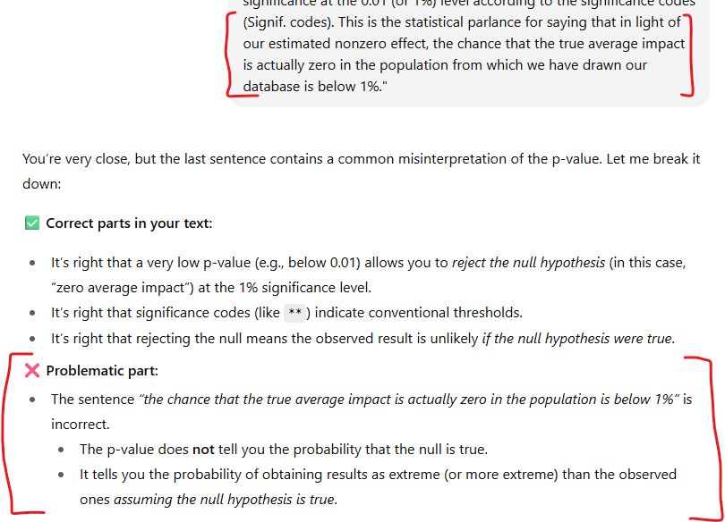

Supposedly, great minds can entertain contradictory ideas at once with ease. I’d love to think I’m one of them, but the truth is I even struggle to keep reading books on new, complex topics when the author makes basic mistakes in areas I actually do still understand. I know I shouldn’t throw the baby out with the bathwater, but it gives me trust issues: what if the author makes similar mistakes in the parts I don’t understand? 😯

I’m curious — do you have a rule of thumb for this? When do you forgive, and when do you close the book?

For example, a friend of mine once said (not a literal quote): “Treat it like a physics lecture — let ‘electrons orbit like planets’ slide, but walk out when someone brings astrology or chakras into quantum mechanics.” 🙃 Currently, I see it similarly - for me, the dividing line is whether the mistake feels like a teaching shortcut or a conceptual blind spot. If it’s a simplification to ease the reader in, I can forgive it. If it betrays a lack of rigor, I usually stop reading. But I must admit that sometimes it’s not easy to tell the difference in the moment — which is why I’m curious how others draw their line.

P.S. This rant-ish post was prompted by my recent reading on causal inference, where the author repeatedly described p-values as the probability that the null hypothesis is true. I was really surprised that an expert in econometrics can still get this wrong — funnily enough, even GenAIs these days seem to get it right (as shown by a bit of ChatGPT’s feedback on the problematic passage below).

{width=100%}

