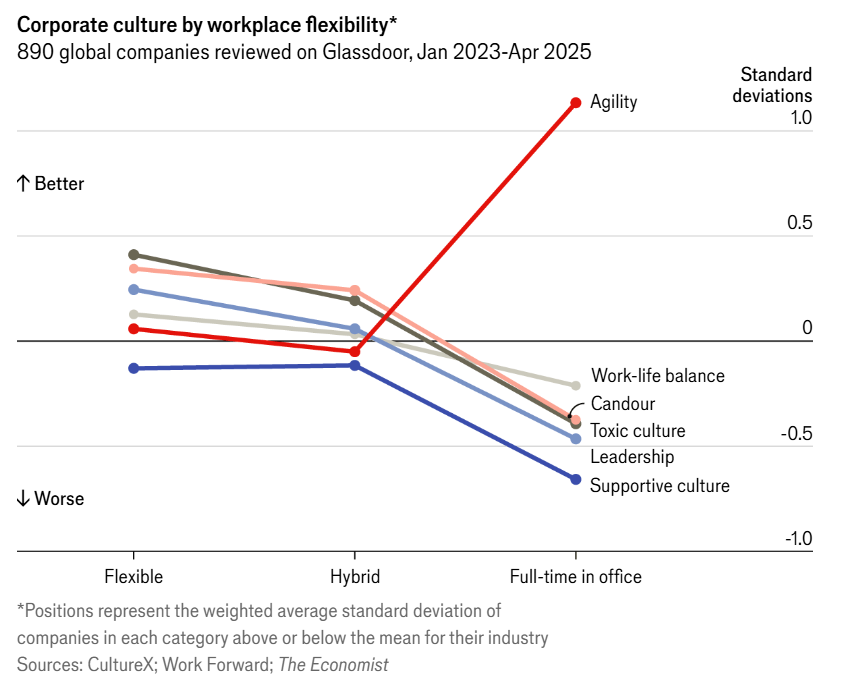

Recently, I came across an [article in *The Economist*](https://www.economist.com/business/2025/07/07/does-working-from-home-kill-company-culture){target="_blank"} analyzing ~890 firms, which suggested that employee experiences in flexible vs. full-time office setups might involve a trade-off between agility and other elements of corporate culture.

Specifically, the authors found that companies mandating five days in the office scored higher on agility, but at the cost of work-life balance, support, candor, leadership trust, and a non-toxic culture (see the plot below).


<div style="text-align:center">
{width=85%}
</div>

That got me wondering how these different dimensions of culture relate to each other more broadly—regardless of work arrangement—and what kinds of trade-offs might exist.

To explore this, I used the same dataset referenced in [another related *Economist* piece](https://www.economist.com/interactive/business/2025/06/16/corporate-culture){target="_blank"} comparing cultures across companies from different industries, as measured by [*CultureX*](https://www.culturex.com/){target="_blank"} through anonymous [Glassdoor](https://www.glassdoor.com){target="_blank"} reviews between Jan 1, 2023 and Apr 4, 2025, and applied [psychometric network analysis](https://www.nature.com/articles/s43586-021-00055-w){target="_blank"} (EBICglasso) to estimate regularized partial correlations between individual cultural factors in the sample.

```{r fig.width=11, fig.height=7, warning=FALSE, message=FALSE, error=FALSE}

library(tidyverse)
library(bootnet)
library(igraph)
library(tidygraph)
library(ggraph)

# uploading the data
data <- read.delim("culturex_data.txt", sep = ",", header = TRUE)

# changing the data format
wide_data <- data %>%
  pivot_wider(
    names_from = topic,
    values_from = post_covid_score
  ) %>% 
  # indicating that the toxic culture score were (very probably) reversed
  rename(`Toxic culture (R)` = `Toxic culture`)

# Psychometric Network Analysis

# estimating the network
network_estimate <- estimateNetwork(
  wide_data[, 4:12],
  default = "EBICglasso",
  corMethod = "cor_auto", 
  tuning = 0.5, # the LASSO penalty / regularization parameter
  threshold = TRUE # removes edges that are not statistically significant, thereby increasing specificity
)

# converting the qgraph object to a tidygraph object
graph_obj <- as_tbl_graph(network_estimate$graph, directed = FALSE) %>%
  activate(nodes)

# getting the edge weights from the graph object
edge_weights <- E(graph_obj)$weight

# creating the network plot
# setting seed for reproducibility
set.seed(2024)
ggraph_plot <- ggraph(
  graph_obj, 
  layout = 'fr', 
  weights = abs(edge_weights) 
  ) +
  geom_edge_link(
    aes(color = weight, linewidth = abs(weight)), 
    show.legend = TRUE
  ) +
  scale_edge_color_gradient2(
    low = "#f28e2b", mid = "gray90", high = "#4e79a7", 
    midpoint = 0, name = "Regularized Partial Correlations"
  ) +
  scale_edge_width(name = "Abs. Regularized Partial Correlations") +
  geom_node_point(
    fill = "black", color = "black", stroke = 1, size = 4
  ) +
  geom_node_text(aes(label = name),, size=5, repel = TRUE) +
  theme_graph(base_family = 'sans') +
  labs(
    title = "Psychometric Network Analysis of Corporate Culture",
    subtitle = "As measured by CultureX through anonymous reviews submitted by employees to Glassdoor between Jan 1st 2023-Apr 4th 2025",
    caption = "\nThe toxic culture score is supposed to be reversed."
  )

# printing the final plot
print(ggraph_plot)


```

The resulting network chart shows a few interesting patterns:

* Leadership sits at the center, with strong positive connections to most other cultural dimensions.
* Innovation appears relatively isolated compared to the rest.
* Work-life balance shows negative associations with several factors, including innovation, strategy, and agility.
* Agility is negatively related to non-toxic culture, supportive culture, work-life balance, and transparency, but positively associated with leadership and strategy. 

Sure, the correlations are far from perfect, so you can find plenty of exceptions to these patterns in the data. But still, imo, it’s interesting food for thought and potentially useful input into considerations about shaping corporate culture in one direction or another, as prioritizing one dimension may carry opportunity costs and unintended consequences.

---

P.S. If you want to replicate the analysis, run your own, or add additional external data, you can use the table below. ⚠️ But please keep in mind that I did not obtain the data officially from *CultureX*—I scraped/downloaded them from [*The Economist's* webpage](https://www.economist.com/interactive/business/2025/06/16/corporate-culture){target="_blank"}, so I cannot guarantee that the data are 100% accurate.

```{r}

# user-friendly table with the data in wide format
library(DT)

datatable(
  wide_data %>% 
    select(name, description, industry, everything()) %>% 
    rename(
      'Company name' = name, 
      'Company description' = description, 
      'Industry' = industry
    ) %>% 
    mutate(Industry = as.factor(Industry)),
  class = 'cell-border stripe', 
  filter = 'top',
  extensions = 'Buttons',
  fillContainer = FALSE,
  rownames= FALSE,
  options = list(
    pageLength = 5, 
    autoWidth = TRUE,
    dom = 'Bfrtip',
    buttons = c('copy', 'csv', 'excel'), 
    scrollX = TRUE, 
    selection="multiple"
  )
)

```