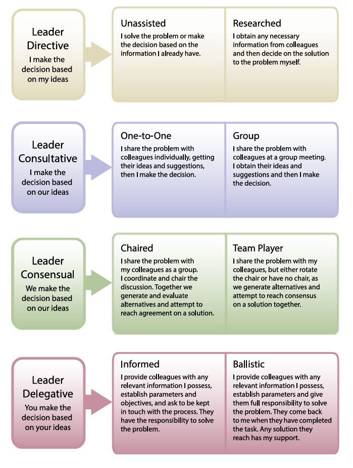

Many of us have probably read about recent [OpenAI research](https://go.sparkpostmail2.com/f/a/2coy4p_7T3W9fFCvydrRxA~~/AAA-fBA~/SrWxfCzqkYIc4YBJbUbAcKC1heZK5iLCyQsE-BKLz5oLGJBugTP8-oWsMWMPo6mGTQFbvhUFGRY3qhVAmCLhEOkN9ijhDjGtO_0yfkjWxeCCZfeAMyUmEuSFgFCNsAcqrU-LvdmeplQkrvKnoJPh3Kc1t4ejHe9lGQUoP_UEdzNlbsl6rMBJlLXlr5SYECoCEUSth9AdamjpMrCzNT5HQHexqveh27VgiSIXdCNi_Vo~){target="_blank"} on how customers are using their tool. The study found, among other things, that asking for information or advice to support decision-making is the single biggest use case, making up 49% of all user interactions. 

That got me wondering: how good could genAI be at helping people managers make better people-management decisions?

To get a more tangible sense of this, I put ChatGPT-5 (in thinking mode) through the *Leadership Judgement Indicator* (LJI) - a well-known situational judgment test that presents people-related decision-making scenarios, offers several possible solutions, and asks respondents to rate how adequate those solutions are. (Note for the psychometricians among you: I ran the test in temporary chat mode, so nothing was saved or used to train OpenAI’s models, reducing the risk of the testing material being exposed. 🫡)

For those who don’t know the tool, it’s based on the theory that leadership effectiveness depends on the ability to adapt decision-making styles to the situation, the task, and the people involved. Specifically, it assumes that…

* no single leadership style is always best,
* context drives effectiveness, and
* effective leaders must flex across various styles, even when they don’t come naturally to them.

<div style="text-align:center">
{width=80%}

*Leadership decision-making model behind the LJI.*
</div>

<br>

So how did genAI do compared to human managers?

* It leaned much more often toward a consultative style, and less often - though still within the broader norm - toward the other three styles: delegative, consensual, and directive.
* Its judgment quality was high when choosing directive and especially consultative styles. For consensual and delegative styles, it showed average judgment quality.
* Overall leadership adequacy landed in the upper part of the broader norm - so pretty solid results, though not exceptional. Personally, I thought it’d do much better.
* Interestingly, it performed about the same even after being given a short description of the LJI model’s principles of effective leadership.

```{r warning=FALSE, message=FALSE, comment=FALSE, fig.width=8, fig.height=4}

library(tidyverse)
library(patchwork)
library(ggtext)

# Data with test results
df <- readxl::read_xlsx("leadership_scores.xlsx")

# Helper to simplify and uppercase style names
clean_metric <- function(x) {
  x %>%
    str_replace("Preference of ", "") %>%
    str_replace("Adequacy for ", "") %>%
    str_replace(" style", "") %>%
    str_to_upper()
}

# Prepare filtered data
pref_df <- df %>%
  filter(section == "Preference Scores") %>%
  mutate(
    metric = clean_metric(metric),
    metric = factor(metric, levels = c("DIRECTIVE", "CONSULTATIVE", "CONSENSUAL", "DELEGATIVE"))
  )

adequacy_df <- df %>%
  filter(section == "Appropriateness Scores",
         metric != "Overall leadership adequacy") %>%
  mutate(
    metric = clean_metric(metric),
    metric = factor(metric, levels = c("DIRECTIVE", "CONSULTATIVE", "CONSENSUAL", "DELEGATIVE"))
    )

# General plotting function with a custom title and color argument
plot_style <- function(data, title, point_color) {
  ggplot(data, aes(x = normed_value, y = forcats::fct_rev(metric))) +
    geom_rect(aes(xmin = -1, xmax = 1, ymin = -Inf, ymax = Inf),
              fill = "lightgrey", alpha = 0.15, inherit.aes = FALSE) +
    geom_point(size = 3, color = point_color) +
    scale_x_continuous(
      limits = c(-3, 3),
      breaks = seq(-3, 3, 1),
      minor_breaks = seq(-3, 3, 0.5)
    ) +
    labs(
      x = "Normed Value (z-score)", 
      y = NULL, 
      title = title
      ) +
    theme_minimal(base_size = 12) +
    theme(
      panel.grid.major.y = element_blank(),
      panel.grid.minor = element_line(color = "grey80", linewidth = 0.3, linetype = 'dashed'),
      panel.grid.major.x = element_line(color = "grey80", linewidth = 0.3),
      plot.title = element_markdown(size = 13, face = "plain", hjust = 0, margin = margin(b = 10)),
      plot.title.position = "plot",
      axis.title.x = element_text(margin = margin(t = 5))
    )
}

# Assign custom colors
pref_color <- "#1f77b4"
adequacy_color <- "#d62728"

# Build plots
p1 <- plot_style(
  pref_df,
  paste0("Leadership Style <span style='color:", pref_color, ";'><b>Preferences</b></span>"),
  pref_color
)

p2 <- plot_style(
  adequacy_df,
  paste0("Leadership Style <span style='color:", adequacy_color, ";'><b>Adequacy</b></span>"),
  adequacy_color
)

# Combine plots side by side
(p1 | p2) +
  plot_annotation(
    title = "ChatGPT-5's Results on the Leadership Judgement Indicator",
    theme = theme(
      plot.title = element_text(hjust = 0, face = "bold", size = 15)
    )
  )

# Save the plots
# ggsave("lji_genai.png", width = 8, height = 4, dpi = 700)


```

The possible takeaway? With full awareness of the obvious limitations of this small “experiment” (one model, one benchmark, one run, no special prompt engineering, etc.), it might suggest that current genAI isn’t bad at leadership judgment, but it’s not exceptional either. At the same time, it may be biased toward certain styles (“safe” and socially desirable consultation) and have blind spots (like situations requiring shared ownership and distributed accountability). If that’s true, it could have implications both for how managers should use it and for how the models should be fine-tuned if they’re meant for this specific purpose at scale.