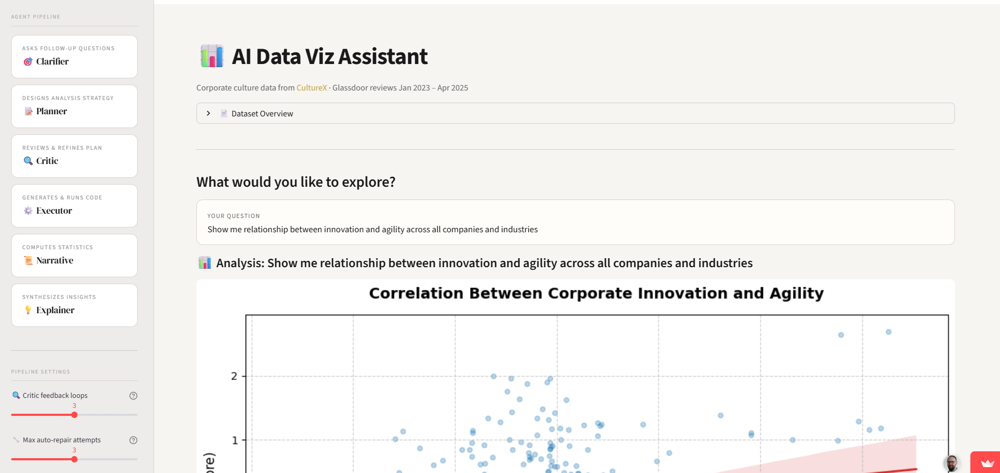

It’s a [simple agentic app](https://ai-dataviz-exploration.streamlit.app/){target="_blank"} for plain-language exploration of corporate culture data. Ask a question in everyday language, and a team of AI agents will plan the analysis, generate the visualization, and explain the findings - all in a few seconds.

It runs on a public dataset from [*CultureX*](https://www.culturex.com/){target="_blank"} with corporate culture scores across companies in different industries, measured through anonymous [*Glassdoor*](https://www.glassdoor.com){target="_blank"} reviews between Jan 1, 2023, and Apr 4, 2025.
 
The app uses several AI agents (powered by Google's Gemini 3 Flash Preview), each responsible for a different step:

* **Clarifier** - asks 2–3 sharpening questions to understand exactly what you want (which companies, which metrics, what chart type, etc.)
* **Planner** - designs the analysis strategy based on your request and the data
* **Critic** - reviews the plan and pushes back if something can be improved (up to 3 rounds)
* **Executor** - turns the plan into runnable visualization code
* **Narrative** - computes statistics and writes a data-driven summary
* **Explainer** - synthesizes everything into a concise insight for a non-technical audience

After the initial analysis, you can ask up to 5 follow-up questions. The AI keeps full context from previous turns - including your answers to sharpening questions - so it builds on what it already knows rather than starting from scratch. Hit `✨ New Analysis ` to  start to  a fresh exploration.

{width=100%}

It usually provides good outputs even with really simple plain language - but based on my experiments, it helps if you know what kind of dataviz and insights you want and spell that out for the agents 😉

[Happy exploring](https://ai-dataviz-exploration.streamlit.app/){target="_blank"} 🕵️‍♀️ And as usual, genAI can make mistakes, so don't trust the outputs blindly - always double-check 😉

----

P.S. Since the app is hosted on Streamlit Community Cloud, it doesn't stay awake continuously. If it hasn't been used recently, you may need to wake it up and wait a few minutes.

P.P.S. Click the GitHub icon in the top right corner of the app to get to the code repo, or go directly [here](https://github.com/lstehlik2809/AI-Dataviz-Exploration/tree/main){target="_blank"}.