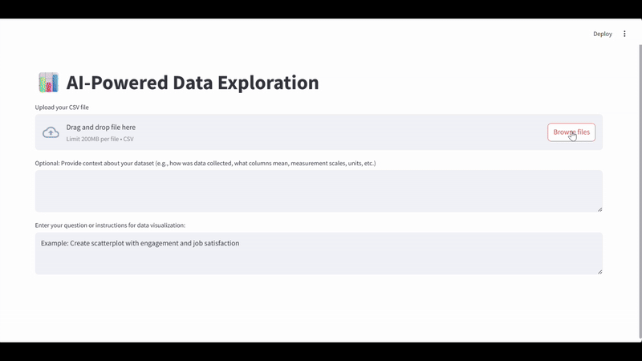

As a data scientist and analyst who spends a lot of time knee-deep in data, trying to figure out how to use it to answer stakeholders’ questions and help them solve the problems they’re facing, I used to be pretty skeptical about the quality and actual value that GenAI could bring to data analysis.

But to challenge my assumptions and get a better sense of what today’s GenAIs and agentic frameworks like *LangChain* and *LangGraph* can actually do, I decided to experiment a bit and built a simple AI-driven assistant for data-insight democratization, that lets non-technical users explore data through basic tools for visualization and descriptive and inferential statistics, all using plain language.

For that purpose I built a simple app consisting of several agent-like components (powered by the GPT-5-mini model), each responsible for a different aspect of the insight-generation process:

* one component plans the analysis steps based on the user’s request, data characteristics, and broader context,
* another evaluates the quality of the proposed plan and suggests adjustments if necessary,
* another turns this plan into runnable code,
* another fixes potential errors in the code based on received error messages,
* another creates code for accompanying analyses to support explanation of the dataviz, and
* another transforms the results of these analyses into a concise, clear narrative for a non-technical audience.

{width=100%}

*The attached video above shows the app in action, answering a question about the employee attitudes that are the most predictive of attrition using the [IBM Employee Attrition dataset](https://www.kaggle.com/datasets/pavansubhasht/ibm-hr-analytics-attrition-dataset){target="_blank"}.* 

I was surprised by how reasonably well the whole system worked. Sure, sometimes the AI chose - at least in my opinion - not exactly the best way to analyze the data or answer the question, but more often than not, it handled the tasks just fine, at a level I’d expect from a junior or mid-level data analyst.

In those less-than-ideal cases, I could always fix things by giving it more context or clearer instructions on what approach to use (though I admit that’s kind of cheating — you can’t really expect non-analysts to know that). Still, I can imagine the system being improved with an extra component whose job would be to ask users for more context before starting the analysis - similar to what some deep research tools do these days.

Personally, this experiment made me update my priors, and now I can imagine that with properly prepared data and guardrails preventing certain ways of handling or interpreting results, you could have a tool that’s very useful in low-stakes situations - when stakeholders use plain language to explore data and test their hypotheses, leaving the most promising ones for deeper examination by human analysts who can factor in broader context and domain knowledge.

Curious where you currently stand on this - feel free to share in the comments.

P.S. If you’re interested, you can grab the code behind the app from my [GitHub repo](https://github.com/lstehlik2809/AI-Powered-Data-Exploration){target="_blank"}. Just plug in your OpenAI API key, and you can play around with your own data locally.

----

**Update**: After Google's release of Gemini 3 Flash Preview, which demonstrates a superior performance-to-price ratio, I replaced GPT-5-mini with this model. Its higher "intelligence" is readily apparent in the quality of the app's outputs - specifically through better chart selection and more nuanced data interpretations. It's a perfect example of the ongoing commoditization of "intelligence."