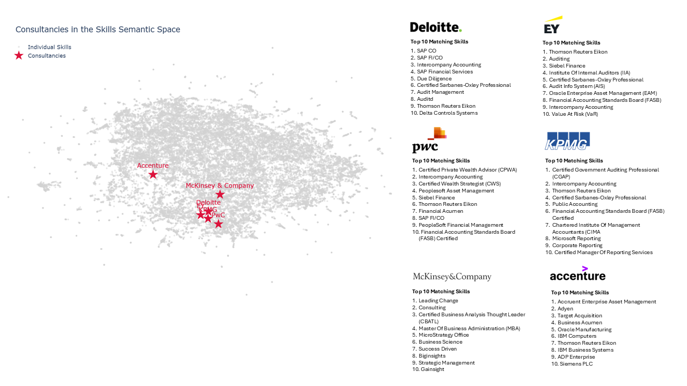

While working on a RAG-technique-based tool for mapping talent and skills in our company, I got an interesting question from a colleague who wondered whether querying “Deloitte” would return skills commonly associated with that consultancy.

At first, I was pretty skeptical, but the more I thought about it, the more it made sense that a good transformer-based embedding model should also capture the relationship between company names and the expertise typically linked to them in the digital space. So I gave it a shot, and to my surprise, the big consultancies landed in the skills semantic space in a way that actually made sense.

Check it out yourself - I reran the analysis using the publicly available [*Lightcast* skill taxonomy](https://lightcast.io/products/data/our-taxonomies){target="_blank"} (with ~35k skills) and the [*gte-multilingual-base*](https://huggingface.co/Alibaba-NLP/gte-multilingual-base){target="_blank"} embedding model to see where the big consultancies ended up in the semantic space of that skill taxonomy.

{width=100%}

You can clearly see how the Big Four accounting firms cluster closely together. McKinsey - not part of the Big Four but focused primarily on strategic consulting - occupies a slightly separate position. Accenture stands even further apart, which makes sense given its dominant orientation toward technology consulting. Don’t know about you, but in my head, they’re parked in a very similar way 😉

That said, this mental map may reflect only their core or historical identities. For example, the Big Four have for some time been expanding their consulting and technology capabilities to compete with players traditionally strong in these domains.

P.S. The whole exercise reminded me of a [*semantic differential*](https://en.wikipedia.org/wiki/Semantic_differential){target="_blank"} - a classic method developed by [*Charles E. Osgood*](https://en.wikipedia.org/wiki/Charles_E._Osgood){target="_blank"} and his colleagues in the 1950s to measure connotative meaning of concepts, objects, or events by asking respondents to rate them on a scale defined by pairs of opposing adjectives. It’s fascinating how ideas from different eras can echo each other when you look closely 🤓

