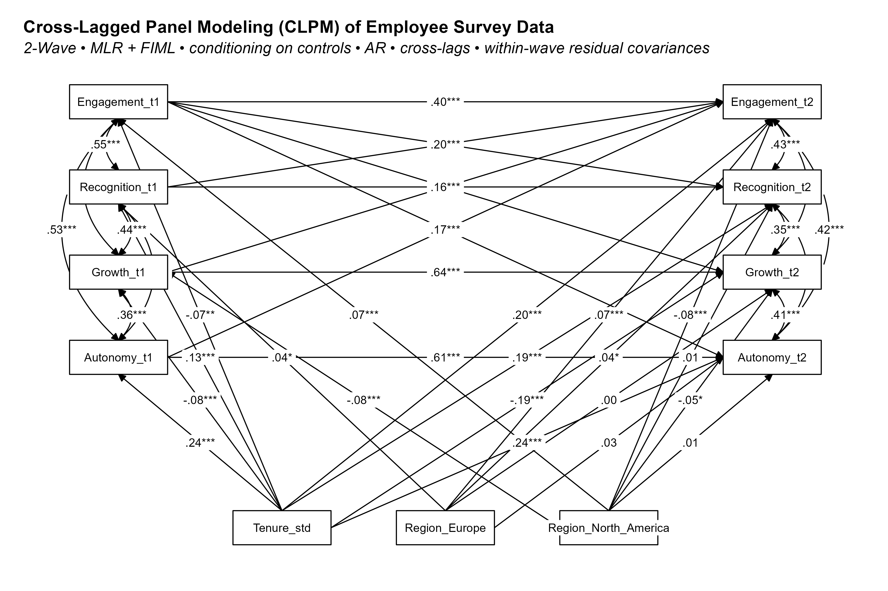

The usual “driver analysis” (regress outcome on multiple drivers + controls, or use relative weights analysis) is useful but purely correlational - it doesn’t support directional claims that inform interventions.

A stronger step in this direction would be a *cross-lagged panel modeling (CLPM)* - a method that uses repeated survey data to estimate directional (not definitive causal) effects between drivers and outcomes like engagement or intention to stay.

Why CLPM gets you closer than simple regression:

* Respects temporal precedence (T1 → T2).️
* Controls autoregressive stability (baseline levels).️
* Allows within-wave residual correlations, so cross-lags aren’t inflated.️
* Can model reciprocal (bidirectional) relations common for constructs like engagement or satisfaction.

When to use it in practice:

* You have at least two waves of employee survey data (annual or pulse).
* Consistent construct measurement across waves.
* Reasonably large sample (hundreds+) to support the model.
* With 3+ waves, you can move to random intercept models (RI-CLPM) to separate stable between-person differences from actual within-person change.

Despite providing a stronger foundation for prioritizing interventions, it still comes with some important caveats:️

* CLPM strengthens causal inference, but it cannot magically turn observational data into a RCT, so unmeasured confounding can remain️.
* Attrition isn’t random - leavers are often less engaged, so simply analyzing the "survivors" who remain can create a heavily biased dataset and lead to misleading, overly optimistic conclusions. It's crucial to use proper statistical methods (like FIML when MAR is plausible or sensitivity checks if MNAR is likely) to handle this.

Has anyone here experimented with CLPM or similar longitudinal methods (e.g., fixed effects panel models) to better understand engagement drivers? What insights - or pitfalls - did you run into?

P.S. If interested, you can check out an example of a 2-wave CLPM in action with dummy data in the R code snippet below.

```{r eval=FALSE}

# ============================================
# 1. SETUP: LOAD LIBRARIES
# ============================================
# Install packages if you haven't already
if (!require("MASS")) install.packages("MASS")
if (!require("tidyverse")) install.packages("tidyverse")
if (!require("lavaan")) install.packages("lavaan")
if (!require("lavaanExtra")) install.packages("lavaanExtra")

library(MASS)
library(tidyverse)
library(lavaan)
library(lavaanExtra)

# ============================================
# 2. DATA GENERATION PROCESS
# ============================================

# 1. EXOGENOUS CONTROLS: Create Tenure (0–14 yrs, standardized) and Region (Asia/Europe/NA) with dummies.
# 2. LATENT T1 ATTITUDES: Generate 4 correlated latent factors (Recognition, Growth, Autonomy, Engagement) via MVN.
# 3. OBSERVED T1: Map latent factors to observed attitudes with loadings + modest Tenure/Region effects + noise.
# 4. T2 DYNAMICS: Build autoregressive & cross-lagged T2 attitudes (strong T1 paths + correlated errors + controls).
# 5. ATTRITION: Apply Missing At Random (MAR) dropout (low T1 engagement ↑ dropout prob) → set T2 vars to NA.
# Result: Realistic longitudinal attitudinal dataset with structured correlations, dynamics, and missingness.

# Measurement note: This demo uses single observed scores per construct at each wave.
# A stronger approach is a latent (multi-item) measurement model with at least partial
# longitudinal invariance (equal factor loadings across waves). Results here should be viewed
# as illustrative, not as a full latent CLPM.


# Random seed for reproducibility
set.seed(2025)
n <- 2000

# --- STEP 1: GENERATE EXOGENOUS CONTROLS FIRST ---
df <- data.frame(id = 1:n) # Start with an empty dataframe
df$Tenure <- sample(0:14, size = n, replace = TRUE)
df$Tenure_std <- as.numeric(scale(df$Tenure))
df$Region <- sample(c('Asia', 'Europe', 'North_America'), size = n, replace = TRUE, prob = c(0.2, 0.4, 0.4))
df <- df %>%
  dplyr::mutate(
    Region_Europe = as.numeric(Region == 'Europe'),
    Region_North_America = as.numeric(Region == 'North_America')
  )

# --- STEP 2: GENERATE LATENT T1 ATTITUDES ---
# These are underlying factors that are correlated.
COV_T1_LATENT <- matrix(c(
  1.00, 0.50, 0.40, 0.65,
  0.50, 1.00, 0.45, 0.68,
  0.40, 0.45, 1.00, 0.62,
  0.65, 0.68, 0.62, 1.00
), nrow = 4, byrow = TRUE)

latent_t1_data <- mvrnorm(n = n, mu = rep(0, 4), Sigma = COV_T1_LATENT)
colnames(latent_t1_data) <- c('rec_lat', 'gro_lat', 'aut_lat', 'eng_lat')

# --- STEP 3: CREATE OBSERVED T1 VARIABLES AS A FUNCTION OF CONTROLS & LATENT FACTORS ---
# This builds in the realistic correlation between controls and T1 attitudes.
noise_std_t1 <- 0.3
df$Recognition_t1 <- 0.8 * latent_t1_data[, 'rec_lat'] + 0.1 * df$Tenure_std + 0.1 * df$Region_Europe + rnorm(n, 0, noise_std_t1)
df$Growth_t1 <- 0.8 * latent_t1_data[, 'gro_lat'] - 0.1 * df$Tenure_std - 0.1 * df$Region_North_America + rnorm(n, 0, noise_std_t1)
df$Autonomy_t1 <- 0.8 * latent_t1_data[, 'aut_lat'] + 0.2 * df$Tenure_std + rnorm(n, 0, noise_std_t1)
df$Engagement_t1 <- 0.8 * latent_t1_data[, 'eng_lat'] - 0.1 * df$Tenure_std + 0.1 * df$Region_North_America + rnorm(n, 0, noise_std_t1)

# --- STEP 4: GENERATE T2 VARIABLES BASED ON T1 ---
# Within-wave dependence at T2:
# We simulate correlated residual shocks across T2 variables to create
# realistic same-wave (contemporaneous) covariation. This prevents inflation
# of cross-lagged effects that would otherwise have to "explain" all T2-T2
# co-movement. These are *residual* (post-regression) correlations, not
# structural paths among T2 variables.

COV_T2_ERRORS <- matrix(0.1, nrow = 4, ncol = 4) # Covariance of 0.1
diag(COV_T2_ERRORS) <- 0.25 # Variance of 0.25
t2_errors <- MASS::mvrnorm(n = n, mu = rep(0, 4), Sigma = COV_T2_ERRORS)

# Define T2 variables with strong paths
df$Recognition_t2 <- (0.6 * df$Recognition_t1 + 0.20 * df$Engagement_t1 +
                        0.15 * df$Tenure_std + 0.1 * df$Region_Europe + t2_errors[, 1])
df$Growth_t2 <- (0.6 * df$Growth_t1 + 0.15 * df$Engagement_t1 -
                   0.15 * df$Tenure_std - 0.1 * df$Region_North_America + t2_errors[, 2])
df$Autonomy_t2 <- (0.6 * df$Autonomy_t1 + 0.18 * df$Engagement_t1 +
                     0.2 * df$Tenure_std + 0.05 * df$Region_Europe + t2_errors[, 3])
df$Engagement_t2 <- (0.5 * df$Engagement_t1 + 0.3 * df$Recognition_t1 +
                       0.25 * df$Growth_t1 + 0.2 * df$Autonomy_t1 +
                       0.2 * df$Tenure_std + 0.15 * df$Region_Europe - 0.15 * df$Region_North_America + t2_errors[, 4])

# --- STEP 5: ATTRITION ---
# MAR - dropout depends on observed Engagement_t1
logits <- -2.5 - 0.7 * (df$Engagement_t1 - mean(df$Engagement_t1))
prob_dropout <- 1 / (1 + exp(-logits))
dropout_flags <- rbinom(n, 1, prob_dropout) == 1
t2_vars <- c('Recognition_t2', 'Growth_t2', 'Autonomy_t2', 'Engagement_t2')
df[dropout_flags, t2_vars] <- NA
df_final <- df %>% dplyr::select(-id, -Tenure, -Region)


# ============================================
# 3. SPECIFY & FIT THE MODEL
# ============================================

model_desc <- '

  # -----------------------------------------------------------
  # SCOPE & LIMITATION
  # -----------------------------------------------------------
  # 2-wave CLPM (not RI-CLPM). With two waves we cannot disaggregate
  # stable between-person differences from within-person change.
  # RI-CLPM requires ≥3 waves plus random intercept factors.
  # # When you have ≥3 waves:
  # - Add random intercepts for each construct (RI-CLPM).
  # - Interpret cross-lags as within-person dynamics net of stable trait differences.

  # -----------------------------------------------------------
  # BASELINE (T1) REGRESSIONS ON EXOGENOUS CONTROLS
  # -----------------------------------------------------------
  # Purpose: partial out stable covariate effects (tenure, region)
  # so cross-lag paths reflect change over time rather than static
  # between-person differences. Region dummies => "Asia" is the reference.
  # Note: These are adjustment paths, not causal claims about controls.
  # If controls may be missing, prefer fixed.x = FALSE with FIML.
  
  Recognition_t1 ~ Tenure_std + Region_Europe
  Growth_t1      ~ Tenure_std + Region_North_America
  Autonomy_t1    ~ Tenure_std
  Engagement_t1  ~ Tenure_std + Region_North_America

  # -----------------------------------------------------------
  # T1 WITHIN-WAVE COVARIANCE STRUCTURE (RESIDUAL CORRELATIONS)
  # -----------------------------------------------------------
  # Purpose: allow contemporaneous (same-wave) covariance among T1 constructs
  # due to unmeasured common causes/method factors/conceptual overlap.
  # These are covariances (~~), not directional paths, preventing inflation
  # of T1→T2 cross-lag effects. This block is saturated; constrain by theory if needed.
  
  Engagement_t1   ~~ Recognition_t1
  Engagement_t1   ~~ Growth_t1
  Engagement_t1   ~~ Autonomy_t1
  Recognition_t1  ~~ Growth_t1
  Recognition_t1  ~~ Autonomy_t1
  Growth_t1       ~~ Autonomy_t1

  # -----------------------------------------------------------
  # T2 REGRESSIONS (AUTOREGRESSIVE + CROSS-LAG + CONTROLS)
  # -----------------------------------------------------------
  # Purpose: estimate directional effects from T1 drivers to T2 outcomes,
  # controlling for T1 baselines (AR paths) and exogenous controls.
  
  Engagement_t2  ~ Engagement_t1 + Recognition_t1 + Growth_t1 + Autonomy_t1 + Tenure_std + Region_Europe + Region_North_America
  Recognition_t2 ~ Recognition_t1 + Engagement_t1 + Tenure_std + Region_Europe + Region_North_America
  Growth_t2      ~ Growth_t1      + Engagement_t1 + Tenure_std + Region_Europe + Region_North_America
  Autonomy_t2    ~ Autonomy_t1    + Engagement_t1 + Tenure_std + Region_Europe + Region_North_America

  # -----------------------------------------------------------
  # T2 WITHIN-WAVE RESIDUAL COVARIANCES
  # -----------------------------------------------------------
  # Purpose: capture contemporaneous (same-time) dependence among T2 residuals
  # so cross-lagged paths are not forced to explain within-wave comovement.
  # These are correlations among disturbances after controlling for T1 + controls.
  
  Engagement_t2   ~~ Recognition_t2
  Engagement_t2   ~~ Growth_t2
  Engagement_t2   ~~ Autonomy_t2
  Recognition_t2  ~~ Growth_t2
  Recognition_t2  ~~ Autonomy_t2
  Growth_t2       ~~ Autonomy_t2
'


fit <- lavaan::sem(
  model_desc, 
  data = df_final, 
  missing = "fiml", 
  estimator = "MLR", # Use robust ML - same point estimates as ML, but robust standard errors and scaled fit statistics that are less sensitive to non-normality and some model misspecifications
  fixed.x = TRUE # Choose FALSE if you need FIML for missing exogenous variables (Tenure, etc.) or prefer joint-model fit
)

# ============================================
# 4. INSPECT RESULTS
# ============================================
print("---------- Model Fit Statistics ----------")
summary(fit, fit.measures = TRUE, standardized = TRUE, rsquare = TRUE)

# --- Rank driver effects ---
est <- parameterEstimates(fit, standardized = TRUE, ci = TRUE)
driver_effects <- est %>%
  dplyr::filter(
    lhs == "Engagement_t2", 
    op == "~", 
    grepl("_t1$", rhs),
    rhs != "Engagement_t1"   # exclude AR path
  ) %>%
  dplyr::transmute(
    Driver = rhs, Std_Estimate = std.all,
    CI_L = ci.lower, CI_U = ci.upper,
    P_Value = pvalue
  ) %>%
  dplyr::arrange(desc(abs(Std_Estimate)))

print("---------- Ranked Driver Effects on Engagement ----------")
print(driver_effects)

# ============================================
# SEM VISUALIZATION
# ============================================

# Create the layout matrix
layout_mat <- matrix("", nrow = 6, ncol = 5,
                     dimnames = list(NULL, paste0("V", 1:5)))

layout_mat[1, c(1, 5)] <- c("Engagement_t1",  "Engagement_t2")
layout_mat[2, c(1, 5)] <- c("Recognition_t1", "Recognition_t2")
layout_mat[3, c(1, 5)] <- c("Growth_t1",      "Growth_t2")
layout_mat[4, c(1, 5)] <- c("Autonomy_t1",    "Autonomy_t2")
# row 5 stays all blanks
layout_mat[6, 2:4]     <- c("Tenure_std", "Region_Europe", "Region_North_America")
layout_df <- as.data.frame(layout_mat)

# Write it to CSV
# write.csv(layout_df, "sem_layout.csv", row.names = FALSE)
# layout_df <- read.csv("sem_layout.csv")

# Generate the plot
p <- lavaanExtra::nice_tidySEM(
  fit,
  layout = layout_df,
  hide_nonsig_edges = FALSE,
  hide_var = TRUE,
  hide_cov = FALSE,
  hide_mean = TRUE,
  est_std = TRUE,
  label_location = NULL,
  reduce_items = NULL,
  plot = TRUE
  ) +
  ggplot2::labs(
    title    = "Cross-Lagged Panel Modeling (CLPM) of Employee Survey Data",
    subtitle = sprintf("2-Wave • MLR + FIML • conditioning on controls • AR • cross-lags • within-wave residual covariances")
  ) +
  ggplot2::theme(
    plot.title = element_text(hjust = 0, size = 17, face = "bold"),
    plot.subtitle = element_text(hjust = 0, size = 15, face = "italic"),
    panel.background = element_rect(fill = "white", colour = "white"),
    plot.background = element_rect(fill = "white", colour = "white"),
    plot.margin = margin(t = 20, r = 20, b = 20, l = 20, unit = "pt")
  )

print(p)

# Save the plot
# ggplot2::ggsave("sem_plot.png", p, width = 12, height = 8, dpi = 300)

```

<div style="text-align:center">
{width=100%}
</div>

---

**Update**

After sharing this post, Joerg Wittkewitz pointed me to [critical work](https://replicationindex.com/2020/08/22/cross-lagged/){target="_blank"} highlighting important weaknesses of CLPM. While CLPM can provide stronger directional insights than simple cross-sectional regression, it also comes with structural limitations that can produce misleading causal stories if not handled carefully.

Key weaknesses to be aware of:

* Underestimation of stability: CLPM often underestimates how stable constructs are over time, especially when one variable (e.g., engagement) is more stable than another (e.g., satisfaction or intention to stay).
* Spurious cross-lagged paths: To “compensate” for this, CLPM can produce artificial directional effects, making one variable look like a driver when it isn’t.
* No modeling of short-term fluctuations: Temporary ups and downs (e.g., seasonal workload, reorganizations) are treated as noise rather than meaningful variance, distorting directional paths.
* Bad model fit often ignored: Many applied studies use CLPM even when model fit is poor - which invalidates the interpretation of the cross-lagged effects.

Practical implication:

* If you have 3+ waves of data, moving to Random Intercept Cross-Lagged Panel Model (RI-CLPM) or fixed-effects panel approaches can help separate stable between-person differences from actual within-person change - where causal signals are more trustworthy.
* With only 2 waves, be extra cautious in interpretation, and consider alternative designs (e.g., latent change models, FE panel models) or sensitivity checks.

Bottom line: CLPM can still be useful as a starting point, but directional effects should be interpreted with care. A significant cross-lagged path ≠ proof of causality - and model misfit can make it worse.


