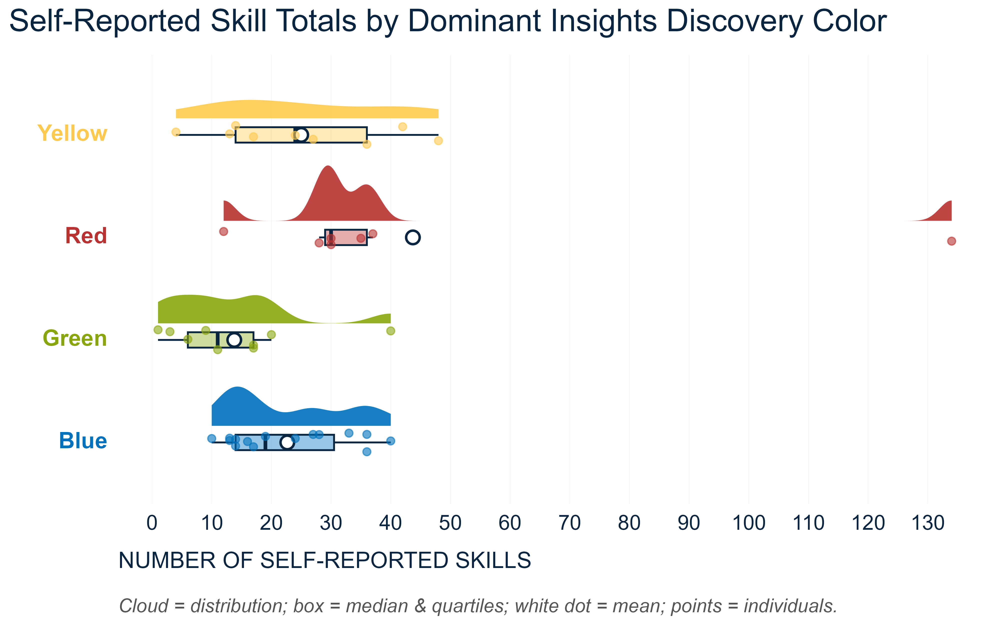
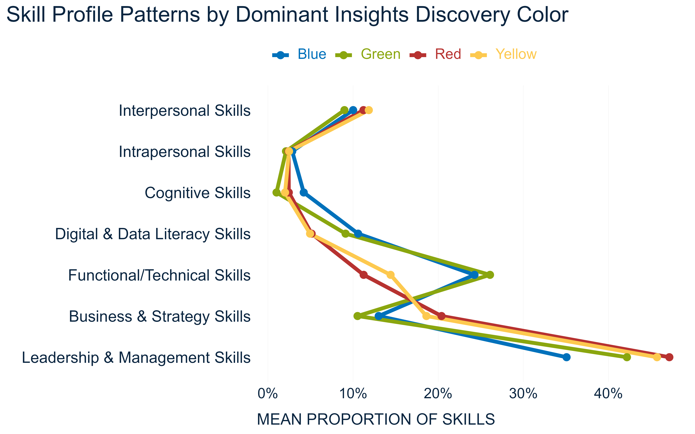

Recently, I had a chance to take a quick look at a small piece of criterion-related validity evidence for the (in)famous psychometric tool known as [Insights Discovery](https://www.insights.com/products/insights-discovery/){target="_blank"} (ID).

For those unfamiliar with the tool, here’s a quick rundown - ID is a Jungian-based typological model that maps behavior onto four “color energies”: Red (driven), Yellow (enthusiastic), Green (caring), and Blue (analytical). It’s popular in corporate training and team development, but also somewhat controversial - engaging and easy to relate to, yet supported by limited peer-reviewed evidence, much like the MBTI.

Having access to data on self-reported skills and ID profiles for a team of about 40 people, I couldn’t resist exploring the relationship between the two 🤓

To make the analysis workable given the limited sample size, I simplified the data a bit (maybe too much 🤔):

* I used only each person’s most dominant color.
* I reduced roughly 600 unique skills across the team to seven broader skill categories: *Interpersonal* (e.g., Mentorship), *Intrapersonal* (e.g., Multitasking), *Cognitive* (e.g., Critical Thinking), *Functional/Technical* (e.g., Azure DevOps), *Digital & Data Literacy* (e.g., Data Visualization), *Business & Strategy* (e.g., Budgeting), and *Leadership & Management* (e.g., Change Strategy).

I didn’t have any strong hypotheses in advance, so at best this is exploratory work, the results of which should be tested on an independent and much larger sample. That said, I still expected to see at least the following patterns:

* Red individuals would self-report the greatest number of skills, while Green individuals would report the fewest.
* Compared with other colors, Red individuals would show a higher proportion of skills in Leadership & Management and Business & Strategy.
* Green and Yellow individuals would report a relatively higher proportion of Interpersonal skills compared with other colors.
* Blue individuals would report a relatively higher proportion of Functional/Technical and Cognitive skills compared with other colors.

To my surprise, the majority of these expectations were more or less met, as illustrated in the two charts below, although the effects are often not large enough to be reliably detected with such a small number of observations. 

{width=100%}

 

{width=100%}

Besides that, some other interesting patterns emerged. For example:

* All colors followed quite similar patterns across skill categories, suggesting that certain types of skills are generally more or less common among people, regardless of their behavioral profile.
* Skill profiles were more tightly correlated along the Introversion/Extraversion dimension than along the Thinking/Feeling dimension of Jungian preferences (i.e., Blue + Green vs. Red + Yellow).

⚠️ As already suggested above, the results should by no means be overinterpreted - whether by supporters or critics of this method - as the analysis is far too limited and simplified for that. It’s primarily an exploratory look at an interesting dataset, intended mainly to satisfy my curiosity and to spark further ideas, questions, or potential analyses related to today’s popular topic of employee skills.