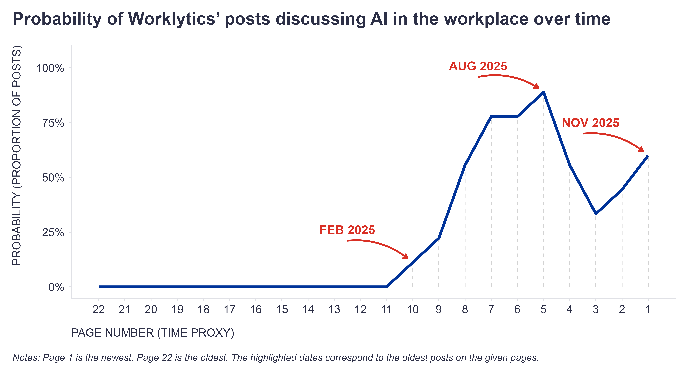

As many of you can probably attest, AI is dominating a lot of today’s debates about the future of work - both near and distant. And, unsurprisingly, this is also showing up in the more or less aggressive pivots of several HR-tech vendors that not so long ago focused on different workplace topics.

I noticed this shift in a company I’ve been a big fan of ever since we played/competed on the same playground back when I was at [Time is Ltd.](https://www.timeisltd.com/){target="_blank"} (okay, maybe more after I left TiL 😉). I’m talking about [Worklytics](https://www.worklytics.co/){target="_blank"} - a company many know for providing insights based on collaboration metadata from tools like chat, meetings, email, Jira, GitHub, and so on.

Scrolling through my LinkedIn feed over the past year or so, I got the impression that the Worklytics team pivoted a bit and is now focusing much more on AI in the workplace and less on the traditional collaboration tools mentioned above.

To check that hunch, I reviewed nearly 200 posts on [their blog](https://www.worklytics.co/blog){target="_blank"} and looked at how the likelihood that a post was primarily about AI in the workplace changed over time. Since not all posts had a release date, I used the page number as a proxy for time (with ~9 posts per page), assuming the higher the page number, the older the posts. And as you can see in the attached plot below, the probability of a post being about AI in the workplace started rising steadily around February 2025 and reached its peak so far in August this year. So I guess my hunch wasn’t totally off, including the timing.

{width=100%}

This isn’t meant to shame a vendor for jumping on a bandwagon - quite the opposite. In this case, the shift is a sensible move, imo, and highlights that the “boring” collaboration metadata we’ve all been analyzing for years can actually be extremely useful during the transition into the AI era. When trying to deploy or measure the impact of AI in the workplace, it’s tough to do it well without a baseline of how work has been done so far. And collaboration metadata can serve as a very handy sensor for that.

Curious whether any of you are already using collaboration metadata for this purpose in a systematic way - for example, tracking AI tool adoption alongside meeting patterns, focus time, or cross-team collaboration. And if so, what insights have surprised you the most? Feel free to share your experiences in the comments.

Note: This post wasn’t paid or sponsored by Worklytics in any way - it was purely driven by my curiosity 🤓

P.S. This was also a nice test of current agentic tools (Google [Antigravity](https://www.googleantigravity.org/){target="_blank"} with Gemini 3 Pro, in this case). And I can confirm what many of you have probably experienced firsthand - it’s a serious efficiency booster. The posts were scraped and analyzed in under 30 minutes, and the real bottleneck was actually the ideation and narrative phase, although AI helped there too 😉
