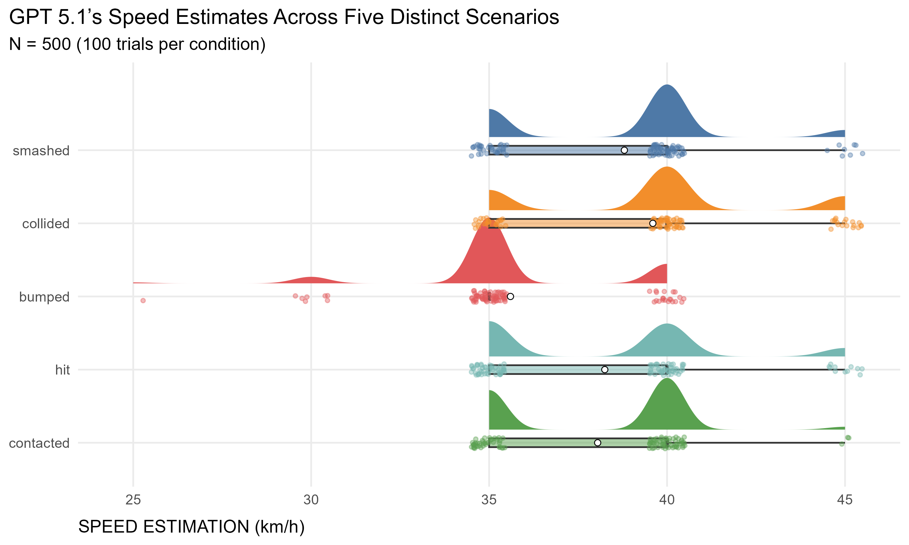

We’ve all seen how GenAI chatbot responses can shift depending on the exact phrasing of our prompts. A recent complaint from a friend about this behavior inspired me to “replicate” a classic psychological experiment - but with GenAI as the subject instead of humans.

I’m referring to the [Loftus & Palmer (1974)](https://psycnet.apa.org/record/1975-04498-001){target="_blank"} study (*Reconstruction of Automobile Destruction*), which examined how language shapes memory. For those unfamiliar with it, participants watched short films of car accidents and were asked to estimate the cars’ speed. The key manipulation was the intensity of the verb in the question. Those asked how fast the cars were going when they **“smashed”** gave higher estimates (~40.5 mph) than those asked with the verbs **“collided”** (39.3 mph), **“bumped”** (38.1 mph), **“hit”** (~34.0 mph), or **“contacted”** (~31.8 mph).

{width=65%}

*Results from the original Loftus & Palmer (1974) study (Experiment 1).*

I tried something similar with a multimodal AI model - GPT-5.1, to be specific - but instead of relying on memory recall from a film, I provided a static image of a car accident (see the picture below) along with the task description (*Based on picture provided, estimate how fast were the cars going when they {word} each other? Don't refuse to make an estimation - make your best guess based on available information. Provide your response as a JSON object with a single key 'speed' and the value should be just the numerical estimation in km/h (without the unit, just the number).*). This made the experiment less about memory distortion/reconstruction and more about contextual drift - essentially testing whether the semantic weight of a single word could override the visual evidence in the pixel data.

{width=65%}

*The car-crash image shown to the AI as part of the prompt during the replication of the original Loftus & Palmer (1974) experiment.*

I ran 100 trials for each of the five verb variations to capture the model’s non-deterministic variability. As shown in the chart below, the results only partially replicate the original findings.

{width=100%}

On a broad level, the pattern holds: the two most intense verbs produce slightly higher estimates than the two least intense ones. However, the effect, though statistically robust, is less pronounced than in the original study.

One specific detail stands out: the middle verb, “bumped,” produced the lowest estimates of all - even lower than "contacted." I’m not a native English speaker, so I might be missing a nuance, but, imo, this may actually track with NLP logic. While "contacted" is a velocity-neutral term often found in formal police reports, "bumped" carries a specific semantic vector in training data that implies low energy (like a parking lot fender-bender). If this interpretation is valid, the model is clearly adhering to the linguistic definition over the visual cues.

I also wondered whether the muted effect in the other verbs might arise from GPT-5.1 being a reasoning model that leans more on “deliberate analysis” than “intuition.” So, I repeated the experiment with OpenAI’s strongest non-reasoning model, GPT-4.1. And as shown in the chart below, its results aligned a bit more with the expected pattern - suggesting reasoning models might anchor more firmly to visual ground truth - but the overall picture is pretty similar to the previous results (aside from generally lower speed estimates), including the odd “bumped” dip.

{width=100%}

This is just one small experiment with two specific models and one narrow task, so the conclusions definitely cannot be overstated. Still, imo, it demonstrates that the wording of our prompts can, at least in some cases, systematically bias GenAI outputs. So next time you craft a prompt, choose your words wisely - your leading questions can lead your favorite chatbot astray 😉

P.S. By coincidence, while working on this post I stumbled upon a much more rigorous and complex study on prompt framing effect in the context of misinformation correction - check it out [here](https://arxiv.org/abs/2511.22746){target="_blank"}. 

