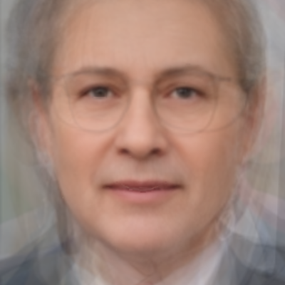

As psychological research suggests, we tend to be drawn to people who are like us - psychologically, sociodemographically, and physically.

This so-called [*similarity-attraction principle*](https://www.encyclopedia.com/social-sciences/applied-and-social-sciences-magazines/similarityattraction-theory){target="_blank"} makes us more comfortable with, and more likely to interact with those we perceive as similar, which often leads to more frequent and more positive communication.

You can think of these similarities as “avenues” between us that make it easier (or harder) to reach out to others. And from that perspective, it’s just one step to operationalize this phenomenon via [*social network analysis*](https://en.wikipedia.org/wiki/Social_network_analysis){target="_blank"}.

For illustration - and to have some fun 🤓 - I focused only on the physical (facial) aspect of similarity and used a group of 16 well-known world politicians as my volunteers (well, not literally).

From a technical perspective, I used [`DeepFace`](https://en.wikipedia.org/wiki/DeepFace){target="_blank"} with [`Facenet512`](https://github.com/TheSnakeCoder/Face_recognition_facenet512){target="_blank"} to extract facial embeddings and computed cosine similarity between all pairs. Then I built a network graph where edges connect politicians with positive facial similarity (thicker lines = stronger resemblance), and a Spring layout algorithm positioned lookalikes closer together. To identify groups of faces with shared features, I applied Greedy Modularity community detection.

The result? See the network graph below - I’ll leave it to you to decide how these discovered similarities might translate into real-world relationships between individual politicians 😉

{width=100%}

Note: Given the methodology, if you averaged all the faces, you’d get an “ideal” politician who should, on average, be in the best (central) position to align with the group as a whole. To get a better idea of what such a politician might look like, I also generated the morphed “average face” of this specific set of politicians - see the pic below. If you think your face looks similar, maybe you should consider entering politics 🙃 But don’t wait too long - politics isn’t exactly a stable profession, this crew can change fast, and your face might not fit as well later on 😁

{width=50%}

P.S. Out of curiosity, I also ran the analysis with my own photo, and it seems I should soon head to Mexico or Germany 🙂