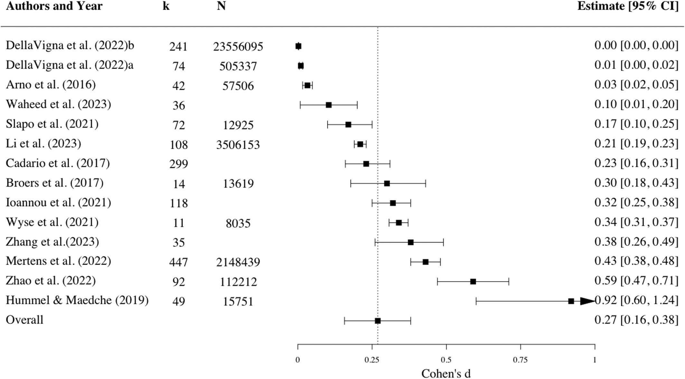

A recent [second-order meta-analysis](https://onlinelibrary.wiley.com/doi/10.1002/bdm.70053?af=R){target="_blank"} synthesizing 14 meta-analyses, 1,600+ primary studies, and ~30 million participants finds that nudges show a small positive average effect (see the corresponding forest plot below). 

{width=100%}

*Forest plot of the effects of the nudging intervention.*

However, after correcting for publication bias (see the corresponding funnel plot below), the pooled effect is statistically indistinguishable from zero.

{width=100%}

*Funnel plot of nudging intervention.*

A common critique is that "nudging" is too broad - like meta-analyzing all medicines at once - and that we should focus on specific interventions that work.

This study challenges that optimism. The authors found no robust moderators to identify successful contexts. This is likely because the foundation itself is shaky: the majority of existing meta-analyses were rated as low or critically low in methodological quality. The signal is simply lost in the noise of low-quality methods.

The implication is stark: We cannot currently distinguish the "winners" from the statistical artifacts.

For policy and practice, we must stop assuming "what works" and demand fundamental rigor. We need valid measurement before we can even begin to identify effective interventions.